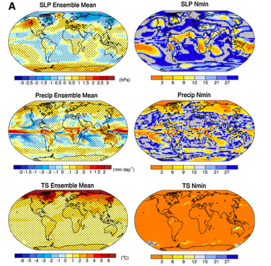

---
output:
  pdf_document: default
  word_document: default
  html_document: default
---

# Natural Variability by internal variability {#iv}

*Author: Senta Roßmayer*

*Supervisor: Henri Funk*

*Suggested degree: Bachelor*

```{r message=FALSE, warning=FALSE, include=FALSE}
library(bookdown)
library(svglite)
```


## Abstract

Natural variability refers to the inherent fluctuations in the climate system that occur without external forcings, such as changes in solar radiation, volcanic eruptions, or human-induced alterations of the Earth's atmosphere and surface. This variability can be due to a variety of factors, including atmospheric processes, ocean currents, the El Niño-Southern Oscillation (ENSO), and other dynamic components of the Earth system. Natural variability occurs across all time scales, from short-term (daily, seasonal) to long-term (decadal, centennial) fluctuations.

## Climate Model Ensemble

Climate models are sophisticated tools that simulate the interactions within the Earth's climate system. To understand and quantify natural variability, scientists use ensembles of climate model simulations. An ensemble consists of multiple runs of the same model, or different models, where each run has slightly different initial conditions or model parameters. This approach helps to capture the range of possible climate outcomes due to the inherent uncertainty and variability in the system.

## Internal Variability

Within the context of climate model ensembles, internal variability refers to the variations in climate that arise from the system's internal processes, independent of external forcings. This variability is a fundamental part of the climate system's dynamics and can lead to different outcomes even if the external conditions are the same.

## 1. Introduction to climate modelling and climate variability

The Earth's climate is a complex system that is characterised by diverse and interrelated physical, chemical and biological processes. Climate models play a central role in analysing and predicting this system. They enable scientists to simulate and analyse the reactions of the Earth's atmosphere, oceans and land surfaces to various influences. By using them, past climate changes can be reconstructed and future climate trends and extremes can be predicted. 
The fundamentals of climate modelling include understanding the basic physical principles that regulate the exchange and distribution of energy and mass within the climate system. These models are based on mathematical representations of physical processes and use complex algorithms to calculate these representations. These calculations are performed repeatedly to simulate the dynamic changes of the climate system over time (@eyring2016overview). A sound knowledge of the physical processes, such as radiative transfer, turbulent fluxes and the dynamics of the atmosphere and oceans, is essential for the development and interpretation of these models (@latif2022natural).
Another important aspect of climate modelling is the consideration of climate variability. Climate variability refers to natural fluctuations in the climate system that can occur on different time scales, from a few years to centuries or even millennia. This variability can have various causes, including internal processes such as the North Atlantic Oscillation or global phenomena such as El Niño (@deser). It is crucial to distinguish between short-term climatic fluctuations and long-term trends in order to make more accurate climate projections.
Various types of climate models are used in research, which differ in their complexity and scope of application. These range from simple energy-equilibrium models that consider basic climate variables to highly complex coupled atmosphere-ocean models that consider a variety of climate components and interactions (@eyring2016overview). The Coupled Model Intercomparison Project Phase 6 (CMIP6) is a prominent example of such a coordinated modelling initiative that aims to overcome the challenges of climate modelling and improve the accuracy of climate predictions (@eyring2016overview).
Analysing and interpreting the results of these climate models requires a deep understanding of the uncertainties and accumulated sources of error in the projections. In particular, internal variability plays a crucial role in the overall uncertainty of climate predictions. These uncertainties need to be quantified through extensive ensemble simulations covering a wide range of scenarios and model parameters (@deser). 
To summarise, climate models and the study of climate variability are essential for understanding and predicting climate change. The continuous improvement of these models and their methods is of crucial importance in order to effectively meet the challenges of global climate change.

## 1.1 Basics of climate models

Climate models are complex mathematical representations of the Earth's climate system that are used to simulate the interactions between the atmosphere, ocean, land surface and ice. These models play a crucial role in predicting future climate changes and understanding historical climate patterns. A fundamental climate model is based on physical laws described by differential equations such as those found in radiative transfer, fluid dynamics and thermodynamics (@eyring2016overview).
The main components of a climate model include the atmosphere, the ocean, the cryosphere and the biosphere. The model takes into account processes such as energy exchange between the Earth's surface and atmosphere, ocean currents, ice cover and feedback effects. The models are divided into different horizontal and vertical grid cells, which represent the physical state variables such as temperature, pressure and humidity. Each cell interacts with neighbouring cells, resulting in very complex three-dimensional simulations.
Validation is a key aspect in the development and utilisation of climate models. This is done by comparing the model results with historical observations. If past climate conditions are correctly reproduced, this strengthens confidence in the model's ability to predict future states of the climate system (@eyring2016overview). Uncertainties play an important role here. A large part of this uncepub : *.Rmd
	Rscript -e "bookdown::render_book('./', 'bookdown::epub_book', clean = FALSE)"ertainty stems from the internal variability of the climate system, i.e. the natural fluctuations that can occur even without external influences. 
The accuracy of a climate model is also determined by the spatial resolution and the quality of the underlying physical parameterisations. Higher-resolution models can better capture smaller-scale phenomena, but are also more computationally intensive. One challenge is that not all climate-relevant processes can be simulated directly. For example, cloud formation or soil moisture must be approximated using parameterisation methods, which leads to further uncertainties (@eyring2016overview). 
Another important approach in climate modelling is the use of ensemble simulations. By carrying out several simulations with slightly varying initial conditions, scientists can estimate the range of possible climate developments and better quantify the uncertainties resulting from internal variability. These approaches help to make more robust statements about future climate trends and to better predict possible extreme events.
To summarise, it can be said that climate models are indispensable tools for investigating the complex and dynamic climate system. Through their continuous development and validation, they greatly contribute to deepening our understanding of climate processes and making well-founded predictions for the future.


## 1.2 Types of climate models: A comparison

Climate models are essential tools for analysing and predicting climatic changes. The models differ primarily in their complexity and applicability. The basic types of climate models can be divided into simple energy balance models, one-dimensional models, two-dimensional models and three-dimensional general circulation models (GCMs).
Simple energy balance models aim to model the Earth's radiative imbalance and are relatively easy to use. They are particularly useful for understanding basic climate change mechanisms and providing rapid estimates of temperature changes. However, their low spatial resolution is a limitation that can affect the accuracy of the results. 
Some of the more advanced models are the so-called one- and two-dimensional climate models. A one-dimensional model can represent vertical temperature layers in the atmosphere or ocean, while a two-dimensional model also includes horizontal components such as latitude or altitude. These models offer improved spatial resolution and take more physical processes into account than simple energy balance models. However, they are usually not suitable for detailed regional forecasts either. General circulation models (GCMs) represent the most complex and detailed tools for climate modelling. They simulate atmospheric and oceanic circulation patterns in three dimensions, taking into account a variety of physical, chemical and biological processes. The GCMs are often used in multi-model ensembles to reduce uncertainties in predictions and produce more robust climate projections (@semenov2010use). These models have proven particularly useful for predicting long-term climate changes and their impacts, such as changes in sea ice cover (@mohamed2022interannual).
In addition, regional climate models (RCMs) are used, which can depict specific climatic conditions in smaller geographical areas in greater detail. Due to their finer spatial resolution, these models are better suited to analysing local climate changes and projecting more specific scenarios (@deser). By downscaling the results of the GCMs to regional models, more precise statements on local climate impacts can be made (@semenov2010use).
Another important aspect in the evaluation of climate models is the uncertainty caused by internal variability and structural differences in the models. Multi-model ensembles help to quantify these uncertainties and provide a sound basis for the assessment of climate impacts (@semenov2010use). However, the challenge remains that different models and approaches often arrive at different results, which makes the interpretation of the data complex.
Overall, the different types of climate models offer a wide range of tools for analysing the climate system, and their combination can help to paint a more comprehensive picture of future climatic conditions

## 2. Introduction to climate model ensembles

Climate model ensembles are an essential tool in modern climate research. These ensembles enable scientists to better understand and quantify the uncertainties and variability in the climate system. An ensemble typically consists of a series of climate model simulations performed using different models or different initial conditions of the same model (@maher2021large). This multitude of simulations helps to capture the range of possible future climate scenarios and to identify and separate both internal and external influences on the climate system.

## 2.1 Definition and meaning of climate model ensembles

Climate model ensembles are an essential method for improving the accuracy of predictions and quantifying uncertainties in climate projections. A climate model ensemble consists of several climate models or several runs of a single model under different assumptions and input data (@eyring2016overview). The fundamental advantage of ensembles is that they make it possible to better capture the variability and uncertainty in climate projections by taking into account a range of possible scenarios and their probabilities. This allows for a more robust prediction, as it is not sufficient to rely on a single model or simulation (@falloon2014ensembles). Analysing a large number of models also helps to identify and address systematic errors and structural uncertainties within the modelling (@maher2021large).
In a climate model ensemble, various models are used that differ in their structural assumptions, parameterisations and input data. By combining these models, error tendencies of individual models can be compensated for and a more robust overall picture can be created (@semenov2010use). This is particularly important as individual climate models can have systematic errors and uncertainties that lead to inconsistencies in the predictions.
Another important feature of climate model ensembles is their application in the investigation of extreme events and the estimation of local climate changes. In particular, the use of regionalised climate models (RCMs) within an ensemble enables a more precise representation of climatic conditions at smaller spatial scales (@maher2021large). These regional models provide more detailed projections, which are crucial for climate change adaptation strategies.
The Coupled Model Intercomparison Project Phase 6 (CMIP6) is one of the most comprehensive initiatives for the creation and use of climate model ensembles by coordinating global climate models from various research institutions worldwide. CMIP6 addresses central scientific questions such as the response of the Earth system to external influences and the causes of systematic model deviations (@eyring2016overview). 
The importance of climate model ensembles lies not only in the reduction of uncertainty, but also in the improvement of the physical realism of the predictions. By combining different climate models, a broader range of physical processes and interactions can be considered, leading to more realistic and robust predictions (@smith2009bayesian). In addition, ensembles enable probabilistic analysis, which provides decision-makers with important information about the probability of different climate scenarios. 
Another key aspect of using climate model ensembles is the possibility of assessing uncertainty. Uncertainties in climate predictions result both from natural climate variability and from uncertainties in the models themselves and future emission scenarios (@eyring2016overview). By using ensembles, the uncertainty can be quantified in a systematic way and integrated into the decision-making process.
Finally, climate model ensembles play a central role in the assessment of regional climate changes and their impacts. Since regional climate changes can vary greatly, it is crucial that the uncertainties in these projections are taken into account by combining several models (@semenov2010use). The use of climate model ensembles thus enables the creation of detailed and reliable climate projections, which are essential for planning and adapting to climate change.

## 2.2 Methods for calculating climate model ensembles

The creation of climate model ensembles is a complex and methodologically diverse process that reduces uncertainties in climate projections and enables more robust predictions. A basic method is ensemble averaging, in which several climate models are combined to obtain an average result. This method aims to minimise the deviations caused by individual model errors and provide a more stable overall picture of the future climate (@smith2009bayesian). 
Another important method is Bayesian model averaging (BMA), which allows probabilistic statements to be made about future climate states. The different models are weighted according to their performance in order to obtain a combined posterior distribution that takes into account the uncertainties of the individual models. This technique enables a differentiated view of possible future climate changes and is considered a substantial progres over earlier approaches (@smith2009bayesian).
In addition, the Reliability Ensemble Average (REA) approach was developed to assess and weight the reliability of the individual models. In this method, the projections are assessed on the basis of their agreement with observed climate data and their convergence with each other, which enables a reliable estimate of future climate conditions. REA is particularly useful for regionalised climate modelling, as different models may have different strengths and weaknesses in different regions (@smith2009bayesian). 
In addition, multivariate analysis methods play a decisive role in the creation of climate model ensembles. These approaches make it possible to consider several climate variables simultaneously and to analyse the interactions between them. Such a method improves the accuracy and reliability of the projections by better accounting for the inherent uncertainties of the models (@smith2009bayesian). 
The cross-validation method is another important tool for validating and fine-tuning climate model ensembles. This involves comparing the predictions of the models with new, independent data sets to check the accuracy and assumptions of the statistical models. This method ensures that the climate models not only accurately reproduce the historical data, but can also provide reliable forecasts for the future (@smith2009bayesian).
Finally, the consideration of internal climate variability is of central importance for the creation of climate ensembles. This variability, which is characterised by both atmospheric and oceanic circulation patterns, contributes substantial to the uncertainty in climate projections. Methods such as ensemble simulations, which run a large number of simulations with a single model, make it possible to capture both the forced response of the climate system and the internal variability (@deser). 
Overall, these methods represent different approaches to reducing uncertainties and improving the reliability of climate model ensembles. They form the basis for sound climate science findings and enable decision-makers to take more effective measures to adapt to future climate change.

## 2.3 Example of a climate model ensemble

```{r EnsembleSenta, eval=, echo=FALSE, fig.align="center", fig.cap="CCSM3 40-member ensemble (@deser)", out.width="80%"}

```

The climate model ensemble from (@deser) in more detail. A coupled ocean-atmosphere-land-cryosphere general circulation model (CCSM3) is used. It realistically simulates the main patterns of climate variability, but shows a higher regularity and frequency for ENSO than in nature. The 40-member CCSM3 ensemble uses the T42 version with specific resolutions for the different components and considers the A1B greenhouse gas scenario. The initial conditions for ocean, land and sea ice are identical for each ensemble member and are from 1 January 2000, while the atmospheric conditions vary. 
In addition, a 10,000-year control integration of CAM3, the atmospheric component of CCSM3, is used. This integration takes into account recurring seasonal cycles without annual variability based on observations from 1980-2000.
A separate CMIP3 multi-model ensemble was formed for the study, comprising a single integration of 21 models with the SRES-A1B forcing scenario, excluding CCSM3. The climate response was calculated using epoch differences and linear trends for the period 2005-2060. Both methods provide almost identical results. The statistical significance of the results was assessed using a two-tailed Student's t-test.
The left panels of Figure 1a show the ensemble mean epoch difference maps (2051-2060 minus 2005- 2014) for sea level pressure (SLP), precipitation (Precip) and surface temperature (TS) during December-January-February (DJF) for the 40-member CCSM3 ensemble. Hatching indicates areas where the differences are significant at a 95% confidence level. 
After explaining the model and the method, the results are now presented. The ensemble mean response is globally considerable for all three variables. Sea level pressure shows negative values at high latitudes in the northern hemisphere and positive values at mid-latitudes, similarly in the southern hemisphere, but with reversed polarity. These patterns correspond to the northern and southern annular modes (NAM and SAM). The global distribution of SLP changes is consistent with the results of 22 CMIP3 models.
Precipitation shows positive values along the equator and negative values south of it. Subtropics generally have less precipitation, while extratropical regions have more precipitation. The surface temperature is rising everywhere, with stronger warming over land and maximum warming in the Arctic due to the loss of sea ice in autumn.
The right panels of Figure 1a show the minimum number of ensemble members required to detect a significant response. Sea level pressure requires larger ensemble sizes than precip, and surface temperature requires the smallest ensemble sizes. Values for SLP range from less than 6 in the tropics to over 15 in other regions. Precip usually requires fewer members, while TS generally requires less than 3 members, except in some isolated regions. It can also be said that the grey areas indicate the locations where the mean response of the 40-member ensemble is not at the 95% confidence level.(@deser)

## 3. Internal variability in the climate system

The study of internal variability in the climate system is of central importance for understanding the complex interactions and fluctuations within the Earth's climate. Internal variability refers to naturally occurring fluctuations in the climate system that arise independently of external influences such as greenhouse gas emissions, volcanic eruptions or solar variations. This variability can manifest itself on different time scales, from monthly and seasonal fluctuations to decade and century scales.
A prominent example of internal variability is the phenomenon of the North Atlantic Oscillation (NAO), which has a considerable impact on weather and climate conditions in Europe and North America. The NAO influences the temperature and precipitation patterns in these regions through its fluctuations, which in turn can be attributed to the internal dynamics of the circulation systems. The thermohaline circulation also plays a substantial role in internal variability, particularly in the North Atlantic region, where variations in the flow and the associated heat distribution have considerable climatic effects (@latif2022natural).
The role of internal variability is particularly important for climate research and modelling, as it contributes to considerable uncertainties in climate projections. Models that do not adequately account for this internal variability tend to underestimate or overestimate the variability of the climate system. For example, studies show that the uncertainties in projections of ocean temperatures and ocean currents are influenced by internal variability (@deser). These uncertainties have a direct impact on the predictability of future climate trends and the planning of adaptation strategies.
The fluctuations in surface temperature and ocean currents observed in the North Atlantic region illustrate the need for precise monitoring and modelling of internal variability processes. This is important in order to distinguish both natural and anthropogenic drivers of climate change and to develop appropriate climate adaptation measures. It is argued that ongoing observation programmes and high model resolutions are necessary to better understand and predict these complex processes (@latif2022natural). 
Internal variability can have both positive and negative effects, depending on the specific climate component and regional characteristics. For example, increased internal variability in the tropics can lead to changes in global atmospheric circulation, which in turn influence climate extremes such as droughts and floods (@deser). 
Understanding these internal processes is therefore crucial for improving the accuracy and reliability of climate models and thus also for developing effective climate change mitigation and adaptation strategies.

## 3.1 Definition and causes of internal variability

Internal variability in the climate system is a central element of climate research and describes fluctuations in the climate that are not caused by external influences such as volcanic eruptions or human activities, but arise from internal dynamics of the climate system itself. The main drivers of this internal variability are the complex interactions between the various components of the climate system, in particular between the atmosphere, oceans, cryosphere and biosphere. Internal variability is the natural variability of the climate system that occurs in the absence of external forcing and includes processes inherent to the atmosphere, ocean and coupled ocean-atmosphere system.
A  major cause of internal variability is the thermodynamic coupling between the atmosphere and the near-surface layers of the oceans. This coupling can cause long-lasting climate fluctuations that last for years to decades (@deser). A prominent example of such variability is the North Atlantic Oscillation (NAO), which is characterised by fluctuations in air pressure between the Icelandic low and the Azores high. These fluctuations have an influence on the weather and climate in the mid-latitudes of the North Atlantic (@latif2009dynamics).
Another important factor is the wind-driven circulation systems of the oceans, such as the ocean gyre, which can contribute to the Pacific Decadal Oscillation and the Atlantic Multidecadal Oscillation. These processes can be influenced by changes in atmospheric circulation, such as different wind patterns and variations in air pressure (@deser). 
Within the North Atlantic, changes in the thermohaline circulation, also known as the Atlantic Meridional Overturning Circulation (AMOC), play a essential role. This circulation contributes to the distribution of heat within the ocean and is strongly dependent on the salinity and temperature of the seawater. The natural fluctuations of the AMOC can have a considerable impact on the climate of the North Atlantic and lead to multidecadal variations (@latif2022natural).
The internal variability of the climate system is therefore caused by a variety of mechanisms that operate on different spatial and temporal scales. These mechanisms are often stochastic in nature and can be described by internal dynamical processes such as interactions between ocean and atmospheric wind patterns (@latif2009dynamics).
In contrast to internal variability, external variability is caused by external drivers; these external factors can influence the climate over longer periods of time. One example of this is changes in solar radiation or volcanic eruptions. In addition, human influences can also play a role, such as greenhouse gas emissons.
To summarise, it can be said that the internal variability in the climate system represents a complex interplay of different factors that include both thermal and dynamic processes. This variability is fundamental to understanding the climate system in all its dynamics and results from the internal interactions of the various climate components. It forms an essential basis for better understanding the uncertainties in climate projections and thus also the planning of adaptation strategies for dealing with climate change.

## 3.2 Effects of internal variability on climate projections

The internal variability in the climate system represents a major uncertainty for climate projections. This variability results from natural processes within the climate system itself and is not caused by external forcing such as greenhouse gases or land-use changes. The internal variability manifests itself on different time scales, from seasonal to multi-decadal, which complicates the interpretation and prediction of future climate conditions.
A key point that illustrates the uncertainties in climate projections is the role of atmospheric circulation. Studies have shown that variations in atmospheric circulation can contribute strongly to uncertainty in climate models (@monerie2020model). For example, differences in simulated atmospheric dynamics, such as the movement patterns of air masses, contribute essential to the variable amount of precipitation in the Sahel. These uncertainties remain in both older (CMIP5) and newer models (CMIP6) (@monerie2020model). 
Another example of the effects of internal variability is the Atlantic Meridional Overturning Current (AMOC). The AMOC is a large-scale ocean current that transports heat from the tropics to higher latitudes and thus has an influence on regional climate patterns. Studies have shown that the internal variability of the AMOC has been the dominant force since 1900 (@latif2022natural). Depending on its state, this internal variability can have short-term and long-term effects on the surface temperatures of the North Atlantic and the European climate.
Internal variability is also increased by other factors such as the North Atlantic Oscillation (NAO) and the Atlantic Multidecadal Oscillation (AMO). Fluctuations in these systems can influence the European and North American climate and lead to seasonal to decadal variations in temperature and precipitation (@latif2022natural).
Furthermore, internal variability complicates policymaking and decision-making as it leads to ranges in climate predictions. This makes accurate predictions difficult and emphasises the need for robust adaptation strategies that consider a variety of scenarios to minimise uncertainties (@tomassini2010uncertainty).
Finally, it can be stated that internal variability is an important, but often difficult to predict component in climate projections. It strongly influences the uncertainty range of model projections and therefore further studies are urgently needed to better understand the mechanisms of internal variability and to quantify its impact on climate projections more precisely.

## 4.  Application and meaning of climate model ensembles in research

The use and importance of climate model ensembles in research has grown considerably in recent years. Climate model ensembles are a valuable method for assessing and minimising uncertainties in climate projections. These models make it possible to incorporate the internal variability of the climate system by performing multiple simulations with different initial conditions or model parameters. By using ensemble techniques, the range of possible climate projections can be better understood and the uncertainties arising from internal variability and model specificities can be quantified (@deser). 
However, the role of climate model ensembles goes beyond the mere assessment of uncertainty. They also provide a robust basis for the assessment of climate dynamics under different scenarios and forcing conditions. Ensemble models facilitate the identification of systematic errors in models and enable the assessment of model performance by comparison with observations and other models (@eyring2016overview). This comparability is particularly important to strengthen confidence in future climate projections and to check the reliability of the models.
In addition, climate model ensembles offer the possibility of analysing the effects of climate change on different spatial and temporal scales. By considering ensembles on a regional scale, researchers can make more accurate predictions about local climate trends and extreme events. This is of particular importance for adaptation to climate change, as it enables decision-makers to develop well-founded and location-specific strategies. For example, modelling can be used to plan agricultural adaptation measures to changing climate conditions by assessing the uncertainties in the projected impacts and using statistical tools such as Monte Carlo simulations (@falloon2014ensembles).
Another key aspect is the promotion of cooperation within the scientific community. The Coupled Model Intercomparison Project Phase 6 (CMIP6) is an outstanding example that shows how coordinated modelling and data comparison between different research centres help to expand the scientific basis and the validity of climate models (@eyring2016overview). These collective efforts not only strengthen the quality of the models, but also their ability to respond to the challenges and issues of climate change.
To summarise, climate model ensembles are an indispensable tool in climate research. They help to reduce uncertainty in climate projections, support the development of robust climate predictions and foster deeper collaboration between research centres worldwide. The ongoing development and application of these models will be crucial to better understand the complexities of the climate system and to develop appropriate adaptation strategies.

## 4.1 Use of climate model ensembles for robust climate predictions

The benefits of climate model ensembles for robust climate predictions are manifold and crucial for the accuracy and reliability of long-term climate projections. These ensembles, which consist of a large number of independent model simulations, make it possible to evaluate and minimise the uncertainties in climate predictions due to internal variability and model-inherent uncertainties.
By using climate model ensembles, the effects of internal variability on future climate projections can be better understood. Internal variability, which is due to natural fluctuations in the climate system, can cause considerable uncertainty in projections (@deser). Climate model ensembles offer the possibility to quantify these uncertainties by combining a large number of simulations under different initial conditions and with different models. This helps to better map the range of possible future climate states and to increase the robustness of the predictions.
Another advantage of climate model ensembles is the improvement in the statistical representativeness of the climate model outputs. By superimposing many simulations, systematic errors of individual models can be compensated and a more reliable estimate of future climate conditions can be achieved. The probabilistic assessment of future climate trends, as made possible by Bayesian models, ensures that the uncertainties in the model forecasts are adequately taken into account (@smith2009bayesian).
In addition, climate model ensembles make valuable contributions to the production of regional and seasonal climate predictions, which are of central importance for adaptation strategies at the local level. For example, high-resolution climate models within an ensemble can be used to project specific regional climate changes in more detail (@croce2021enhancing). This is particularly important for regions that are strongly affected by specific climate extremes, such as the Mediterranean region, where extreme temperature and precipitation events need to be intensively analysed (@croce2021enhancing). 
By considering different emission scenarios in the simulations, the range of possible future climate states can also be covered. This is essential in order to plan and implement adaptive measures that can react flexibly to different climatic developments. A multi-model ensemble thus enables a more robust and comprehensive consideration of climate risks and contributes to improved strategic decision-making (@deser; @smith2009bayesian).
To summarise, climate model ensembles provide an indispensable basis for making well-founded and reliable climate predictions. They not only enable a realistic assessment of uncertainties, but also support the development of specialised and regionally adapted climate adaptation strategies. This makes them an essential tool in modern climate research and planning.

## 4.2 Application examples: regional and seasonal climate trends

Climate model ensembles play a crucial role in producing robust regional and seasonal climate predictions. By using a multi-model approach, uncertainties can be minimised and the accuracy of projected climate changes can be increased. An illustrative example of this is the study of long-term spatiotemporal variability and trends in extreme rainfall and temperatures in Bangladesh, which can have an impact on rice production (@mainuddin2022long). The analysis shows regional variations in climate trends, such as the decrease in precipitation in specific regions and the marked rise in temperature, which could substantially affect agricultural yields.
Another example is the use of EURO-CORDEX RCMs and HighResMIP GCMs to analyse the daily precipitation distribution in Europe. These high-resolution models provide an improved representation of precipitation patterns compared to older CMIP5 models. In particular, the PRIMAVERA GCMs show precipitation distributions that are closer to observations in many European regions than the results of the EURO-CORDEX RCMs (@demory2020european). Such regional climate models are particularly useful for simulating complex topographical and coastal areas more precisely, which is crucial for predicting extreme weather events, for example.
Seasonal trends are of particular interest in climate research as they have a direct impact on agricultural productivity and water resources. Analyses of climate models show that intensified precipitation and longer dry periods have different regional effects. For example, some models show a tendency to overestimate winter rainfall and underestimate summer rainfall, which can be partially corrected by finer grid resolutions (@demory2020european). Such seasonal discrepancies must be taken into account when planning and adapting agricultural and water management strategies in order to increase resilience to climate change.
The importance of climate model ensembles is emphasised by the combined use of regional and global models. These models make it possible to understand and project the climate at different scales, which is particularly valuable for assessing potential climate risks in specific regions. In this way, the results of this modelling help to develop early warning systems and adaptation strategies that can counter the effects of extreme weather events and support long-term planning (@falloon2014ensembles). Overall, these application examples illustrate that climate model ensembles are an indispensable tool for analysing and predicting regional and seasonal climate trends. They provide a sound basis for scientifically sound decision-making processes and adaptation planning in the face of advancing climate change.

## 5. Conclusion

The relationship between natural variability and climate modelling is a central aspect of climate science. Natural variability refers to the natural fluctuations in the climate system caused by internal processes such as El Niño/La Niña, volcanic activity or solar cycles. These fluctuations occur independently of human influences and can affect the climate in the short and medium term. Climate models attempt to take both these natural and anthropogenic (man-made) factors into account in order to provide a realistic simulation of the climate. They use historical data and physical laws to simulate and predict natural climate fluctuations. 
Natural variability can cause short-term fluctuations in temperature and precipitation that differ from the long-term trends due to climate change. Climate models show that natural variability can have a major impact on regional climate patterns in the coming decades, even if the long-term trend is dominated by anthropogenic climate change. Scientists compare the results of climate models with historical climate data to assess the accuracy of the models. Models that can correctly simulate natural variability are better able to predict future climate changes. 
Despite the progress made in modelling, there are still challenges. The complexity of the climate system and the large number of influencing factors make modelling natural variability a challenge. Moreover, uncertainties regarding future natural events and their impact on the climate system pose an additional difficulty. Overall, natural variability is an integral part of climate modelling, and understanding its mechanisms and influences is crucial for the accuracy of climate projections.