---
output:
  pdf_document: default
  keep_tex: true
  latex_engine: pdflatex
---
# Compound events {#ce}

*Author: Shiyu Lu*

*Supervisor: Henri Funk*

*Suggested degree: Master*

```{r message=FALSE, warning=FALSE, include=FALSE}
library(bookdown)
library(svglite)
```
## Abstract
As global temperatures continue to warm, extreme weather is occurring more frequently. In climate research, a combination of multiple extreme weather or climate events occurring simultaneously or sequentially is known as a compound event. This can cause more severe impacts than one extreme weather alone. Hot and dry is often considered as one such compound event. In this paper, we take Germany and the Bundesland as an example, and analyze temperature and precipitation data from 1881 to 2023 by fitting a Copula model to study the occurrence of a composite event: hot and dry.

## Introduction
With global warming, extreme weather is becoming more frequent, in 2023, the @wmo2023a had released a news that stated extreme weather will become the “new norm”. And in the year 2024 immediately afterward, @wmo2024 released news again and mentioned more extreme heat. In other words, the occurrence of extreme weather is still tending to become more and more common today. The effects of extreme heat have been widely discussed and researched, but there are more different types of extreme weather and the terrible thing is that they don't always happen alone.

In climate research, a compound event is a combination of multiple extreme weather or climate events that occur simultaneously or sequentially. And the previously mentioned hot is often considered with the dry together to be as such compound events. This means that the interactions between hot and dry amplify the consequences, which are more severe than the impacts that would be expected if these events occurred separately. Extremely dry and hot weather poses a great risk to many fields, such as agriculture (@lesk2016), ecology (@jentsch2008) and human health (@libonati2022) etc. Therefore, it is important to study the frequency of compound events of hot and dry and to predict the probability of extreme hot and extreme dry climates in the future.

In this study, Germany is used as examples, temperature and precipitation data from beyond 1881 will be studied to analyze and predict the occurrence of extreme hot and extreme dry weather. @zscheischler2020 have used Copula models to analyze and study temperature and precipitation in Germany up until 2019, as the compound hot and dry in 2018 German growing season had broken records. And in this study, we refer to some of the research methods used in that study and update the data to 2023, which is the latest and most complete data that can be collected now, in order to follow the changes in the data. At the same time, in addition to the study for Germany as a whole, we also focus on the Bundesland in order to make the data more varied, so that we can observe and compare the differences in hot and dry compounds between the Bundesland states.

During the study we start by finding the most suitable Copula model for each data i.e. for different regions, this process can be achieved by using the function "BiCopSelect()" in the R package VineCopula (@schepsmeier2018). After that we plot contour lines for the data based on the model and also plot a scatter plot to help observe the distribution of data points. In addition, in order to observe the occurrence of extreme heat and dryness composite events, we follow the approach from @zscheischler2020, that is to introduce four intuitive hazard scenarios, define the criteria for extreme hot and dry by using the 2018 data as the threshold and similarly presented them in the graphs. At the end we also perform simulations based on the model so that we can predict the probability of extreme hot and dry weather to occur in the future in Germany and its Bundesland.

There are three main data sets that will be used in this study, which are temperature and precipitation average over Germany as provided by the @dwd2024 and observation-based estimates of annual global mean temperature anomalies from the @giss2024, they are all from 1881 to 2023. It is worth noting that for temperature and precipitation data we only focus on the growing season, March to November, and the summer season, June to August, which prevents possible extreme cold winter weather from weakening possible hot weather when calculating temperature averages. In addition the analysis of the growing season has shown great meaning for agriculture.

## Theoretical Background
### Copula
Copulas are multivariate distribution functions whose one-dimensional margins are uniform on the interval $[0,1]$ (@nelsen2006) and used to describe the dependence between random variables. @salvadori2016 introduced Copulas using the following notation. In fact Copula can be multivariate, but since this article studies hot and dry, we focus on the bivariate Copula. Let $C$ denote a bivariate Copula and $F$ a bivariate cumulative distribution function, by Sklar's Theorem, we have:

$$F(x) = P(X_1 \leq x_1, X_2 \leq x_2) = C(F^{-1}(x_1), F^{-1}(x_2)) \tag{1} $$
for all $x \in R^2$, where $F_1$ and $F_2$ are the univariate margins of $F$ (@sklar1959).

The formula of probability distribution function $f$ is:
$$f(x) = f_1(x_1) f_2(x_2) c(u_1, u_2) \tag{2} $$
and $c$ here represents the copula density.

The (joint) survival function can be denoted as:
$$\bar{F}(x) = P(X_1 > x_1, X_2 > x_2) = \hat{C}( \bar{F}_1(x_1), \bar{F}_2(x_2)) \tag{3} $$
where $\hat{C}$ represents the survival copula of the $X_i$'s and $\bar{F}_i$ represents the survival functionof $X_i$, $i = 1, 2$.

The Kendall’s function $K$ associated with the copula $C$ of $X$ can be written as:
$$K(t) = P\left(F(X_1, X_2) \leq t\right) = P\left(C\left(F_1(x_1), F_2(x_2)\right) \leq t\right) \tag{4} $$
with $t \in [0,1]$ and the upper-orthant Kendall distribution function $\hat{K}$ can be stated as:
$$\hat{K}(t) = P\left(\bar{F}(X_1, X_2) \leq t\right) = P\left(\hat{C}\left(\bar{F}_1(x_1), \bar{F}_2(x_2)\right) \leq t\right) \tag{5} $$
These formulas are not only important for the copula, but also very useful when defining four intuitive hazard scenarios afterwards.

Kendall's Tau is a correlation coefficient, for copula we can calculate it to describe the direction and strength of the relationship between two variables. Kendall's Tau can be computed as follows (@barbe1996):
$$\tau = 4E(C(U, V)) - 1= 4 \int_{0}^{1} t \, dK(t) - 1 \tag{6} $$
Kendall's Ta takes values between -1 and 1, with 1 representing Perfect positive dependence, -1 representing Perfect negative dependence and 0 representing independence.

Upper Tailed Dependence (UTD) refers to the dependence which is shown when both variables reach their upper values, it is a better representation of the dependence between extreme values. We can calculate UTD using the following formula (@fischer2006):
$$\lambda_U \equiv \lim_{{u \to 1^-}} P(Y > F_Y^{-1}(u) \mid X > F_X^{-1}(u))= \lim_{u \to 1^{-}} \frac{1 - 2u + C(u, u)}{1 - u} \tag{7} $$
Utd ranges from 0 to 1, with 1 representing Perfekt Upper Tail Dependence, i.e. when one variable reaches its maximum value, the other variable also reaches its maximum value. Whereas 0 represents no Upper Tail Dependence.

### Empirical Copula
Empirical Copula does not need to assume marginal distributions, but still captures the dependency structure between variables in the dataset. The specific function can be written as (@bucher2013):
$$C^n(u_1, u_2) = \frac{1}{n} \sum_{i=1}^n \mathbb{I}\left(U_{i1} \leq u_1, U_{i2} \leq u_2\right) \tag{8} $$
where $U$ stand for constructing pseudo-copula observations using the empirical distribution function.

### Archimedean Copulas
Archimedean Copulas defines a family of copulas that often have an explicit formula and satisfy the following conditions (@mcneil2009):
$$C(u_{1}, u_{2}; \theta) = \psi^{-1}\left( \psi(u_{1}; \theta) + \psi(u_{2}; \theta); \theta \right) \tag{9}$$
where $\psi : [0,1] \times \Theta \rightarrow [0,\infty)$ is called generator function. And $\psi^{-1}$ is defined as its pseudo-inverse:
$$\psi^{-1}(t; \theta) =
\begin{cases}
    \psi^{-1}(t; \theta) & \text{if } 0 \le t \le \psi(0; \theta) \\
    0 & \text{if } \psi(0; \theta) \le t \le \infty
\end{cases} \tag{10}$$

Note that there are many other families of Copulas, but the two Copula models that were used the most in this study are from this family.

Joe Copula belongs to Archimedean copulas and has a good ability to capture the Upper Tail Dependency, Joe Copula and its generator function can be represented like the following (@triantafyllou2024):
$$\phi(t) = -\log\left(1 - (1 - t)^\theta\right), \ \ \theta \geq 1 \tag{11}$$
$$\phi^{-1}(t) = 1 - ((1 - e^{-t}))^{1/\theta}, \ \ \theta \geq 1 \tag{12}$$
$$C(u_1, u_2; \theta) = 1 - \left[ (1 - u_1)^\theta+(1 - u_2)^\theta - (1 - u_1)^\theta(1 - u_2)^\theta)\right]^{1/\theta} \tag{13}$$
Clayton Copula also belongs to the Archimedean copulas, but it is better at capturing Lower Tailed Dependencies. Clayton Copula and its generator function are represented as follows (@chesneau2023):
$$\phi(t) = \frac{1}{\theta} (t^{-\theta} - 1), \ \ \theta \in [-1, \infty) \backslash \{0\} \tag{14}$$
$$\phi^{-1}(t) = (1 + \theta t)^{-\frac{1}{\theta}}, \ \ \theta \in [-1, \infty) \backslash \{0\} \tag{15}$$
$$C(u_1, u_2; \theta) = \left[\max\{u_1^{-\theta} + u_2^{-\theta} -1;0\}\right]^{-\frac{1}{\theta}} \tag{16}$$
Since in this study we focus on the Upper Tail Dependence, we do not use the Clayton Copula directly, but we can obtain the Survival Clayton Copula, also known as the rotated Clayton Copula, by rotating the Clayton Copula.

### Intuitive Hazard Scenarios
AND Scenario:
$$ \text{P}_\text{AND} = P(U > u \cap V > v) = 1 - u - v - C(u, v) \tag{17}$$
OR Scenario:
$$ \text{P}_\text{OR} = P(U > u  \cup V > v) = 1 - C(u, v) \tag{18}$$
Kendall Scenario:
$$ \text{P}_\text{K} = P(C(U, V) > t) = 1 - K(t) \tag{19}$$
Survival Kendall Scenario:
$$ \text{P}_\text{SK} = P( \hat{C}(1 - U, 1 - V) < t) = \hat{K}(t) \tag{20}$$
Of the four Intuitive Hazard Scenarios cited, $\text{P}_\text{AND}$ and $\text{P}_\text{OR}$ are very easy to understand, Pand considers both variables to be large, while Por considers that only one of the variables needs to be large. The $\text{P}_\text{K}$ and $\text{P}_\text{SK}$ can be characterized by the "critical layers" $L_t$ and $\bar{L}_t$, respectively, which separates the bivariate space into a critical region and a non-critical region (@zscheischler2020).

## Descriptive Analysis
### Climate Map of Germany

```{r climatemap1, cache=FALSE, fig.cap = 'Temperature and Precipitation maps in Germany from March to November', out.width='100%', fig.align='center', echo=FALSE, eval = TRUE}
knitr::include_graphics('work/03-compounds/figures/climatemapMtoN.gif')
```

In Figure \@ref(fig:climatemap1)  we can see two climate maps of Germany from 1881 to 2023, showing the changes in temperature as well as precipitation from March to November over the years, from which we can already see that there is a clear upward trend in temperature, which clearly echoes global warming. By focusing on the regional characteristics we can also see that the south-west corner of the country is the place with the lowest temperatures and also the most precipitation, while the north-east, Sachsen-Anhalt, Brandenburg and Berlin have relatively the highest temperatures and the least amount of precipitation in Germany, this characteristic matching exactly the compound event hot and dry that we want to study.

```{r climatemap2, cache=FALSE, fig.cap = 'Temperature and Precipitation maps in Germany from June to August', out.width='100%', fig.align='center', echo=FALSE, eval = TRUE}
knitr::include_graphics('work/03-compounds/figures/climatemapJJA.gif')
```

Looking again at the climate map for June to August in Figure \@ref(fig:climatemap2), the situation is very similar to Figure \@ref(fig:climatemap1).

### Development of Average Data in Germany as a whole
Dynamic maps allow us to view trends in data from all corners of Germany, and after comparing differences by region, we can look at temperature and precipitation changes over the 143 years as a whole. We can more visually feel in Figure \@ref(fig:AverageTemperature) that there is a very clear upward trend in temperatures, both from March to November and from June to August, and that the average summer temperatures will be significantly higher than those from March to November, and we can also focus on the fact that 2018, which is the location, does have super high temperatures, it has the highest temperatures in the March to November comparison, and it comes second in June to August, but the difference with the hottest year is not too great either.

```{r AverageTemperature, cache=FALSE, fig.cap = 'Average Temperature in Germany from March to November and from June to August', out.width='70%', fig.align='center', echo=FALSE, eval = TRUE}
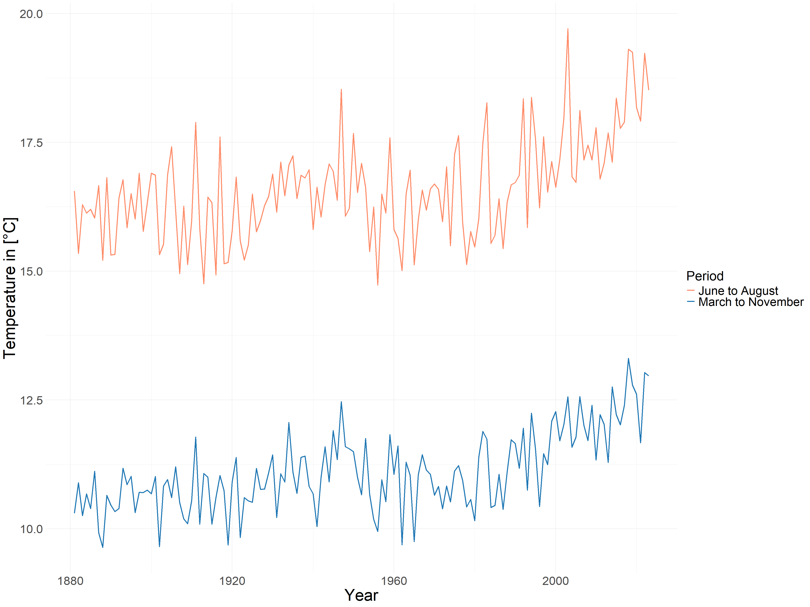
```

Now let's look at the precipitation in Figure \@ref(fig:AveragePrecipitation) , as a whole, there is no significant upward will downward trend in precipitation, it's very stable overall. In order to avoid misinterpretation, it should be noted that due to the different calculation methods, we cannot directly compare the amount of precipitation from March to November and from June to August because they have different time scales, and what we can compare is only the trend of both of them. Similarly, the amount of precipitation from March to November and June to August 2018 was very low.

```{r AveragePrecipitation, cache=FALSE, fig.cap = 'Average Precipitation in Germany from March to November and from June to August', out.width='70%', fig.align='center', echo=FALSE, eval = TRUE}
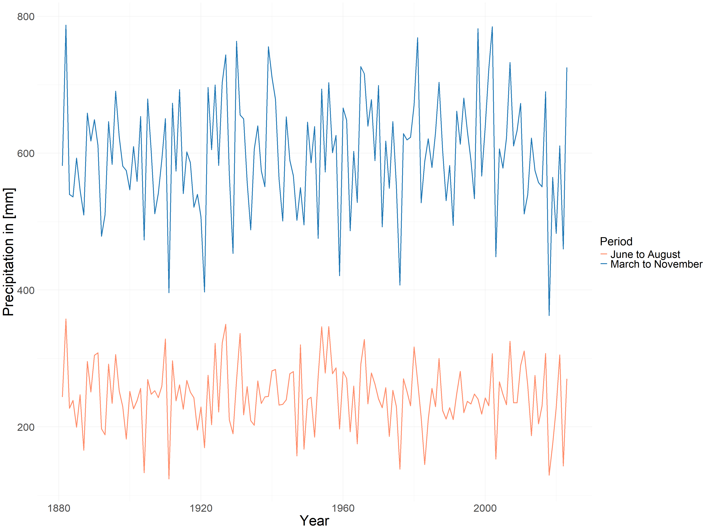
```

Now we understand the changes of these two variables over time, but based on the previous introduction to Copula we can know that real data cannot be put into the Copula model for computation directly, so we have to compute the cumulative distribution function. The empirical cumulative distribution function and the fitted normal cumulative distribution function were used simultaneously, and the results obtained are shown in Figure \@ref(fig:TemperatureCPD). and Figure \@ref(fig:PrecipitationCPD).

```{r TemperatureCPD, cache=FALSE, fig.cap = 'Cumulative Probability of Temperature', out.width='65%', fig.align='center', echo=FALSE, eval = TRUE}
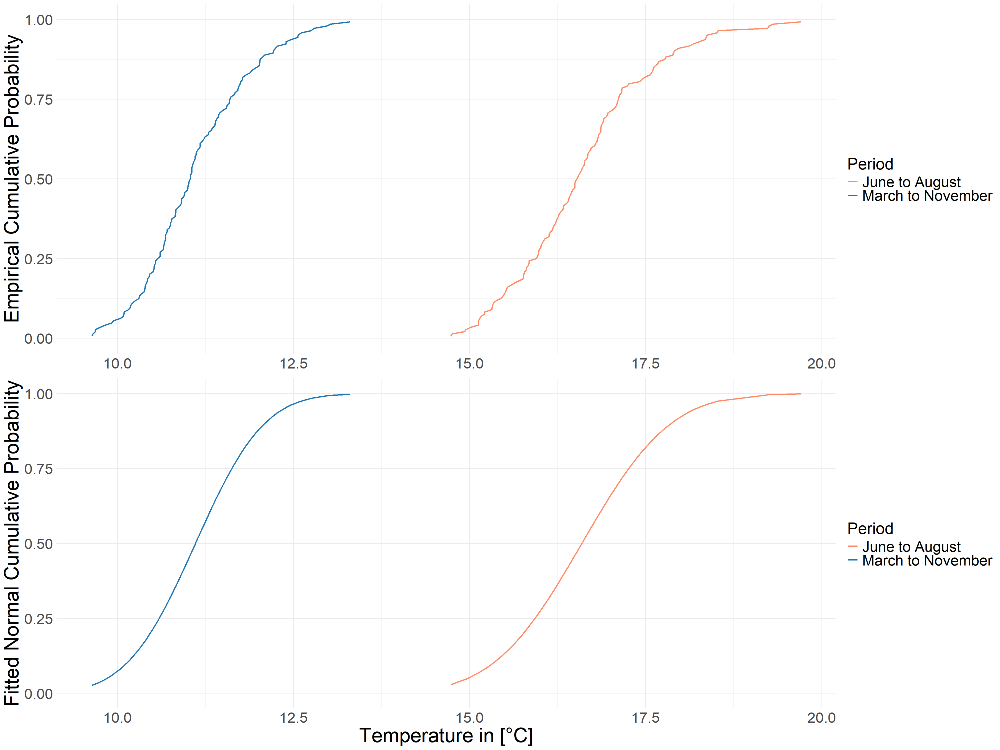
```

In Figure \@ref(fig:PrecipitationCPD), instead of using precipitation directly, we used negative precipitation, so the hottest and driest values mean that both our variables negative precipitation and temperature are at their maximum values, which is the reason why we introduce the Upper Tailed Dependence in 4.3.1.

```{r PrecipitationCPD, cache=FALSE, fig.cap = 'Cumulative Probability of -Precipitation', out.width='65%', fig.align='center', echo=FALSE, eval = TRUE}
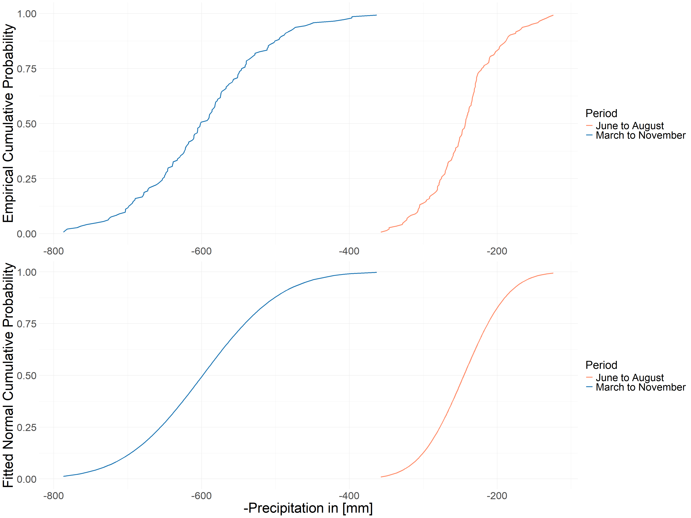
```
### Annual Global Mean Temperature Anomalies

In addition, we introduce annual global mean temperature anomalies to estimate global mean temperature (GMT), which captures the global climate trend over the last 143 years. As can be seen from the increasing and steeper shape of the lines in Figure \@ref(fig:gmt), global temperatures are really rising and at an increasing rate. However, the trends from June to August and March to November are very similar, suggesting that summers are not getting hotter faster compared to the entire growing season.

```{r gmt, cache=FALSE, fig.cap = 'Annual Global Mean Temperature Anomalies from March to November and from June to August', out.width='70%', fig.align='center', echo=FALSE, eval = TRUE}
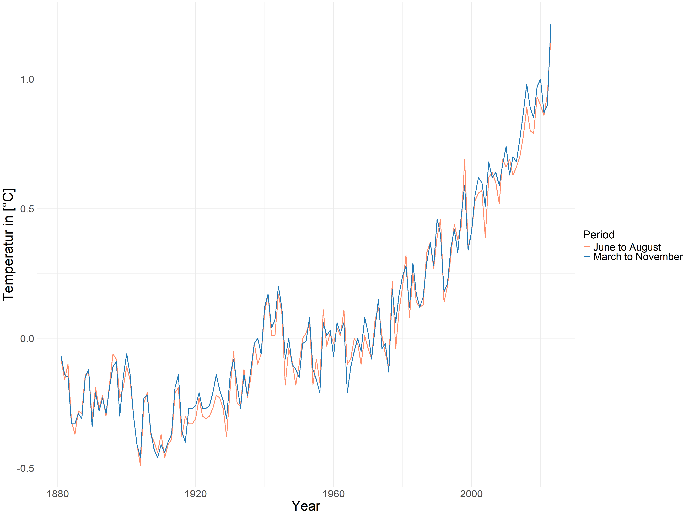
```

## Model
### Copula Models using Original data
```{r tab1, echo=FALSE}
data <- data.frame(
  NO1 = c("Anomalies", "", "", "Anomalies","", "", ""),
  NO2 = c("T", "-P", "Copula", "T", "-P", "Copula", "Utd"),
  EMP = c("-","-", "Survival Clayton(θ = 0.61)", "-", "-", "Joe(θ = 1.53)", 0.43),
  FIT=c("N(0, 0.5)", "N(0, 83)","Survival Clayton(θ = 0.56)","N(0, 0.55)","N(0, 84)","Survival Clayton(θ = 0.58)",0.30))
colnames(data) <- c("", "","EMP","FIT")
knitr::kable(data, caption = "Marginal distributions and copulas for Anomalies (March-November averages)")
```

Table \@ref(tab:tab1) shows the marginal distributions and copulas for observational data in March to November. The data in the first row is from paper and is only updated to 2019, the data in the second row is updated to 2023, it is easy to see that the addition of 4 new years of data doesn't change the distribution of the data too much, which makes sense since there are over 100 years as a base. As mentioned in 4.2, here we used “BiCopSelect()” in the R package VineCopula (@schepsmeier2018) for the model selection, it is possible to set different selection criteria in this function, and here we used the default criterion Akaike information criterion (AIC). Different Copula models were chosen in 2019 and 2023, but at least they are all Copula's that are suitable for capturing Utd as mentioned in 4.3.3, I extracted their Utd values for the 2023 model and we can see that the Utd for the 2023 Copula model based on the empirical marginal distribution is 0.3, and the Utd of the Copula model based on the fitted normal marginal distribution is 0.22, which is not particularly strong, but already suggests a Upper Tailed Dependence between hot and dry.

```{r tab2, echo=FALSE}
copula_data <- data.frame(
  shapeName = c("Baden-Württemberg", "Bayern", "Berlin", "Brandenburg", "Bremen", 
                "Hamburg", "Hessen", "Mecklenburg-Vorpommern", "Niedersachsen", 
                "Nordrhein-Westfalen", "Rheinland-Pfalz", "Saarland", "Sachsen", 
                "Sachsen-Anhalt", "Schleswig-Holstein", "Thüringen"),
  model = c("Tawn type 1", "Joe", "Joe", "Joe", "Joe", 
            "Joe", "Joe", "Joe", "Joe", "Joe", 
            "Survival Clayton", "Survival Clayton", "Survival Clayton", "Joe", 
            "Independence", "Joe"),
  tau = c(0.18, 0.15, 0.13, 0.14, 0.10, 0.10, 0.13, 0.13, 0.11, 0.12, 
          0.15, 0.13, 0.23, 0.17, 0.00, 0.14),
  p_value = c(5.791349e-03, 6.509076e-03, 2.402609e-02, 1.238229e-02, 5.150413e-01, 
              7.653586e-01, 3.576122e-02, 1.158248e-01, 2.974293e-01, 6.660326e-02, 
              2.074672e-02, 3.995117e-02, 2.459736e-05, 1.004252e-02, 4.435574e-01, 
              3.861971e-02),
  Utd = c(0.23, 0.30, 0.27, 0.29, 0.22, 0.21, 0.27, 0.26, 0.23, 0.26, 
          0.13, 0.10, 0.31, 0.33, 0.00, 0.29)
)
p_value_to_significance <- function(p) {
  if (p < 0.001) {
    "***"
  } else if (p < 0.01) {
    "**"
  } else if (p < 0.05) {
    "*"
  } else if (p < 0.1) {
    "."
  } else {
    " "
  }
}
copula_data$tau <- paste(copula_data$tau, sapply(copula_data$p_value, p_value_to_significance))
copula_data <- copula_data[, c("shapeName", "model", "tau", "Utd")]
knitr::kable(copula_data, 
             col.names = c("shapeName", "model", "tau", "Utd"),
             caption = "Best Copula Model (EMP) for different Bundesland (March to November)")
```
$$\text{Signif. codes: 0 ‘***’ 0.001 ‘**’ 0.01 ‘*’ 0.05 ‘.’ 0.1 ‘ ’ 1}$$

At the level of Germany as a whole, the Copula model is performing well, so next we'll look at the Bundesland. The data obtained from the empirical marginal distributions are shown in Table \@ref(tab:tab2), where we can see that Joe and Survival Clayton Copula are still chosen for most of the regions, and based on the tau it shows that there is a positive correlation between temperature and negative precipitation in almost all of the regions, i.e. a negative correlation between temperature and precipitation.  There is also a clear Upper Tailed Dependence in almost all of the Bundesländer. Only in Schleswig-Holstein precipitation and temperature are considered uncorrelated.

```{r tab3, echo=FALSE}
copula_data <- data.frame(
  shapeName = c("Baden-Württemberg", "Bayern", "Berlin", "Brandenburg", "Bremen", 
                "Hamburg", "Hessen", "Mecklenburg-Vorpommern", "Niedersachsen", 
                "Nordrhein-Westfalen", "Rheinland-Pfalz", "Saarland", "Sachsen", 
                "Sachsen-Anhalt", "Schleswig-Holstein", "Thüringen"),
  model = c("Gumbel", "t", "Survival Clayton", "Survival Clayton", "Joe", 
            "Joe", "Survival Clayton", "Joe", "Joe", "Survival Clayton", 
            "Survival Clayton", "Survival Clayton", "Gumbel", "Joe", 
            "Independence", "Joe"),
  tau = c(0.13, 0.15, 0.13, 0.14, 0.09, 0.09, 0.11, 0.11, 0.08, 0.11, 0.11, 
          0.09, 0.21, 0.14, 0.00, 0.11),
  p_value = c(5.791349e-03, 6.509076e-03, 2.402609e-02, 1.238229e-02, 5.150413e-01, 
              7.653586e-01, 3.576122e-02, 1.158248e-01, 2.974293e-01, 6.660326e-02, 
              2.074672e-02, 3.995117e-02, 2.459736e-05, 1.004252e-02, 4.435574e-01, 
              3.861971e-02),
  Utd = c(0.17, 0.09, 0.09, 0.11, 0.19, 0.19, 0.06, 0.24, 0.18, 0.07, 0.06, 
          0.03, 0.28, 0.29, 0.00, 0.23)
)
p_value_to_significance <- function(p) {
  if (p < 0.001) {
    "***"
  } else if (p < 0.01) {
    "**"
  } else if (p < 0.05) {
    "*"
  } else if (p < 0.1) {
    "."
  } else {
    " "
  }
}
copula_data$tau <- paste(copula_data$tau, sapply(copula_data$p_value, p_value_to_significance))
copula_data <- copula_data[, c("shapeName", "model", "tau", "Utd")]
knitr::kable(copula_data, 
             col.names = c("shapeName", "model", "tau", "Utd"),
             caption = "Best Copula Model (FIT) for different Bundesland for (March to November)")
```

$$\text{Signif. codes: 0 ‘***’ 0.001 ‘**’ 0.01 ‘*’ 0.05 ‘.’ 0.1 ‘ ’ 1}$$

In Table \@ref(tab:tab3), which shows the data obtained according to the fitted marginal distributions and compares the two tables, it can be seen that the tau values do not change much, that means the overall correlation between the variables does not change particularly much, regardless of which distribution is used. However, Utd seems to be very much affected, and the results of the comparison can be more visualized through Figure \@ref(fig:utdmap1).

```{r utdmap1, cache=FALSE, fig.cap = 'Upper Tail Dependence in different Bundesland from March to November (Original))', out.width='80%', fig.align='center', echo=FALSE, eval = TRUE}
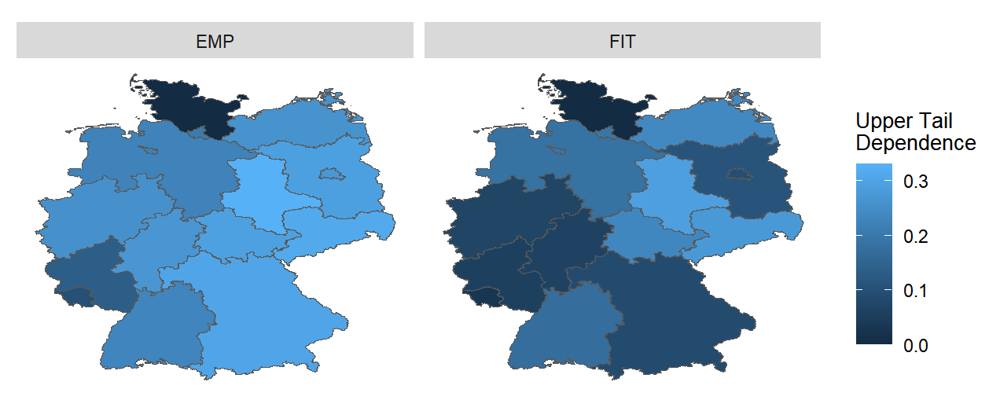
```

Only Sachsen-Anhalt, Sachsen and Mecklenburg-Vorpommern remain relatively high in UTD, with Bayern, Hessen, and the surrounding area all having low UTD. This result is very unpromising, as we have to use data obtained according to the fitted marginal distribution for subsequent studies. The reason for this result may be due to that the difference between the extreme values in the data and their closest values is also very large, and thus the probability that the parameter fit assigns an extreme value becomes smaller thus affecting the Utd. So we need to find ways to standardize the raw data even more.

### Copula Models using Anomalies
Now, we introduce the GMT, which estimated by annual global mean temperature anomalies, to process the raw data in order to remove the effect of global temperature change on regional temperature and precipitation. First we model GMT and temperature and precipitation with the simplest linear model to get the following two models, then we use the real data to subtract the estimates of temperature and precipitation from these two models to get the data we will use later, which we call Anomalies.
$$\text{Temperature} = 11 + 1.41 * \text{GMT} \tag{21}$$
$$\text{Precipitation} = 597.71 + 13.04 * \text{GMT} \tag{22}$$

With the new data, we can find that the selected models still all good at capturing Utd. And comparing the Utd values of the two sets of models in \@ref(tab:tab1) and \@ref(tab:tab4), it is easy to see that the Copula model using Anomalies has improved.

```{r tab4, echo=FALSE}
data <- data.frame(
  NO1 = c("Anomalies", "", "", "Anomalies","", "", ""),
  NO2 = c("T", "-P", "Copula", "T", "-P", "Copula", "Utd"),
  EMP = c("-","-", "Survival Clayton(θ = 0.61)", "-", "-", "Joe(θ = 1.53)", 0.43),
  FIT=c("N(0, 0.5)", "N(0, 83)","Survival Clayton(θ = 0.56)","N(0, 0.55)","N(0, 84)","Survival Clayton(θ = 0.58)",0.30))
colnames(data) <- c("", "","EMP","FIT")
knitr::kable(data, caption = "Marginal distributions and copulas for Anomalies (March-November averages)")
```

Then looking again to Bundesland, in \@ref(tab:tab5) both tau and Utd have improved with respect to the previous data in \@ref(tab:tab2), and even in Schleswig-Holstein now shows a correlation between the two variables.

```{r tab5, echo=FALSE}
copula_data <- data.frame(
  shapeName = c("Baden-Württemberg", "Bayern", "Berlin", "Brandenburg", "Bremen", 
                "Hamburg", "Hessen", "Mecklenburg-Vorpommern", "Niedersachsen", 
                "Nordrhein-Westfalen", "Rheinland-Pfalz", "Saarland", "Sachsen", 
                "Sachsen-Anhalt", "Schleswig-Holstein", "Thüringen"),
  model = c("Survival Clayton", "Joe", "Survival Clayton", "Survival Clayton", "Survival Clayton", 
            "Joe", "Joe", "Survival Clayton", "Survival Clayton", "Survival Clayton", 
            "Survival Clayton", "Survival Clayton", "Survival Clayton", "Joe", 
            "Survival Clayton", "Joe"),
  tau = c(0.24, 0.27, 0.20, 0.20, 0.16, 0.17, 0.20, 0.16, 0.19, 0.22, 
          0.22, 0.22, 0.27, 0.22, 0.13, 0.24),
  p_value = c(7.600396e-05, 3.970754e-06, 2.324112e-04, 1.002062e-03, 6.712275e-02, 
              3.139799e-02, 4.275240e-03, 3.638034e-02, 1.379104e-02, 2.792055e-03, 
              5.244042e-04, 1.838429e-04, 1.974426e-06, 3.008366e-04, 1.311173e-01, 
              1.691094e-04),
  Utd = c(0.34, 0.48, 0.26, 0.26, 0.16, 0.33, 0.38, 0.16, 0.22, 0.29, 
          0.30, 0.30, 0.40, 0.42, 0.10, 0.44)
)
p_value_to_significance <- function(p) {
  if (p < 0.001) {
    "***"
  } else if (p < 0.01) {
    "**"
  } else if (p < 0.05) {
    "*"
  } else if (p < 0.1) {
    "."
  } else {
    " "
  }
}
copula_data$tau <- paste(copula_data$tau, sapply(copula_data$p_value, p_value_to_significance))
copula_data <- copula_data[, c("shapeName", "model", "tau", "Utd")]
knitr::kable(copula_data, 
             col.names = c("shapeName", "model", "tau", "Utd"),
             caption = "Best Copula Model (EMP) for different Bundesland (March to November Anomalies)")
```
$$\text{Signif. codes: 0 ‘***’ 0.001 ‘**’ 0.01 ‘*’ 0.05 ‘.’ 0.1 ‘ ’ 1}$$

In \@ref(tab:tab6), the overall lowering of UTD has also become smaller, but Rheinland-Pfalz and Saarland, while still maintaining kendalls tau, have lost Utd, but this is much more acceptable compared to the previous overall sharp fall.

```{r tab6, echo=FALSE}
copula_data <- data.frame(
  shapeName = c("Baden-Württemberg", "Bayern", "Berlin", "Brandenburg", "Bremen", 
                "Hamburg", "Hessen", "Mecklenburg-Vorpommern", "Niedersachsen", 
                "Nordrhein-Westfalen", "Rheinland-Pfalz", "Saarland", "Sachsen", 
                "Sachsen-Anhalt", "Schleswig-Holstein", "Thüringen"),
  model = c("Survival Clayton", "Joe", "Survival Clayton", "Survival Clayton", "Tawn type 1", 
            "Survival Clayton", "Survival Clayton", "Survival Clayton", "Survival Clayton", 
            "Survival Clayton", "BB8", "BB8", "Survival Clayton", "Joe", 
            "Survival Clayton", "Joe"),
  tau = c(0.23, 0.26, 0.20, 0.19, 0.06, 0.17, 0.19, 0.16, 0.17, 0.20, 
          0.23, 0.22, 0.27, 0.22, 0.12, 0.22),
  p_value = c(7.600396e-05, 3.970754e-06, 2.324112e-04, 1.002062e-03, 6.712275e-02, 
              3.139799e-02, 4.275240e-03, 3.638034e-02, 1.379104e-02, 2.792055e-03, 
              5.244042e-04, 1.838429e-04, 1.974426e-06, 3.008366e-04, 1.311173e-01, 
              1.691094e-04),
  Utd = c(0.31, 0.47, 0.25, 0.24, 0.07, 0.18, 0.24, 0.15, 0.18, 0.24, 
          0.00, 0.00, 0.38, 0.41, 0.07, 0.41)
)
p_value_to_significance <- function(p) {
  if (p < 0.001) {
    "***"
  } else if (p < 0.01) {
    "**"
  } else if (p < 0.05) {
    "*"
  } else if (p < 0.1) {
    "."
  } else {
    " "
  }
}
copula_data$tau <- paste(copula_data$tau, sapply(copula_data$p_value, p_value_to_significance))
copula_data <- copula_data[, c("shapeName", "model", "tau", "Utd")]
knitr::kable(copula_data, 
             col.names = c("shapeName", "model", "tau", "Utd"),
             caption = "Best Copula Model (FIT) for different Bundesland (March to November Anomalies)")
```
$$\text{Signif. codes: 0 ‘***’ 0.001 ‘**’ 0.01 ‘*’ 0.05 ‘.’ 0.1 ‘ ’ 1}$$
As can also be seen in Figure \@ref(fig:utdmap2), the differences in EMP and FIT-related data between Sachsen and Sachens Anhalt are still relatively small, while the differences in regions such as Bayern and Thuringen are not as clearly visible as they were in Figure \@ref(fig:utdmap1).

```{r utdmap2, cache=FALSE, fig.cap = 'Upper Tail Dependence in different Bundesland from March to November (Anomalies))', out.width='80%', fig.align='center', echo=FALSE, eval = TRUE}
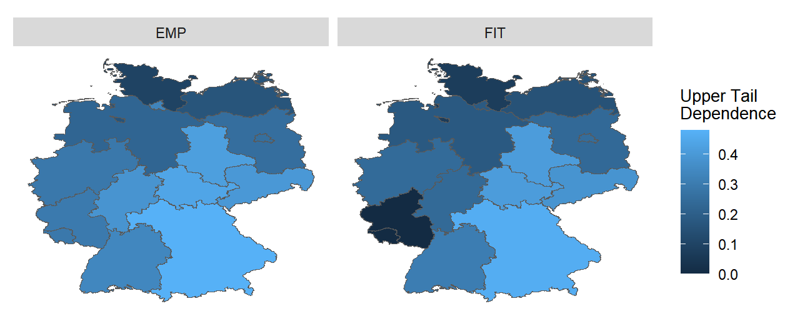
```

When we look at the data from June to August only, we can see that the situation is very similar to that of March to November, and Anomalies can be also very helpful.

## Rarity of 2018
### From March to November
Next we use the model as a basis to study hot and dry, and here we need to review the four hazard scenarios mentioned in 4.3.4 and follow the criteria from @zscheischler2020, i.e by using the 2018 data as threshold to calculate the $\text{P}_\text{AND}$, $\text{P}_\text{OR}$, $\text{P}_\text{K}$ and $\text{P}_\text{SK}$.

```{r result1, cache=FALSE, fig.cap = 'Rarity of 2018 for whole Germany from March to November', out.width='80%', fig.align='center', echo=FALSE, eval = TRUE}
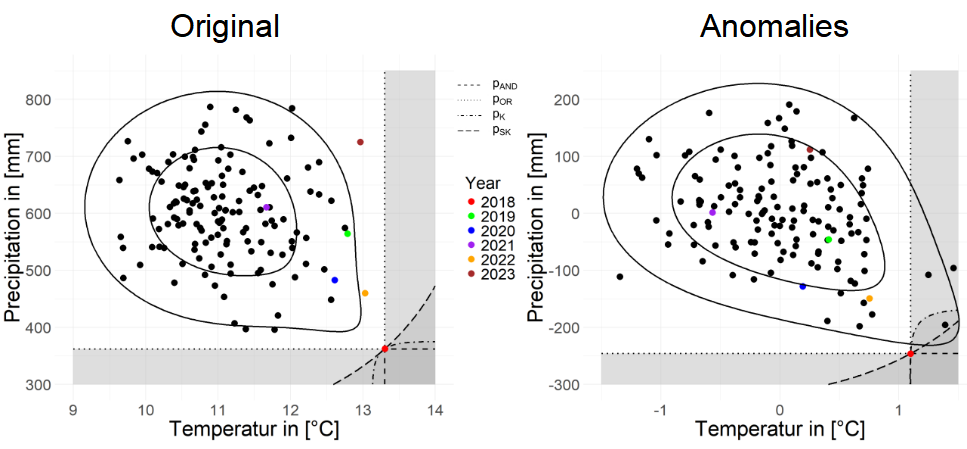
```
Each point in Figure \@ref(fig:result1) represents one year, 2018 as threshold is marked with a red point, while each year after 2018 is represented by other different colors, respectively. The contour lines are plotted according to the fitted copula model mentioned earlier and illustrate the copula at the levels 0.001 and 0.0001. The 4 different types of dotted lines and their corresponding shaded parts here represent the 4 hazard scenarios. We can see that the intersection of the four dotted lines is the point of the 2018 data. The left figure uses original data and the right figure uses Anomalies.
Looking at the figure of the original data, 2018 is indeed unquestionably the driest and hottest, and no other year can touch any of the four hazard scenarios. But when we look at the Anomalies data, we can find that 2018 is no longer the hottest year, which suggests that the high temperatures in Germany in 2018 were largely influenced by global heat. There were other years that came into the hazard scenario, but none of them are recent years.
Looking at the points for the most recent years of original data, we see that temperatures in 2022 and 2023, while not part of any hazardous scenarios, are higher than all other years except 2018. 2023 is relatively very wet, but 2022 is also relatively dry, in line with what the @wmo2023b said in its report about the European state for 2022. But the high temperatures in Germany in the past two years have also been largely influenced by the global heat.

```{r result2, cache=FALSE, fig.cap = 'Rarity of 2018 for Bundesland from March to November', out.width='80%', fig.align='center', echo=FALSE, eval = TRUE}
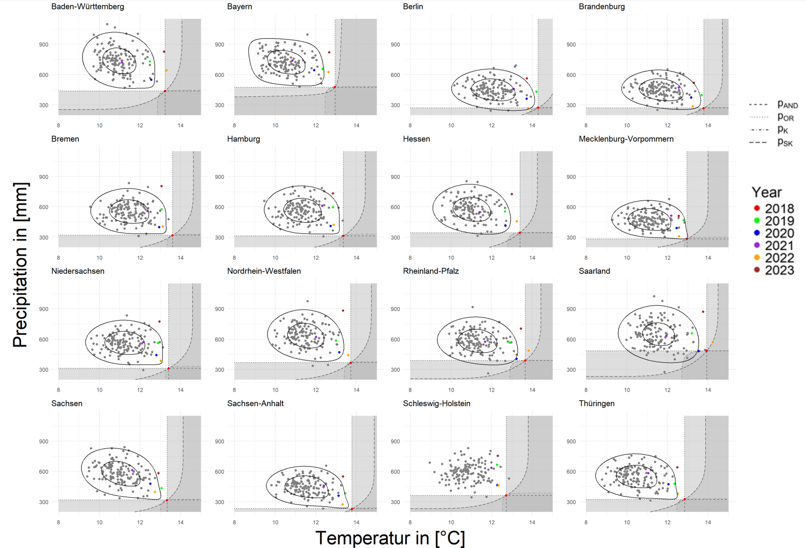
```

Moving on to the situation in all Bundesland, we can see in Figure \@ref(fig:result2) that 2018 can be an special year for all Bundesland from the original data point of view, there may be some regions that will have other years that exceed 2018 on one single variable, but in general, 2018 was still a very hot and dry year. 2022 was very hot for many regions, and for Baden the last two years have both been very hot. Also we can notice that the three states of Berlin, Brandenburg and Sachsen Anhalt, as we learned from the map in 4.4.1, are the three hottest and driest states.
When looking at the Anomalies data, there is a large amount of data that appears in the shadow of hazard scenarios, and even in parts of the country there are years that are drier as well as hotter than 2018, and this can be seen especially in Saarland, but in none of region has a situation in recent years that was hotter and drier than 2018.

```{r result3, cache=FALSE, fig.cap = 'Rarity of 2018 for Bundesland from March to November (Anomalies)', out.width='80%', fig.align='center', echo=FALSE, eval = TRUE}
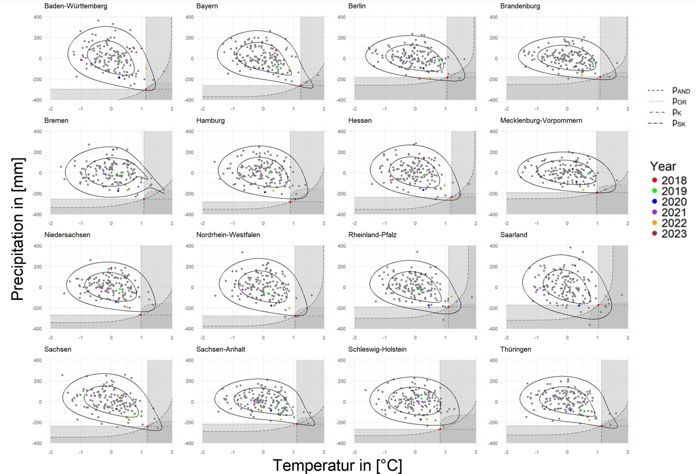
```

When looking at the Anomalies data in Figure \@ref(fig:result3), there is a large amount of data that appears in the shadow of hazard scenarios, and even in parts of the country there are years that are drier as well as hotter than 2018, and this can be seen especially in Saarland, but in none of region has a situation in recent years that was hotter and drier than 2018.

Saarland has a Utd of 0 in the Anomalies data. Looking at the figure in more detail, we can see that there is a lot of data for either dry-only or hot-only conditions. This makes the distribution of data in the bottom-right corner to be less concentrated and may lead to the driest and hottest conditions here being not significant. Sachsen - Anhalt is the Bundesland with a very strong Utd in the table, it is also clear in the graph that the values here close to 2018, although not as many as Saarland, are more concentrated and better able to fulfil both hot and dry.

### From June to August
```{r result4, cache=FALSE, fig.cap = 'Rarity of 2018 for whole Germany from June to August', out.width='80%', fig.align='center', echo=FALSE, eval = TRUE}
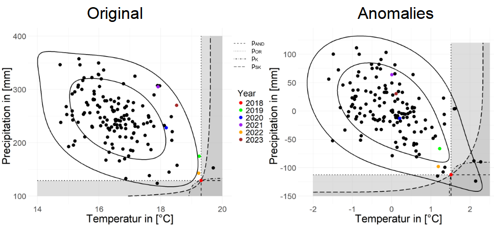
```

Next let's look at the summer in Figure \@ref(fig:result4),  we are surprised to find that the model for original data seems to capture a stronger LTD compared to Utd, but this makes sense, especially for hotter summers where high precipitation can have a significant cooling effect. The good thing is that the model for Anomalies data is still good at capturing Utd.

```{r result5, cache=FALSE, fig.cap = 'Rarity of 2018 for Bundesland from June to August', out.width='80%', fig.align='center', echo=FALSE, eval = TRUE}
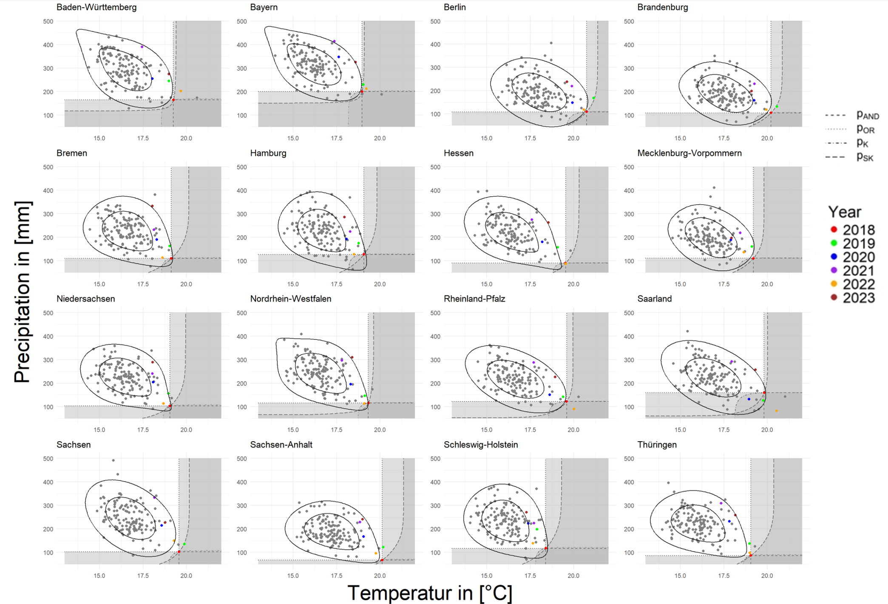
```

```{r result6, cache=FALSE, fig.cap = 'Rarity of 2018 for Bundesland from June to August (Anomalies)', out.width='80%', fig.align='center', echo=FALSE, eval = TRUE}
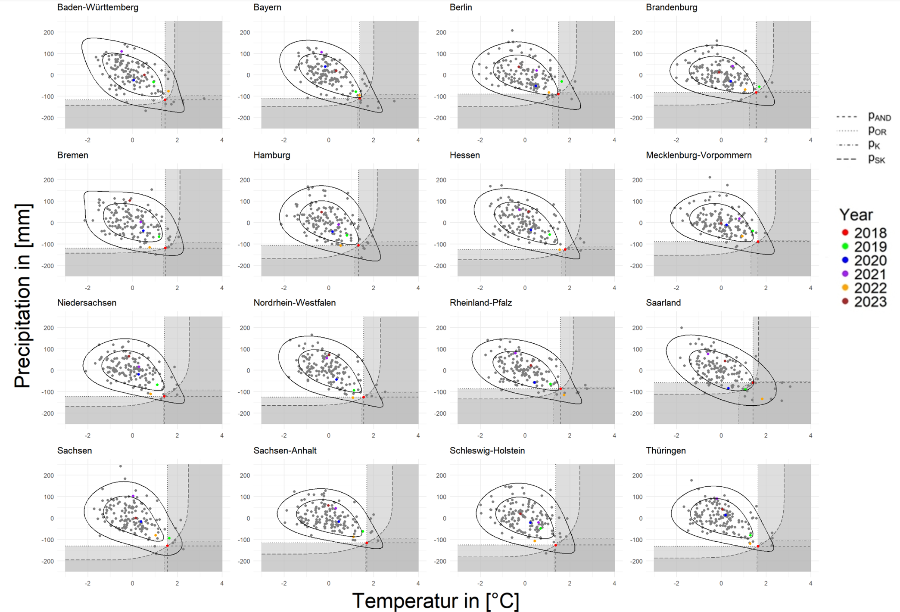
```

Turning to Bundesland in Figure \@ref(fig:result5) and Figure \@ref(fig:result6), it seems that many models of the Bundesland cannot capture Utd well over the summer. However, when we use Anomalies the situation immediately improves, with significantly stronger Utd in all areas except Saarland. So let's take a closer look at Saarland, there are more extremes in Saarland in the summer compared to March to November, but it may be that the number of extremes is just too high, leading instead to the fact that in the hottest and driest regions, there is still a very unfocussed distribution of data. In contrast, Sachensen Anhalt, although the extremes are still less, are tightly distributed in the lower right corner, favouring the finding of stronger Utd.

## Prediction
We also make a prediction to see if a hot and dry climate like 2018 will continue to happen in the future, here we first fit Copula with Anomalies data and then predict the final temperature and precipitation data through the model in 4.5.2. For each of these sets we generate 10,000 sets of data. Due to global Warming is the trend of climate change nowadays, so we use use 5 sets of GMT increasing from 0, which are 0, 1, 1.5, 2, and 3. And the red dots in the graph still represent the data of 2018.

```{r prediction1, cache=FALSE, fig.cap = 'Prediction for whole Germany', out.width='80%', fig.align='center', echo=FALSE, eval = TRUE}
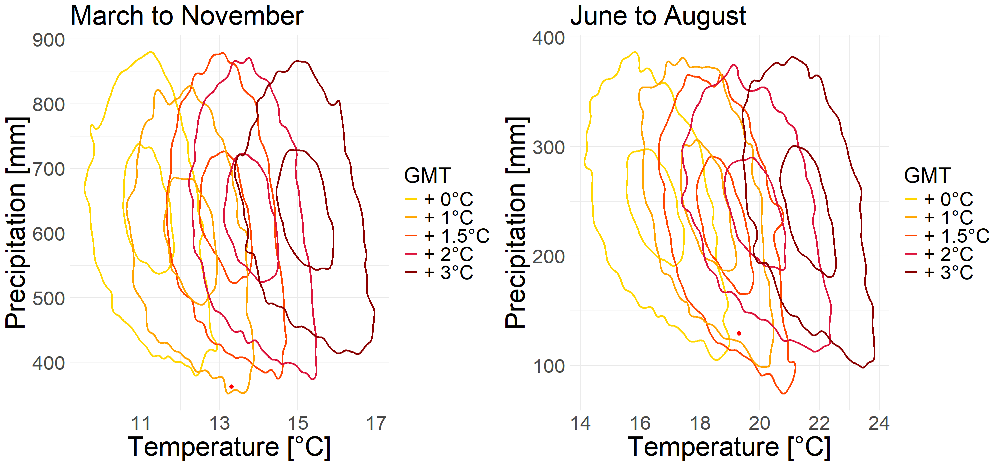
```

We can see in Figure \@ref(fig:prediction1) that for the months of March to November the dry and hot situation is actually unlikely to occur. These contour lines show an overall upward trend, which indicates that in the warmer temperatures at the same time precipitation will actually rise, so the two extremes will not happen at the same time. But for June to August the situation changes completely, while the weather becomes hot, the precipitation also shows a downward trend, so for the summer, the two extremes are likely to occur together.

```{r prediction2, cache=FALSE, fig.cap = 'Prediction for Bundesland from March to November', out.width='80%', fig.align='center', echo=FALSE, eval = TRUE}
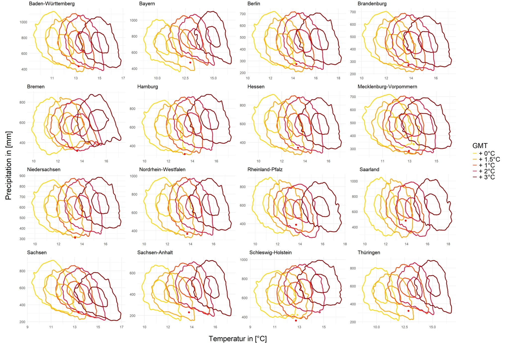
```

```{r prediction3, cache=FALSE, fig.cap = 'Prediction for Bundesland from March to November', out.width='80%', fig.align='center', echo=FALSE, eval = TRUE}
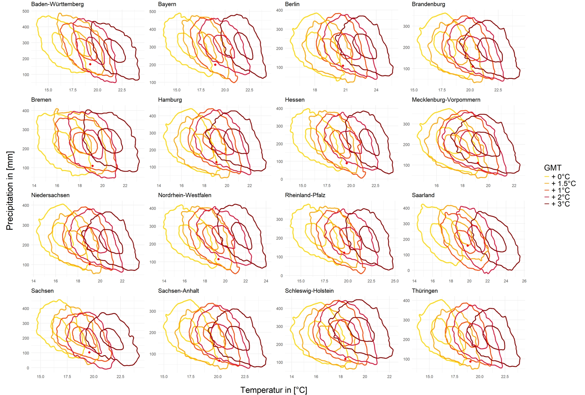
```

And in Figure \@ref(fig:prediction2) and Figure \@ref(fig:prediction3) for the bundesland the general trend is the same, in the simulation from March to November only the two Bundesland of Baden and Sachensen show a trend that precipitation also decreases when the temperature increases, the others tend to have more precipitation. For the months of June to August too, most of the Bundesland shows the same trend as the whole of Germany, only Schleswig shows the opposite trend, i.e. more precipitation. But there are some Bundesland where the precipitation doesn't seem to have changed significantly such as Bremen, Harmburg and so on.

## Conclusion
There are many types of Copula models, each capturing different features of the data. The selection of a model needs to capture as many features of the data as possible while preventing overfitting. In this study, we use the “BiCopSelect()” function and its default criteria AIC to do model selection.

A positive Upper Tail Dependence between temperature and negative precipitation was found both in March to November and June to August in whole Germany.  However, when we look at Bundesland, there are many different situations that occur; some Bundesland consistently show high values of Utd, such as Sachsen-Anhalt and Sachsen, and some Bundesland's values of Utd are greatly reduced by the use of fitted marginal distributions, such as Bayern and Hessen. Introducing GMT and removing the effect of global temperature changes on temperature and humidity changes in Germany can reduce the lowering of Utd values by fitting marginal distributions, which is valid for the German data as a whole and many Bundesland, but there are exceptions. 

If we consider only the actual temperatures and precipitation, 2018 was the hottest and driest year in Germany since 1881, and in almost all Bundesland states as well. The situation changes if the influences of global temperature changes are excluded. This is not only true for 2018, but also for all the hot years in recent years, which suggests that all regions of Germany have been affected by the global heat in recent years in no small way.

Hot and dry climates like 2018 in March to November will be difficult to come in the future in Germany, even though the global climate may continue to warm, but at the same time precipitation will increase. But if we only look at the summer months, similar situations may occur frequently in Germany.  This conclusion also stands for most of Bundesland, but not all of them. It is worth noting that this prediction is very dependent on the relationship between GMT and the variables.
