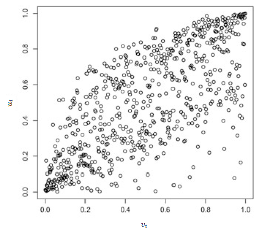

---
output:
  pdf_document: default
  html_document: default
---
# Asymmetric bivariate copulas for compounds {#ac}

*Author: Claudia Rettenbeck*

*Supervisor: Henri Funk*

```{r, echo=FALSE, include=FALSE, message=FALSE, warning=FALSE}
library(knitr)
library(kableExtra)
```

## Introduction {#intro}

There are different definitions of compound events. In this chapter (i.e. chapter \@ref(ac)), a compound event is defined as an extreme event, which is caused by at least two climate variables (e.g. hydrological variables such as river discharge). Thus, the question of how to model the interplay of several climate variables by means of their multivariate distribution arises. Answering this question lays the basis for modelling compound events, which can, but don't have to, arise from this interplay. After having briefly presented the definition of \(d\)-variate copulas in section \@ref(defcop), this chapter focuses on the interplay of *two* random variables. One approach for modelling multivariate cumulative distribution functions is based on copulas. According to Sklar's theorem, the joint cumulative distribution function of two univariate random variables can be modelled by combining its marginals with a copula (see section \@ref(skl) for details). As @genest2007 state, an appropriate model for the dependence structure, which is determined by the copula, can therefore be selected independently from the choice of the marginals, which is advantageous in modelling. Since in this chapter, the focus is on modelling the interplay of two random variables by means of their multivariate distribution via the copula approach, it is possible to further narrow the focus to modelling the dependence structure of these random variables, which will be done in the following. In particular, this chapter concentrates on a specific type of dependence, namely asymmetric dependence. This is relevant for climate research since there are climate variables whose dependence structure is characterized by asymmetry, i.e. the corresponding random variables are asymmetrically dependent (see section \@ref(asymVsSym) for details). For instance, the sections \@ref(asymVsSym) and \@ref(exAppl) show that the monthly average flow rates (flow rates measure river discharge) of the rivers Inn and Danube can be considered asymmetrically dependent (where the data set presented in the sections \@ref(asymVsSym) and \@ref(exAppl) is used to draw this conclusion). Thus, when modelling the dependence structure of two climate variables, the assumption of symmetry, which is made when using most classical copulas (see @genest2013, p. 92), might be too restrictive. Therefore, the goal of this chapter is to lay the theoretical foundation for recognizing and modelling asymmetric dependence between two random variables. There are several approaches for modelling this kind of dependence structure by means of copulas. Due to its scope, this chapter focuses on Archimax copulas as modelling approach, but the interested reader may be referred to chapter 5.4 in @genest2013 for an overview of modelling approaches based on bivariate copulas. Moreover, following a large part of the relevant literature, from section \@ref(asymVsSym) onwards, the focus lies on the asymmetric dependence of *continuous* random variables.    

While theoretically, a compound event could arise from non-extreme events, climate research often  defines compound events via the interplay of extreme events. Thus, while this chapter lays the theoretical foundation for modelling compound events defined according to a broader definition, chapter \@ref(ce) presents a stricter version of this definition, which is often used in climate research.

The remainder of this chapter proceeds as follows: Section \@ref(backgrcop) provides theoretical background on copulas in general, where also the distinction between symmetric and asymmetric copulas is established. Section \@ref(backgrmeas) covers theoretical background on measures of asymmetry in a copula and presents an application of a selection of these asymmetry measures to hydrological data. Section \@ref(archi) covers Archimax copulas. Specifically, it defines Archimax copulas, presents well-known special cases of these copulas and explains their asymmetry property. The asymmetry property is not the only relevant property of Archimax copulas (for instance, the fact that an Archimax copula can be constructed with a predetermined extreme value attractor (see @caperaa2000 for details) represents another property, which might be interesting in the context of the climate crisis). Due to the scope of this chapter however, the focus is on the property most relevant to it, i.e. the asymmetry property. Finally, section \@ref(concl) concludes.

## Theoretical background on copulas {#backgrcop}

### Definition of d-variate copulas and the special case of bivariate copulas {#defcop}

Following @durante2016 (p. 10), copulas can be defined as follows: A \(d\)-dimensional copula \(C\), i.e. a \(d\)-variate copula, is a \(d\)-dimensional cumulative distribution function concentrated on \([0,1]^d\) with univariate marginals which are uniformly distributed on \([0,1]\), where \(d \geq 2\). Thus, as stated by @durante2016 (p. 10), \(C\) assumes values on \(\mathbb{R}^d\). However, in the literature, \(C\) is frequently defined as a function with domain \([0,1]^d\) and range \([0,1]\), such that \(C\) can be described by \(C: [0,1]^d \to [0,1]\) (see e.g. @durante2010a and @klement2006). According to @durante2016 (p. 10), this can be attributed to the fact that \(C\) concentrates the probability distribution on \([0,1]^d\) and therefore the values \(C\) assumes on \(\mathbb{R}^d \setminus [0,1]^d\) are usually not specified.

@durante2016 (p.11) further remark that a random vector \(\mathbf{U}\) (defined on a suitable probability space) corresponds to each copula \(C\) such that the joint cumulative distribution function of \(\mathbf{U}\) is \(C\).

The previous paragraph defines copulas based on their probabilistic interpretation. According to @durante2016 (p. 14), copulas can also be defined in terms of their analytical properties, where the probabilistic and the analytical definition are equivalent:

A function \(C: [0,1]^d \to [0,1]\) is a \(d\)-variate copula if and only if the following holds:

i) \(C\) is \(d\)-increasing,

ii) \(C(u_1, \ldots,u_d) = 0 \) if \(u_k = 0\) for at least one \(u_k \in \{u_1, \ldots, u_d\}\),

iii) \(C(1, \ldots, 1, u_k, 1, \ldots, 1) = u_k\), where the left-hand side of the equation means that all arguments equal 1 except possibly for the \(k\)th one, which can assume any value in \([0,1]\).

@durante2016 (p. 14) point out that ii) and iii) are called boundary conditions, where ii) means that \(C\) is grounded (also named anchored) and iii) shows that \(C\) has univariate marginals which are uniform on \([0,1]\).

Since this chapter focuses in the following on bivariate copulas, the expression \(d\)-increasing is not explained in full generality here. Instead an explanation will be provided for the special case of \(d=2\) in the subsequent paragraph. For a more general explanation, see @durante2016 (p.7).

For \(d=2\), the definition above can be translated to (see @durante2016, p.15 as well as @nelsen2006, p. 8 and p. 10): A function \(C: [0,1]^2 \to [0,1]\) is a \(2\)-variate copula if and only if the following holds:

i) \(C\) is \(2\)-increasing, meaning that for all \(a_1, a_2, b_1, b_2 \in [0,1]\), where \(a_1 \leq a_2\) and \(b_1 \leq b_2\), it holds that:
\(C(a_1, b_1) - C(a_1, b_2) - C(a_2, b_1) + C(a_2, b_2) \geq 0\),

ii) \( C(0,v) = C(u,0) = 0 \quad \forall u,v \in [0,1]\),

iii) \( C(1,v) = v\) and \(C(u,1) = u \quad \forall u,v \in [0,1]\).

Note that the names \(2\)-variate copula and bivariate copula are used as synonyms in this chapter.

### Sklar's theorem and the probability integral transformation {#skl}

According to @durante2016 (p. 42), Sklar's theorem states that *any* multivariate cumulative distribution function can be expressed in terms of a copula and its univariate marginals. Specifically, let \((X, Y)\) be a bivariate random vector on a probability space \((\Omega, \mathcal{F}, \mathbb{P})\). Moreover, \( H(x, y) := \mathbb{P}(X \leq x, Y \leq y)\) denotes the joint cumulative distribution function  of \((X, Y)\), where \(F(x) = \mathbb{P}(X \leq x)\) and \(G(y) = \mathbb{P}(Y \leq y)\) represent the marginals of \(H\). Then, there exists a bivariate copula \(C = C_{X,Y}\) such that it holds that

\begin{equation}
H(x,y) = C(F(x), G(y)) \quad \forall (x, y) \in \mathbb{R}^2,
(\#eq:sklar)
\end{equation}

where the copula \(C\) is unique, if the marginals \(F\) and \(G\) are continuous.

Note that Sklar's theorem can be generalized to \(d-\)variate copulas easily, where \(d > 2\) (see @durante2016, p.42 for details), but since this chapter focuses on bivariate copulas, also the version of Sklar's theorem presented here is described for the bivariate case.

For the case of continuos marginals, on which this chapter focuses from section \@ref(asymVsSym) onwards, the probability integral transformation plays an important role in understanding Sklar's theorem. Let \(\tilde{X}\) be a random variable on \((\Omega, \mathcal{F}, \mathbb{P})\) with continuous cumulative distribution function \(\tilde{F}\). Then, \(\tilde{F} \circ \tilde{X}\) is called the probability integral transformation and it can be shown that \(\tilde{F} \circ \tilde{X}\) is uniformly distributed on \([0,1]\) (see @durante2016, pp. 5-6). As @durante2016 (p. 6) note, this means that transforming a random variable by its continuous cumulative distribution function always leads to a random variable that follows the standard uniform distbribution, whereas transforming each component of a random vector by its continuous univariate cumulative distribution function can result in multivariate distributions that differ from the multivariate standard uniform distribution. This can be seen from the proof of equation \@ref(eq:sklar) given in @durante2016 (p. 43) for continuous marginals \(F\) and \(G\), which moreover explains the connection between Sklar's theorem and the probabilistic definition of copulas. The proof requires rewriting \(H(x,y)\) for all \((x, y) \in \mathbb{R}^2\) as follows:

\begin{equation*}
\begin{split}
H(x,y) 
&= \mathbb{P}(X \leq x, Y \leq y) \\
&= \mathbb{P}(F(X) \leq F(x), G(Y) \leq G(y)) \\
&= \mathbb{P}(U \leq F(x), V \leq G(y)),
\end{split}
\end{equation*}

where \(U := F(X)\) and \(V := G(Y)\).
It can be seen from the description of the probability integral transformation above that \(U\) and \(V\) are uniformly distributed on \([0,1]\). As a consequence, the cumulative distribution function of \((U,V)\) has uniform univariate marginals on \([0,1]\), from which it follows that this cumulative distribution function is a copula (see probabilistic definition in section \@ref(defcop)). Therefore, \(\mathbb{P}(U \leq F(x), V \leq G(y))\) can be written as \(C(F(x), G(y))\) (recall that \(C\) denotes a copula). Thus, it has been shown that \(H(x,y)=C(F(x), G(y))\).

If \(H\) is absolutely continuous, then the density \(h\) corresponding to \(H\) can be written in terms of the density \(c\) of the copula \(C\). Specifically, \(h\) is given for almost all \((x,y) \in \mathbb{R}^2\) by

\begin{equation}
h(x, y)=c(F(x), G(y)) \cdot f(x) \cdot g(y),
(\#eq:sklardens)
\end{equation}

where \(F\) and \(G\) are the univariate marginals (as above) with the corresponding densities being denoted by \(f\) and \(g\), respectively (see @durante2016, p. 42).

### Distinction between symmetric and asymmetric copulas {#asymVsSym}
There are different forms of symmetry. Among them are exchangeability, radial symmetry and joint symmetry, where radial symmetry is also called reflection symmetry (see @durante2016, pp. 30-33). In line with that, @genest2013 (p. 92) note that in the copula literature, the term symmetry can refer to both exchangeability and radial symmetry. However, following the majority of the relevant literature on Archimax copulas reviewed, this chapter defines a copula as symmetric if and only if it is exchangeable.

According to @durante2016 (pp. 30-31), it can be shown that when the cumulative distribution function \(C\) of the random vector \((U,V)\) on a probability space \((\Omega, \mathcal{F}, \mathbb{P})\) is a copula, also the cumulative distribution function \(\tilde{C}\) of \((V,U)\) is a copula. Then, the bivariate copula \(C\) is defined as being exchangeable if

\begin{equation}
C=\tilde{C}.
(\#eq:defsymmgen)
\end{equation}

Note that the definition of exchangeability presented above can be generalized to \(d\)-variate copulas. This generalization is based on the concept of a  symmetry and in particular the group of symmetries under the operation of composition. This group includes permutations (see @durante2016, pp. 30-31 for details), on which the definition above is based.

In the bivariate case, on which this chapter focuses, this translates to a copula being exchangeable if 

\begin{equation}
C=C^T,
(\#eq:defsymm)
\end{equation}

where \(C^T(u,v) = C(v,u)\) for all \((u,v) \in [0,1]^2\), i.e. \(C^T\) is the copula that results from permuting \(C\)'s arguments, and \(C^T\) is also called the transpose of \(C\) (see @durante2016, p. 31).

Thus, a slightly different form of definition \@ref(eq:defsymm) one often finds in the literature is that a copula is exchangeable if (see e.g. @genest2013, p. 92)

\begin{equation}
C(u,v)=C(v,u) \quad \forall (u,v) \in [0,1]^2.
(\#eq:defsymm2)
\end{equation}

Asymmetry is then defined via non-symmetry, i.e. when equation \@ref(eq:defsymm2) is not fullfilled for some \((u,v) \in [0,1]^2\), the copula \(C\) is non-exchangeable, which, as explained above, is defined as being equivalent to asymmetric in this chapter (see @genest2013, p. 92).

From now on, this chapter (i.e. chapter \@ref(ac)) focuses on continuous random variables, meaning that the random variables, whose univariate cumulative distribution functions enter the copula, are continuous. For instance, for the setting, which has been defined for equation \@ref(eq:sklar), this means that \(X\) and \(Y\) are restricted to being continuous random variables for the rest of chapter \@ref(ac). Recall from Sklar’s theorem that any cumulative distribution function can be expressed in terms of a copula and its univariate marginals and that the copula \(C\) is unique if the marginals \(F\) and \(G\) are continuous. Thus, as described in equation \@ref(eq:sklar), the cumulative distribution function \(H(x, y)\) can be written as \(H(x, y)=C(F(x), G(y))\) for all \((x, y) \in \mathbb{R}^2\) (for details and definitions see section \@ref(skl)). From equation \@ref(eq:defsymm2), we know that the copula \(C\) is then, symmetric if \(C(F(x), G(y)) = C(G(y), F(x))\) for *all* \((F(x), G(y)) \in [0,1]^2\), i.e. \(F(x)\) corresponds to \(u\) in equation \@ref(eq:defsymm2), whereas \(G(y)\) corresponds to \(v\). Then, when this equation is not fullfilled for some \((F(x), G(y)) \in [0,1]^2\), \(C\) is non-exchangeable, i.e. asymmetric, and the variables \(X\) and \(Y\) are asymmetrically dependent, which usually occurs, when there is a causal relationship between these variables (see  @genest2013, p. 92). As an example, @genest2013 (p. 92) give the monthly average flow rate (in \(m^3/s\)) of the rivers Inn \((X)\) and Danube \((Y)\), which are measured at the stations in Schärding and Nagymaros, respectively. The notation shown in brackets in the previous sentence was chosen since the monthly average flow rate of the rivers Inn and Danube are considered examples for the random variable \(X\) and \(Y\), respectively, which have been introduced above.  Note that the flow rate in \(m^3/s\) determined at a given point, measures river discharge, also called river flow, which is the volume of water moving through a river channel (see @copernicus2022 and @copernicus2023). Moreover, river discharge is considered a climate variable by @copernicus2023. Thus, @genest2013 investigate the dependence structure of two climate variables, namely (river) discharge of the Inn and (river) discharge of the Danube. The Inn flows into the Danube after it has passed Schärding and afterwards, the Danube passes Nagymaros. For illustration, this situation is depicted in the stylized map shown in figure \@ref(fig:stylizedMapClaudia):

(ref:captionMap)  @genest2013

```{r stylizedMapClaudia, echo=FALSE, message=FALSE, warning=FALSE, out.width="70%", fig.align='center', dpi = 52, fig.cap="Stylized map, which shows the location of the Schärding and Nagymaros measurement stations. Adapted from (ref:captionMap), p. 92."}

```

Thus, high discharge of the Inn is likely to cause high discharge of the Danube, but not vice versa, where this circumstance describes a causal relationship. Consequently and as also pointed out by @genest2013 (p. 92), one would expect to observe high discharge of the Danube, when the discharge of the Inn is high, but not necessarily the other way round.

## Theoretical background on measures of asymmetry in a copula and their application to hydrological data {#backgrmeas}

### Measures of asymmetry in a copula

The question arises how to measure the degree of asymmetry in a copula. @durante2010a introduce measures of asymmetry in an axiomatic way. Specifically, they define the term measure of asymmetry for the class of (bivariate) copulas \(\mathcal{C}\) as a function \(\mu:\mathcal{C} \rightarrow \mathbb{R}^+_0\) that satisfies the following axioms:

- (A1) There exists \(L \in \mathbb{R}^+_0\) such that: \(\mu(C) \leq L \quad \forall C \in \mathcal{C}\),
- (A2) \(\mu(C) = 0\) if and only if \(C = C^T\), i.e. \(C\) is symmetric,
- (A3) \(\mu(C) = \mu(C^T) \quad \forall C \in \mathcal{C}\),
- (A4) \(\mu(C) = \mu(\check{C}) \quad \forall C \in \mathcal{C}\),
- (A5) \((\mu(C_n))_{n \in \mathbb{N}}\) converges to \(\mu(C)\) if  \((C_n)_{n \in \mathbb{N}}\) converges uniformly to \(C\) and if \( (C_n)_{n \in \mathbb{N}} \in \mathcal{C}\) and \(C  \in \mathcal{C}\),

where \(\check{C}\) is the so-called survival copula of \(C\) with \(\check{C}(u,v) = u + v - 1 + C(1-u, 1-v)\) for all \((u,v) \in [0,1]^2\) (for further details on survival copulas, see @durante2016, pp. 32-33).

Axiom (A1) ensures that the measure \(\mu(C)\) is bounded which will help interpretation (see below), whereas axiom (A2) makes sure that when the measure \(\mu(C)\) assumes the value zero, it can be concluded that the copula is symmetric (and vice versa). The remaining axioms (A3) to (A5) reflect certain invariance properties of the exchangeability of a random pair, which translates to the symmetry of the corresponding copula if exchangeability is given (see @durante2010a for details).
@durante2010a then show that the function \(\mu_p:\mathcal{C}\rightarrow \mathbb{R}^+_0\) is a measure of asymmetry for all \(p \in [1, \infty]\), where for \(p \in [1, \infty)\)

\begin{equation}
\mu_p(C) = \left( \int_0^1 \int_0^1 |C(u, v) - C(v, u)|^p \, du \, dv \right)^{1/p}
(\#eq:asymmeassupgen)
\end{equation}

and for \(p = \infty\)
\begin{equation}
\mu_{\infty}(C) = \max_{(u,v) \in [0,1]^2} |C(u, v) - C(v, u)|.
(\#eq:asymmeassup)
\end{equation}

Moreover, they point out that equation \@ref(eq:asymmeassupgen) and equation \@ref(eq:asymmeassup) describe a large class of asymmetry measures.

Note that the class of asymmetry measures described above has been discussed by @klement2006 and @nelsen2007 before @durante2010a, but without basing it on axioms.

An alternative measure of asymmetry has been introduced by @genest2013 (pp. 96-97). Its main advantage is that the corresponding estimate can be calculated more easily than in case of \(\mu_p\) for \(p \neq 2\) and \(p \neq \infty\). Since in this chapter, the focus is not on the estimation procedure, this is not explored further. Moreover, other alternative measures can be found in the literature, which were discussed shortly by @genest2013 (p. 94). Following their work however, these measures are not explored further here. More recently, additional measures of asymmetry have been proposed (see e.g. @kamnitui2018). Since the class of measures described above is relatively large, is based on a broad axiomatic approach, still appears to be relevant in practice (see @lin2020) and has been studied relatively extensively in the context of Archimax copulas, this class of measures appears to be the most important one for the questions this chapter addresses, wherefore the focus is set accordingly.

### Bounds for measures of asymmetry in a copula and the resulting possibility for normalization {#bounds}

@klement2006 and @nelsen2007 show that \(\frac{1}{3}\) is an upper bound for the asymmetry measure defined by \@ref(eq:asymmeassup), i.e. for every copula \(C\) the following inequality holds:

\begin{equation}
\mu_{\infty}(C) \leq \frac{1}{3} =: \eta_\infty.
(\#eq:upboundasyminf)
\end{equation}
Moreover, they show that inequality \@ref(eq:upboundasyminf) holds with equality for some \(C \in \mathcal{C}\). 

Also for asymmetry measures defined by equation \@ref(eq:asymmeassupgen), an upper bound exists for every copula \(C\) (see @durante2010a). Specifically, for \(p \in [1,\infty)\) it holds that

\begin{equation}
\mu_p(C) \leq \left( \frac{2 \cdot 3^{-p}}{(p+1)(p+2)} \right)^{1/p} =: \eta_p.
(\#eq:upboundasymp)
\end{equation}

@durante2010a conclude that thus for \(p \in [1,\infty]\), an asymmetry measure \(\mu_p(C)\) can be normalized as follows:

\begin{equation}
\frac{\mu_p(C)}{\eta_p} =: \nu_p(C)
(\#eq:asymmeasnorm)
\end{equation}
and therefore \(\nu_p:\mathcal{C} \rightarrow [0,1]\), i.e the range of \(\nu_p\) is the interval \([0,1]\). 

Note however that it is unknown if for \(p \in [1,\infty)\) the corresponding upper bound is attained. It is true that @durante2010a show that for every measure of asymmetry \(\mu:\mathcal{C} \rightarrow \mathbb{R}^+_0\) there is a copula \(\overset{\circ}{C}_{\mu} \in \mathcal{C}\) and a constant \(L_{\mu} \in \mathbb{R}^+_0\) such that \(\mu(C) \leq L_{\mu}\) for all \(C \in \mathcal{C}\) and \(\mu(\overset{\circ}{C}_{\mu}) = L_{\mu}\), but it is not clear if  \(\eta_p = L_{\mu}\) for \(\mu = \mu_p\) and \(p \in [1,\infty)\). Thus, \(\nu_\infty\) takes values in the entire interval \([0,1]\), but for \(p \in [1,\infty)\) it can only be said that \(\nu_p \in [0,1]\) (see @genest2013, p. 97).

### Example of an application of a selection of the asymmetry measures described above to hydrological data {#exAppl}

@genest2013 (pp. 95-98) use two of the asymmetry measures described above to asses the asymmetry in the dependence of the flow rates of two rivers. Specifically, they use data on monthly average flow rates (in \(m^3/s\)) of the rivers Inn and Danube, which were determined at the Schärding and Nagymaros measurement stations in the period from 1936 to 1991, i.e. over a period of 55 years (see section \@ref(asymVsSym) for an explanation why these two random variables are expected to be asymmetrically dependent). From this data, they obtain 660 values \((u_i, v_i)\), where for each \(i \in \{1,\ldots, n\}\), \((u_i, v_i) = (F_n(x_i), G_n(y_i))\), with \(n\) representing the sample size and \(x_i\) denoting the realization of the \(i\)th monthly average flow rate of the Inn \(X_i\). Analogously, \(y_i\) represents the realization of the \(i\)th monthly average flow rate of the Danube \(Y_i\). Furthermore, \(F_n\) and \(G_n\) denote the marginals of the (rescaled) empirical cumulative distribution function \(H_n\) corresponding to \(H\), where \(H_n\) is calculated from the realizations of the sample \((X_1, Y_1),\ldots,(X_n, Y_n)\) and \(H\) represents, as introduced above, the theoretical joint cumulative distribution function of \((X_i, Y_i)\) for all \( i \in \{1,\ldots, n\}\) with unique copula \(C\). Therefore, for each \(i \in \{1,\ldots, n\}\), \((u_i, v_i) = (F_n(x_i), G_n(y_i))\) can be seen as a pseudo-observation from \(C\). These pseudo-observations are shown in figure \@ref(fig:scatterClaudia), which thus visualizes the dependence structure in the data (see @durante2016, p. 43).

(ref:captionScatter) @genest2013

```{r scatterClaudia, echo=FALSE, message=FALSE, warning=FALSE, out.width="60%", fig.align='center', fig.cap="Scatter plot of the pseudo-observations \\((u_1, v_1) \\ldots, (u_n, v_n)\\) from \\(C\\), where \\(u_i\\) is calculated from data on the Inn and \\(v_i\\) is obtained from data on the Danube (\\(\\forall i \\in \\{1,\\ldots, n\\}\\)). Adapted from (ref:captionScatter), p. 93."}

```
As can be seen from this figure, the visualization of the dependence structure supports the notion of asymmetry in the dependence between \(X\) and \(Y\), where this conclusion has also been drawn by @genest2013 (p. 92).

Based on the insight that \((u_1, v_1), \ldots, (u_n, v_n)\) can be seen as pseudo-observations from \(C\), @genest2013 (p. 96) calculate the empirical copula \(\hat{C}_n\) as an estimate of \(C\). Then, they use \(\hat{C}_n\) to calculate estimates of \(\mu_2(C)\) and \(\mu_\infty(C)\) (for details on their estimation procedure, see @genest2013, pp. 95-96). These estimates are then standardized using the upper bounds for the corresponding measure, namely \(\eta_2=1/\sqrt{54}\) and \(\eta_\infty=1/3\). Afterwards, these standardized estimates are used as estimates of \(\nu_2(C)\) and \(\nu_\infty(C)\) as defined by equation \@ref(eq:asymmeasnorm). This results in

\(
\nu_\infty(\hat{C}_n) = 3 \mu_{\infty}(\hat{C}_n) \approx 0.127
\)

and

\(
\nu_2(\hat{C}_n) = \sqrt{54} \mu_2(\hat{C}_n) \approx 0.083.
 \)

As explained in section \@ref(bounds), the values \(\nu_\infty\) and \(\nu_2\) assume lie in the interval \([0,1]\). For \(\nu_\infty\) we know additionally that it takes values in the entire interval \([0,1]\). This is not clear for \(\nu_2\), since the bound \(\eta_2\) might not be sharp (see section \@ref(bounds) as well as @genest2013, p. 97), but following the assessment of @genest2013 (p.97) that \(\eta_2\) still is reasonable for standardization in practice, the estimates of both \(\nu_{\infty}(C)\) as well as \(\nu_2(C)\) appear to be relatively small. Since a value of 0 indicates symmetry (see section \@ref(backgrmeas)), this does not provide strong support for the notion of asymmetry.
A similar result is obtained when the series is de-trended to avoid the time-invariant dependence measured between the two variables being distorted by serial dependence, which is possible since the data used shows time trends (see @genest2013, p. 97). Still, the estimates @genest2013 (p. 98) obtain from this approach are relatively small. Specifically, they obtain

\(
\nu_\infty(\hat{C}_n) = 3\mu_{\infty}(\hat{C}_n) \approx 0.091
\)

and

\(
\nu_2(\hat{C}_n) = \sqrt{54} \mu_2(\hat{C}_n) \approx 0.063.
 \)

Positive dependence supports symmetry in the sense that certain positive dependence properties can induce upper bounds on asymmetry measures which are relatively close to zero (see @genest2013, p. 95 for details) and @genest2013 (p. 98) find that the two variables investigated here are clearly positively correlated. For instance, the sample value of Kendall's tau as reported by @genest2013 (p. 98) equals approximately 0.525 for the raw data and it assumes a similar value, namely 0.548, for the de-trended data. Thus, the small values of the asymmetry measures reported above might not be entirely surprising. In order to investigate if the estimates reported above are significantly greater than zero, and thus the dependence between the two variables can be considered asymmetric, @genest2013 (pp. 98-101) conduct formal statistical tests for both the raw and the de-trended data. Since the null hypothesis of symmetry was rejected in all cases, approaches to model asymmetry, such as Archimax copulas, should be considered for this example of hydrological data.

## Archimax copulas {#archi}

### Definition

Since Archimax copulas are only symmetric under a condition that will be made precise in section \@ref(asymarchi), they can be used for modelling asymmetric dependence between random variables. Archimax copulas have been introduced by @caperaa2000. Following @caperaa2000, @bacigal2011 as well as @durante2010b, the following bivariate function is a copula and is called Archimax copula:

\begin{equation}
C_{\phi, A}(u, v) = \phi^{[-1]} \left[ (\phi(u) + \phi(v)) A \left( \frac{\phi(u)}{\phi(u) + \phi(v)} \right) \right] \quad \forall (u,v) \in [0,1]^2
(\#eq:archimax)
\end{equation}

with the conventions \(0/0 = \infty/\infty=0\) (see @bacigal2011) and where

i) \( A: [0, 1] \rightarrow [1/2, 1] \) is a convex function such that \( \max(t, 1 - t) \leq A(t) \leq 1 \) for all \( 0 \leq t \leq 1 \),
  
ii) \(\phi: [0, 1] \rightarrow [0, \infty]\) is a convex, strictly decreasing and continuous function for which it holds that \(\phi(1) = 0\) and with pseudo-inverse

\begin{equation}
\phi^{[-1]}(t) = 
\begin{cases} 
\phi^{-1}(t), & 0 \leq t \leq \phi(0), 
\\0, & otherwise.
(\#eq:pseudoinv)
\end{cases}
\end{equation}

Functions \(A\) as defined in i) are called dependence functions (see @caperaa2000 and @bacigal2011) or Pickands dependence functions (see @genest2013, pp. 101-102 and p. 105) and functions \(\phi\) as defined in ii) are called Archimedean generators (see @caperaa2000) or just generators (see @bacigal2011).

### Archimedean and extreme value copulas as special cases of Archimax copulas {#special}
There are two special cases of Archimax copulas, namely Archimedean copulas and extreme value copulas (see e.g. @caperaa2000 and @durante2010b). In the following, it is described under which conditions these special cases arise:

When \(A \equiv 1\), Archimax copulas can be written as

\begin{equation}
C_{\phi, A}(u, v) = C_{\phi}(u, v) = \phi^{[-1]}\left[\phi(u) + \phi(v) \right] \quad \forall (u,v) \in [0,1]^2,
(\#eq:archimedan)
\end{equation}

where the equation above corresponds to a bivariate Archimedean copula as described by @nelsen2006 (pp. 110-112). Note that Archimedean copulas are symmetric (see also @genest2013, p. 103).

In contrast, for \(\phi(t)=log(1/t)\), an Archimax copula can be written in the general form of a bivariate extreme value copula (see @durante2010b), i.e. as

\begin{equation}
C_{\phi, A}(u, v) = C_A(u, v) = \exp\left[ \log(uv) A\left( \frac{\log(u)}{\log(uv)} \right) \right] \quad \forall (u, v) \in (0,1)^2.
(\#eq:extreme)
\end{equation}

Extreme value copulas are only symmetric under a condition, which will be made precise in section \@ref(asymarchi). Note that this is in contrast to Archimedean copulas.

Well-known examples of extreme value copulas are the independence copula \(\Pi(u, v) = u \cdot v\) as well as the comonotonicity copula \(M(u, v) = \min\{u, v\}\) (see @durante2010b). The dependence structure the independence copula induces corresponds to the one its name suggests (see @durante2016, p. 63 as well as p.11 for details). Also the comonotonicity copula obtains its name from the dependence structure it induces, where comonotonicity is the strongest concept of positive dependence (see @durante2016, pp. 64-65 as well as p.11 for details).

### Asymmetry {#asymarchi}

While the majority of classical copulas is symmetric (see @genest2013, p. 92), according to @bacigal2011, an Archimax copula \(C_{\phi, A}\) as defined in \@ref(eq:archimax) is symmetric if and only if 

\begin{equation}
A(t) = A(1-t) \quad \forall t \in [0,1].
(\#eq:archasymcond)
\end{equation}

Thus, when \(A(t) \neq A(1-t)\) for some \(t \in [0,1]\), Archimax copulas are asymmetric. Note that the same holds for the special case of extreme value copulas (see also @genest2013, p. 102).

However, the degree of asymmetry that can be modelled by Archimax copulas is limited. This is shown by @durante2010b, who derive an upper bound for the degree of asymmetry in an Archimax copula (defined as in \@ref(eq:archimax)) as measured by the normalized version of the asymmetry measure given in equation \@ref(eq:asymmeassup). Specifically, they show that for every Archimax copula \(C_{\phi, A}\) it holds that

\begin{equation}
\nu_{\infty}(C_{\phi, A}) \leq 3\left( \sup_{s \in (0,\infty)} \left| \phi^{[-1]}(s) - \phi^{[-1]}\left(\frac{5s}{4}\right) \right| \right).
(\#eq:upboundarch)
\end{equation}

Note that the upper bound in \@ref(eq:upboundarch) depends on the generator \(\phi\). Thus, by choosing a different generator \(\phi\), the upper bound for the degree of asymmetry in an Archimax copula can be changed. 

In addition, @durante2010b find that the upper bound in \@ref(eq:upboundarch) is reached by \(\nu_{\infty}(C_{\phi, A})\) if and only if \(A \in \{A_1, A_2\}\), where \(A_1\) and \(A_2\) are defined as follows:

\begin{equation}
A_1(t) = \max\left(1 - t, \frac{t + 1}{2}\right),
(\#eq:a1)
\end{equation}

\begin{equation}
A_2(t) = \max\left(t, \frac{2 - t}{2}\right).
(\#eq:a2)
\end{equation}

Since the upper bound presented in \@ref(eq:upboundarch) depends on the generator \(\phi\), the interpretation of its size depends on \(\phi\) as well. Thus, for getting an impression of the degree of asymmetry that is possible for Archimax copulas, it is useful to calculate the values the upper bound for \(\nu_\infty(C_{\phi, A})\) assumes for different examples of Archimedean generators \(\phi\). This is done by @durante2010b (p. 615). The results are presented in table \@ref(tab:archiBoundsClaudia).

(ref:captionTable)  @durante2010b

```{r, label = archiBoundsClaudia, echo=FALSE, include=TRUE, message=FALSE, warning=FALSE}
df <- data.frame(
  Generator = c("$t^{-1}-1$", "$log(\\frac{3-t}{2t})$","$(-log(t))^3$",
                "$-log\\left( \\frac{e^{-t} - 1}{e^{-1} - 1} \\right)$",
                "$1-t$"),
  Upper_Bound = c(0.167, 0.274, 0.082, 0.214, 0.600))
colnames(df) <- c("$\\text{Generator } \\phi(t)$", 
                  "$\\max_{A}(\\nu_\\infty(C_{\\phi, A}))$")

knitr::kable(df, escape = FALSE, booktabs = TRUE,
      caption = "Approximated sharp upper bounds for the measure of asymmetry $\\nu_\\infty(C_{\\phi, A})$ of Archimax copulas $C_{\\phi, A}$ with different Archimedean generators $\\phi$. Adapted from (ref:captionTable), p. 615.") #%>%
  #kable_styling(full_width = FALSE)
```

Recalling that the measure \(\nu_\infty\) takes values in the entire interval \([0,1]\) and that the upper bounds in table \@ref(tab:archiBoundsClaudia) are only reached if the dependence function \(A\) takes one of the two forms described by the equations \@ref(eq:a1) and \@ref(eq:a2), the upper bounds appear to be relatively small for all of the generators shown in table \@ref(tab:archiBoundsClaudia) except for \(\phi(t)=1-t\).

Since extreme value copulas form a special case of Archimax copulas, the question arises if Archimax copulas offer more flexibility in modelling asymmetric dependence than extreme value copulas. @durante2010b show that the upper bound for \(\nu_\infty(C_{A})\), i.e. the upper bound for \(\nu_\infty\) applied to an extreme value copula as defined by equation \@ref(eq:extreme), equals \(3 \cdot \frac{4^4}{5^5} \approx 0.246\). Specifically, they show that for every extreme value copula \(C_{A}\) it holds that

\begin{equation}
\nu_\infty(C_{A}) \leq 3 \cdot \frac{4^4}{5^5}.
(\#eq:upboundev)
\end{equation}

Moreover, Archimax copulas can also be symmetric, in which case \(\nu_\infty(C_{\phi, A})\) equals 0 (see axiom A2 in section \@ref(backgrmeas)), which is the smallest value \(\nu_\infty(C)\) can assume for any copula \(C\). Combined with the fact that the maximum of the values presented is table \@ref(tab:archiBoundsClaudia) equals \(0.600\), which is larger than \(0.246\), this shows that the range of asymmetry of Archimax copulas is wider than that of extreme value copulas, which corresponds to the conclusion drawn by @durante2010b. Consequently, Archimax copulas in their general form are more flexible in modelling asymmetric dependence structures than one of their special cases, the extreme value copulas. This might be required in some applications.

For further illustration of the asymmetry property of Archimax copulas, scatter plots for examples of several asymmetric Archimax copulas as given by @genest2013 (p. 107) are presented in figure \@ref(fig:archSmplsClaudia). Specifically, these scatter plots show samples of size 2,000 drawn from Archimax copulas generated based on Gumbel's asymmetric Pickand's dependence function and different Archimedean generators. According to @genest2013 (p. 102), the Gumbel family represents a typical example for symmetric extreme value copulas. It can be made asymmetric using Khoudraji's device, which relies on the parameters \(\lambda, \kappa \in (0,1)\) and produces an asymmetric extreme value copula if \(\lambda \neq \kappa\) (see @genest2013, p. 102 and references therein for further details). An Archimax copula with a dependence function corresponding to the one of such an asymmetric extreme value copula is also asymmetric and thus Khoudraji's device can be used for generating asymmetric Archimax copulas (see equation \@ref(eq:archasymcond) and the accompanying explanations as well as @genest2013, p. 105). In the examples, the parameters \(\lambda\) and \(\kappa\) are set to 0.5 and 0.7, respectively, while the parameter of the Gumbel's dependence function varies from left to right, i.e. it assumes three different arbitrary values (see @genest2013, p. 102 and p. 107 and references therein for details). For \(\phi\), the Clayton (top), the Frank (middle) and the Joe (bottom) Archimedean generators are selected, where the corresponding parameter is chosen such that the Kendall's tau of the Archimedean copula with generator \(\phi\) equals 0.5. The scatter plots corresponding to these asymmetric Archimax copulas, which are shown in figure \@ref(fig:archSmplsClaudia), suggest that the degree of asymmetry is relatively small in the examples chosen. 

(ref:captionScatter2)  @genest2013

```{r archSmplsClaudia, echo=FALSE, message=FALSE, warning=FALSE, out.width="70%", fig.align='center', dpi = 52, fig.cap="Samples of size 2,000 drawn from different Archimax copulas with Gumbel's asymmetric Pickands dependece function, where Khoudraji's device with $\\lambda = 0.5$ and $\\kappa = 0.7$ is used to induce asymmetry. The parameter of the Gumbel's dependence function varies from left to right, i.e. it assumes three different arbitrary values (see (ref:captionScatter2), p. 102 and p. 107 and references therein for details). For $\\phi$, the Clayton (top row), Frank (middle row), and Joe (bottom row) Archimedean generators are used, where the corresponding parameter is chosen such that Kendall's tau of the Archimedean copula with generator $\\phi$ equals 0.5. In every of the scatter plots presented above, the x-axis shows the values of the first component of the realizations drawn from the respective Archimax copula, while the y-axis shows the value of the respective second component. Adapted from (ref:captionScatter2), p. 107."}

```

## Conclusion {#concl}

Compound events are caused by at least two climate variables and the dependence between these climate variables can be asymmetric. This chapter laid the theoretical foundation for modelling compound events characterized by asymmetric dependence. Specifically, by reviewing the relevant literature, this chapter investigated how to recognize asymmetric dependence between two random variables and if and to what extent this asymmetric dependence can be modelled via Archimax copulas. For doing so, first, theoretical background about copulas in general was given, which allowed for making the concept of asymmetry in the dependence structure of random variables precise. Then, it was explained how this asymmetry can be measured based on the axiomatic approach developed by @durante2010a. Thus, the foundation for estimating the degree of asymmetry in the dependence structure of two random variables from real-world data as well as for measuring the theoretical degree of asymmetry in Archimax copulas was laid. In the next step, bounds for these asymmetry measures were presented, which allowed for normalization and thus supports interpretation of the values these measures assume. For illustration, an application of a selection of the asymmetry measures to hydrological data was presented. Finally, the concept of Archimax copulas was explained, which form a relatively broad class of copulas in the sense that they include the well-known Archimedean and extreme value copulas as special cases. Since Archimax copulas are only symmetric under a condition which was stated in section \@ref(asymarchi), they can be used for modelling asymmetric dependence between random variables. However, the degree of asymmetry in Archimax copulas is limited by an upper bound presented in section \@ref(asymarchi). The specific value this upper bound assumes depends on the generator \(\phi\) and the upper bound is reached if and only if the dependence function \(A\) takes one of two specific forms (see section \@ref(asymarchi) for details). However, Archimax copulas are more flexible in modelling asymmetric dependence structures than one of their special cases, the extreme value copulas, which can also be asymmetric (see section \@ref(asymarchi) as well as @genest2013, pp. 101-103 and @durante2010b for details).

Due to its scope, the focus of this chapter was on Archimax copulas. However, these copulas do not represent the only approach for modelling asymmetric dependence. In future work, one could compare different approaches for modelling this type of dependence structure, for which chapter 5.4, in @genest2013 might be a good starting point. Moreover, as already explained in section \@ref(intro), this chapter focused on the asymmetry property of Archimax copulas. This however, is not the only property of these copulas. For example, one property, which might be interesting in the context of the climate crisis, is that Archimax copulas can be constructed with a predetermined extreme value attractor (see @caperaa2000 for details). Also this might be worth further investigation, for which @caperaa2000 as well as @chatelain2020 could serve as starting points. In terms of asymmetry measures, this chapter focused on a certain class of asymmetry measures, which is in line with the axiomatic approach established by @durante2010a (see section \@ref(backgrmeas)). Investigating alternative measures in more detail and comparing them to the ones explained above might be another interesting question one could address in the future.


