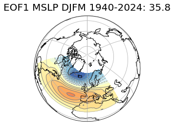
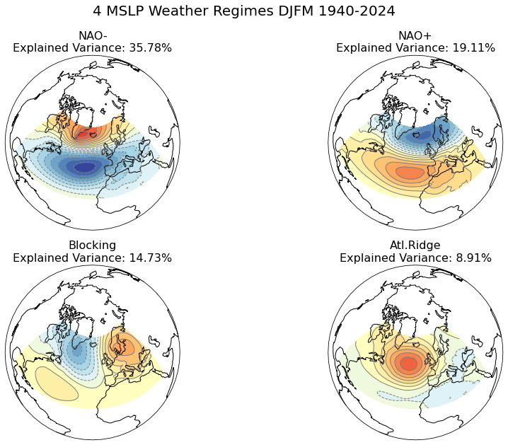
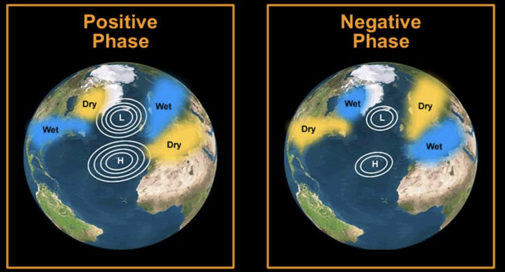

# Teleconnections North Atlantic Oscillation {#nao}

*Author: Pamela Sorelle Tueam*

*Supervisor: Henri Funk*

*Suggested degree: Bachelor*

## Abstract

The concept of teleconnections in climate science refers to climate anomalies or patterns that are related across large distances, often thousands of kilometers apart. Teleconnections represent atmospheric interactions that link weather and climate conditions in one region of the globe with those in another, often through the movement and behavior of large-scale atmospheric wave patterns (@feldstein2017). These connections are crucial for understanding regional climate variations, predicting weather patterns, and assessing climate change impacts. One prominent example of a teleconnection pattern in the Northern Hemisphere is the North Atlantic Oscillation (NAO). This oscillation plays a significant role in influencing the climate over the North Atlantic region. Its impacts are observed in various climate elements, including temperature, wind speed and direction, storm and precipitation, as well as ocean and sea ice dynamics. $\\$
This chapter explores various methods for defining and analyzing the North Atlantic Oscillation (NAO), following the framework established by @hurrell2010. These methods include one-point correlation map, Empirical Orthogonal Function (EOF) analysis, and cluster analysis. Additionally, we present the long-term trends of the NAO using the NAO Index. Through a detailed examination of these approaches, we aim to provide a better understanding of the spatial and temporal characteristics of the NAO. Such understanding is important for improving climate models, enhancing weather prediction accuracy, and developing robust climate change adaptation and mitigation strategies. Furthermore, by assessing the NAO's influence on temperature, wind patterns, storm activities, and oceanographic conditions, this chapter contributes to a deeper comprehension of how large-scale atmospheric phenomena shape our climate system.

## Introduction

The North Atlantic Oscillation (NAO), one of the most prominent and recurrent teleconnections over the Northern Hemisphere, is characterized by a redistribution of atmospheric mass at sea level between the Icelandic Low and the Azores High (@hurrell2010). It dictates climate variability from the eastern seaboard of the United States to Siberia and from the Arctic to the subtropical Atlantic, especially during boreal winter. Fluctuations from one phase of the NAO to another result in significant variations in the average wind speed and direction over the Atlantic, as well as in the transport of heat and moisture between the Atlantic and neighboring continents. This also affects the intensity and number of storms, their paths, and associated weather conditions (@hurrell2003). Especially during the months of December to March, the NAO is responsible for much variability of weather over the North Atlantic region. Thus, the NAO influences weather and climate conditions across the North Atlantic region and beyond, affecting winter temperatures and storm tracks. $\\$
In this chapter, our primary focus will be on exploring the spatial and temporal characteristics of the NAO. We will begin by discussing common methods used to define it, such as the one-point correlation map, which helps to identify the NAO by regions of positive and negative correlations. Additionally, we will employ the EOF analysis to discern the dominant patterns of variability associated with the NAO, and utilize the cluster analysis to identify distinct atmospheric patterns with similar pressure characteristics. Furthermore, we will analyze the NAO Index to observe its variations over long periods. Finally, we will investigate the impacts of the NAO on various climate factors including temperature, wind speed and direction, precipitation patterns, storm activities, oceanic conditions, and sea ice dynamics.


## The spatial and temporal structure of the NAO

Understanding NAO requires a comprehensive understanding of its spatial and temporal characteristics. To analyze these aspects, we will review established methods commonly employed for defining or identifying NAO patterns. These methods include the one-point correlation map, the EOF analysis for its spatial structure, as well as cluster analysis. For its temporal structure, we will focus on the NAO index. These methods are used in the paper of (@hurrell2010) and the data used in his paper go up to 2006. The idea is to reproduce these on new data up to 2024 and see if the NAO patterns remain similar. 

### Data

Monthly geopotential height at 500 hPa (Z500) and mean sea level pressure (MSLP) data are used in this chapter. The monthly geopotential height at 500 hPa were obtained from the ERA5 reanalysis dataset for global climate and weather (@geopotential2023).
Mean sea level pressure data used here were also sourced from the ERA5 reanalysis (@mean_sea_level2023) dataset. For both monthly geopotential height and mean sea level pressure, only data from the Northern Hemisphere specifically within the coordinates 20°-70°N and 90°W-40°W, were extracted. Considering that the NAO is responsible for much variability of weather in boral winter over the Northern Hemisphere, the period from December to March (DJFM) was selected for this analysis. The time series used consist of 84 DJFM seasons from 1940-2024. The data used to examine the NAO Index were collected from the National Center for Atmospheric Research (NCAR). This dataset includes station-based NAO index data of 159 DJFM seasons spanning from 1864 to 2023 (@nao_index_2003). To examine the pattern of variability we need to compute the anomalies which are calculated by subtracting time means, computed for each calender month from the data for individual year-months. These anomalies form the basis for all methods described in this chapter. 

### One-point correlation maps

One way to define the NAO is through conceptually simple one-point correlation map, identifying the NAO by regions of maximum negative correlation over the North Atlantic. For these one-point correlation we will focus on the methods described by @athanasiadis2009 and by @wallace1981 in their respective papers. $\\$
One-point correlation correlates a variable at a specific location with the same variable at other locations. Given a field of data, we compute the correlation coefficient between the base point - referred to as the center of action - and each other points. The center of action is a specific location defined by latitude and longitude. The resulting correlation values generate a map that identifies the NAO by regions of positive and negative correlation. In this analysis, we use monthly geopotential heights data at 500 hPa for winter season December-March from 1940 to 2024. Anomalies are calculated by subtracting geopotential height time means, computed for each calendar month from the data for individual geopotential height year-months (@wallace1981, 790). $\\$
The correlation coefficient for a given center of action is calculated using the Pearson's linear correlation coefficient at every point as follows: 

  $r_{i} = \frac{Cov(X_{i}, Y_{i})}{\sqrt{Var(X)Var(Y)}}$                      

where X and Y are time series of contemporaneous observations, $[(x_{i}, y_{i}); i = 1, 2, . . . N]$, where we fix one of the data points, say, X, at the center of action and compute the correlation over all Y. Covariance and variance are denoted as Cov and Var, respectively (@athanasiadis2009, 3721). $\\$
Figure \@ref(fig:CorrelationPamela) illustrates the corresponding one-point correlation map for the NAO pattern. The reference point that has been chosen is located in Iceland at 65°N and 18°W. The correlations are calculated for all points belonging to the Northern Hemisphere (20-70°N, 90°W-40°E).
As we can see on the figure the map is characterized by more or less elliptical regions where correlation coefficients can be positive or negative, surrounding each base grid point. The size of these regions provides an indication of the horizontal scale of the anomalies, particularly near the base grid points (@wallace1981, 790).
The identifying dipole patterns located at the Icelandic Low and Azores High, reflect the NAO signature based on the chosen reference point. The color gradients on the figure indicate the strength of the correlation, with blue representing negative correlations and yellow to red representing positive correlations. $\\$
As implications, regions with strong positive correlations experience atmospheric conditions similar to Iceland (the center of action). These areas may share similar temperature anomalies. For instance, if the region of the center of action experiences warmer-than-average temperatures during high NAO phase, positive correlated regions might also experience similar warmth temperatures. We will also have similar precipitation patterns (if it is drier than the nearby regions may also be similar dry). Conversely, the region with negative correlations such as the anticorrelation center at Azores, will exhibit opposite conditions, including temperature contrasts (warmer vs. cooler) and differing precipitation patterns (wetter vs. drier).


```{r CorrelationPamela, fig.cap = "One-point correlation map of 500 hPa geopotential height for boreal winter (December-March) over 1940-2024. The reference point is 65°N, 18°W. Negative correlation coefficients are in blue and the lines are dashed.", echo=FALSE, warning=FALSE, error=FALSE, message=FALSE, out.width="50%", fig.align="center"}
knitr::include_graphics('work/05_nao/figures/OnePointCorrelation.png')
```

### EOF Analysis

The second method is the Empiriacal Orthogonal Function (EOF) analysis, also known as Principal Component Analysis (PCA). EOF analysis is commonly used to identify and analyze dominant patterns of variability in spatial and temporal datasets. The EOFs of a dataset are simply the eigenvectors of the covariance matrix of the dataset, which provide maximal data compression (@wilks2011). The method reduces a dataset with many variables to a smaller set of new variables, which are linear combinations of the original ones, chosen to capture the maximum possible variability of the original data (@wilks2011). Given multiple observations of a (K × 1) data vector $\textbf{x}$, PCA finds (M x 1) vector $\textbf{u}$, which are linear combinations of the elements of  $\textbf{x}$ and capture most of the information from the original data (@wilks2011). The steps by performing the EOF are as follows:

- Collection of the dataset: We used the mean sea level pressure (MSLP) data for boreal winter DJFM over 84 years from 1940 to 2024.
- Calculation of the anomalies: Anomalies are calculated by subtracting the MSLP time means, computed for each calendar month from the data for individual MLSP year-months.
- Formation of the Covariance Matrix as we want to analyze the variance and patterns in the data.
- Performance of the eigenvalue decomposition: The covariance matrix is decomposed using eigenvalue decomposition to obtain the eigenvalues and eigenvectors. The eigenvectors represent the spatial patterns, and the eigenvalues indicate the amount of variance explained by each EOF.
- The first principal component, $u_{1}$ is obtained as the projection of the anomalies vector onto the first eigenvector $\textbf{e}_{1}$ $\textbf{u}_{1} = \textbf{e}_{1}^{T} = \sum_{k= 1}^{K} e_{k, 1}x_{k}^{'}$. This first EOF/PC explains the most variance, followed by the second, and so on (@wilks2011). 

Computing the EOFs allows for comparison with the results of the one-point correlation analysis. While correlation analysis focuses on the variability relative to the primary center of action of specific teleconnections, EOF analysis is not centered on specific points. The loading at any two points are not solely determined by the temporal correlation between the time series at those points (@athanasiadis2009, S 3724). Furthermore, EOF analysis is not explicitly designed to highlight regional patterns of strong correlation. Instead, EOF analysis sequentially identifies the leading patterns that explain the most variance within the analyzed dataset (@athanasiadis2009 S 3724). Therefore, values of the same sign at two different spatial points in an EOF do not necessarily imply a significant correlation between those two points. 

Figure \@ref(fig:EofPamela) illustrates the leading eigenvectors of the cross-covariance matrix calculated from seasonal (4-month average) MSLP anomalies in the North Atlantic sector (20°-70°N; 90°W-40°E). Since the eigenvectors are, by definition, structured to explain maximum variance, it is expected that the center of actions of the leading EOFs will coincide with the regions of strongest variability. Although EOF patterns are not exactly identical to the one-point correlation map, there is a noticeable similarity between the two. Both correlation map and EOF analysis consistently illustrate the distinct behavior of variability across different time scales. During the winter season (December-March), the NAO accounts for more than one-third (35.8%) of the total variance in SLP over the North Atlantic and appears with a slight northwest-to-southeast orientation.


```{r EofPamela, fig.cap = "Leading empirical orthogonal function (EOF 1) of the seasonal mean sea level pressure anomalies in the North Atlantic sector (20°–70°N, 90°W–40°E), and the percentage of the total variance it explains. The data cover the period of 1940–2024.", echo=FALSE, warning=FALSE, error=FALSE, message=FALSE, out.width="60%", fig.align="center"}

```

### Cluster Analysis

Another method to examine the dynamical signature of interannual variability in the North Atlantic is the cluster analysis. This non-linear approach groups similar data points into clusters based on their similarities, and is used here to identify distinct atmospheric patterns with similar pressure characteristics. It is applied to 84 years of monthly MSLP data from December to March using procedures based on a clustering algorithm. The algorithm groups in this case the monthly MSLP data into a small number of representative states (or regimes) according to an objective criterion of similarity.
Given a prescribed number of clusters $k$, the goal of the algorithm is to find a partition $P$ of the data points into $k$ clusters $C_{1}, C_{2}, …, C_{k}$ that minimizes the sum of the variances within the clusters, expressed as (@michelangeli1995): $$W(P) = \sum_{j= 1}^k \sum_{x \in C_{j}} d^2(X, Y_{j})$$ where $Y_{j}$ is the centroid cluster $C_{j}$ and $d(X, Y)$ represents the Euclidean distance between two points X and Y as a measure of similarity. The global minimum of the function $W(P)$ therefore corresponds to a partition that achieves the best separation of data points. The dynamic cluster algorithm defines iterative partitions $P^{(n)}$ for which $W(P^{(n)})$ decreases with n and eventually converges to a local minimum which generally differs from the global one. This algorithm thus provides the optimal $k$ number of clusters to be retained (@michelangeli1995, S 1241).
The steps by performing the cluster Analysis are:

- Data collection and anomalies calculation.
- Selection of a clustering algorithm: In this case the k-means clustering is used.
- Determination of the optimal number of clusters.
- Application of the algorithm: Assign each monthly SLP data to a cluster with each cluster representing a distinct atmospheric regime or pattern.

The clustering algorithm applied over the Atlantic domain (20°–70°N; 90°W–40°E) identifies four winter climate regimes Figure \@ref(fig:RegimesPamela). The clustering partition yields the optimal $k = 4$ number of significant winter climate regimes subsequently represented by the cluster centroid. Two of these clusters correspond to the negative and positive phases of the NAO and are characterized by a zonally elongated meridional pressure dipole between the Icelandic Low and the Azores High. The third regime exhibits a zonal pressure dipole between Greenland and Scandinavia (the “Blocking” regime) with a clear southeastward extension of low-pressure anomalies toward the Iberian Peninsula. The fourth regime displays a strong anticyclonic ridge (RDG) over western Europe (the “Atlantic Ridge” regime) (@hurrell2010).  

```{r RegimesPamela, fig.cap = "Boreal winter (December–March) climate regimes in sea level pressure (hPa) over the North Atlantic domain (20°–70°N, 90°W–40°E) using monthly data over the period from 1940 to 2024. The percentage on each panel expresses the explained variance of each cluster.", echo=FALSE, warning=FALSE, error=FALSE, message=FALSE, out.width="70%", fig.align="center"}

```


### NAO positive and negative Index

The most modern NAO indices are derived either from the simple difference in surface pressure anomalies between selected northern and southern locations, or from the PC time series of the leading Empirical Orthogonal Function (EOF) of the sea level pressure (SLP) field (@hurrell2010). Although the NAO is observable throughout the year, it is most pronounced during winter, accounting for over one-third of the total variance in the SLP field over the North Atlantic (@hurrell1997, 305). (@hurrell1997) defined a simple index of the NAO as the difference between the normalized mean winter (December–March) SLP anomalies at Lisbon, Portugal and Stykkisholmur, Iceland.

Figure \@ref(fig:IndexPamela) illustrates the positive and negative index of the NAO from 1864 to 2023. The average winter sea level pressure data at each station were normalized by division of each seasonal pressure by the long-term mean (1864–2023) standard deviation. Positive values of the index are in red and negative values in blue. The NAO index, as depicted in Figure \@ref(fig:IndexPamela), exhibits a well-defined oscillation. However, several periods exist where the NAO index remained in one phase over multiple winters, such as from 1903 to 1914 (positive phase), from 1915 to 1919 (negative phase), from 1958 to 1971 (negavite phase, excluding 1961 and 1967), and from 2014 to 2020 (posivite phase). On this figure of the NAO index \@ref(fig:IndexPamela) we can notice that there is little evidence for the NAO to vary on any preferred time scale. Significant changes can occur from one winter to the next, as well as from one decade to another.$\\$

```{r IndexPamela, fig.cap = "Normalized indices of the mean winter (December–March) NAO constructed from sea level pressure data. The index is based on the difference of normalized sea level pressure between Lisbon, Portugal and Stykkisholmur/Reykjavik, Iceland. The average winter sea level pressure data at each station were normalized by division of each seasonal pressure by the long-term mean (1864–2023) standard deviation. The indicated year corresponds to the January of the winter season (e.g, 1990 is the winter of 1989/1990)", echo=FALSE, warning=FALSE, error=FALSE, message=FALSE, out.width="80%", fig.align="center"}

```

The NAO is in a positive phase when both Icelandic low-pressure center and the high-pressure center at the Azores are stronger than the average (figure \@ref(fig:phasePamela)). During the positive NAO phase, the increased difference in pressure between these two regions results in a stronger Atlantic jet stream and a northward shift of the storm track. Consequentlly, northern Europe experiences increased storminess, higher precipitation, and warmer-than-average temperatures due to the air masses that arrive from lower latitudes. At the same time, southern Europe experiences decreased storminess and below-average precipitation. In eastern North America, the positive phase of the NAO generally brings higher air pressure, a condition associated with fewer cold-air outbreaks and decreased stormisses (@hurrell2010).

Conversely, the NAO is in a negative phase when both the Icelandic low and Azores high are weaker than average. During the negative NAO phase, the Atlantic jet stream and storm track have a more west-to-east orientation. This results in decreased storminess, below-average precipitation, and lower-than-average temperatures in to northern Europe. Conversely, southern Europe experiences increased storminess, above-average precipitation, and warmer-than-average temperatures. In eastern North America, the negative phase of NAO generally brings lower air pressure, a condition associated with stronger cold-air outbreaks and increased storminess (@hurrell2010).


```{r phasePamela, fig.cap = "Positive and negative phase of the North Atlantic Oscillation. Image from @NAO\\_phase2013", echo=FALSE, warning=FALSE, error=FALSE, message=FALSE, out.width="70%", fig.align="center"}

```


## The Implications of the North Atlantic Oscillation

The NAO plays a critical role in shaping climate patterns across the North Atlantic and surrounding areas. Changes in its spatial and temporal structures can lead to significant variations in temperature, precipitation, and weather extremes, influencing ecosystems, human activities, and natural resources.

### Temperature, wind speed and direction

During the positive phase of the North Atlantic Oscillation (NAO), the atmospheric pressure difference between the Icelandic low and the Azores high intensifies. This results in a stronger-than-usual westerly flow across the North Atlantic during the winter months. Consequently, relatively warm, and moist maritime air is transported over much of Europe and extends across Asia (@hurrell2003). This influx of warm air can lead to milder winter conditions across the continent, often resulting in higher temperatures (@hurrell2003). Meanwhile, while stronger northerly winds over Greenland and northeastern Canada transport cold air southward leading to a decrease in land temperatures in the northwest Atlantic (@hurrell2003). The cold air intrusions can lead to harsher winter conditions in parts of eastern Canada and the northeastern United States. $\\$
Additionally, the stronger clockwise circulation around the subtropical Atlantic high-pressure center during this phase of the NAO significantly impacts other regions. In North Africa and the Middle East, this results in cooler-than-average temperatures due to the altered wind patterns. In contrast, parts of North America experience warmer conditions as the strengthened high-pressure system influences the weather patterns across the continent (@hurrell2003).

### Storm and precipitation

NAO signals can also be found in winter precipitation and storm over the North Atlantic.During the positive phase of the NAO, storm activities in the Atlantic shift northeastward. This means there are more intense and frequent storm activities from southern Greenland across Iceland into northern Europe, and slightly less storm activities from the Azores across the Iberian Peninsula and the Mediterranean (@hurrell2010). Furthermore, the positive phase is typified by more intense and frequent storms in the vicinity of Iceland and the Norwegian Sea. During the NAO-, a weak subtropical high and a weak Icelandic Low dominate, resulting in a reduced pressure gradient and fewer, weaker winter storms with a more west-east trajectory, while moist air is brought into the Mediterranean and cold air into northern Europe (@rousi2020).
$\\$
Changes in the mean flow and storminess associated with oscillations in the NAO index lead to significant changes in the transport and convergence of atmospheric moisture, impacting the distribution of evaporation and precipitation (@hurrell2010). These results in drier conditions of this magnitude are observed over central and southern Europe, the Mediterranean, and parts of the Middle East, while more precipitation than normal occurs from Iceland through Scandinavia (@hurrell2010). 

### Ocean and Sea Ice

Another implication of the NAO mentioned by @hurrell2010 is its impact on ocean and sea ice. SST and NAO strength fluctuate together, with the main pattern of SST variability in boreal winter forming a tri-polar structure: a cold anomaly in the subpolar North Atlantic, a warm anomaly in mid-latitudes, and a cold anomaly in subtropical regions (@hurrell2010). These SST anomalies are driven by changes in surface wind and air-sea heat exchanges related to NAO variations. Persistent SST anomalies over longer periods also relate to consistent anomalous SLP patterns, including the NAO, reflecting the ocean's response to long term atmospheric variability.
The reduction of the Arctic Sea ice is one of the most prominent indicators of climate change. less compact ice in high NAO winters plays an important role in the reduction of summer sea ice extent in high NAO years. In winter, the stronger wind in high NAO years drives more ice away from the Eurasian coastal region, suppressing sea ice buildup there (@hurrell2003).


## Conclusion

In this chapter we have presented the NAO as the dominant mode of regional climate variability over the Northern Hemisphere, focusing particularly on common methods used to identify its spatial and temporal structure. These methods, although they are different, each have their strengths and limitations.
One point correlation map is easy to implement and interpret providing clear insight into how the chosen center of action is related to the variability at other locations. However, the result heavily depends on the choice of the center of action. Selecting a different center may not well capture the full spatial pattern of the NAO. EOF analysis captures the dominant patterns of variability in a dataset and provides a quantitative measure of how much variance a pattern explains. But it assumes linear relationships and might not capture non-linear features of the NAO. Cluster Analysis is effective at identifying distinct patterns and regimes including non-linear and non-stationary features, but it is computationally intensive and requires careful selection of clustering parameters. Additionally, interpreting the results can be challenging if the patters are not well separated.

As we have seen, the NAO is a significant climatic driver in the North Atlantic region, influencing temperature, wind speed and direction, precipitation, storm tracks, ocean and sea ice, particularly over Europe and North America. Its variability poses challenges and opportunities for understanding and predicting weather and climate impacts in affected regions. Understanding the implications of the NAO for climate change is essential for developing adaptive strategies to deal with the resulting implications on weather patterns and sea ice. 

By improving climate models, and implementing robust adaptation plans, we can better address the challenges posed by NAO-induced climate variability. Predicting the future behavior of the NAO in a changing climate is challenging due to the complexity of the interactions between the atmosphere, oceans, and sea ice. Enhanced climate models that incorporate these interactions are crucial for reducing uncertainties and improving forecasts. Despite the strong influence of the NAO, many open issues remain about which climate processes govern NAO variability, how the phenomenon has varied in the past or will vary in the future, and to what extent it is predictable. External factors, such as the rise in greenhouse gas emissions, have a significant impact on the recent patterns of the NAO (@gillett2003). Research indicates that higher greenhouse gas concentrations are associated with alterations in atmospheric circulation, which may result in more frequent occurrences of positive NAO phases (@gillett2003). Understanding these shifts is essential for developing strategies to mitigate and adapt to the climate change effects influenced by the NAO (@gillett2003). 