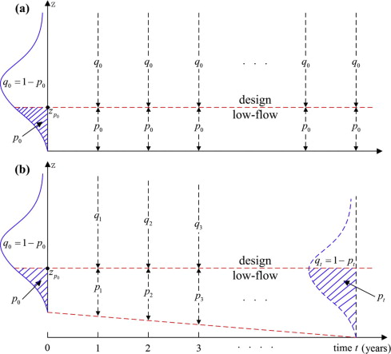
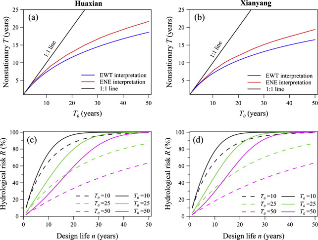

---
output:
  pdf_document: default
  html_document: default
  word_document: default
---

```{r message=FALSE, warning=FALSE, include=FALSE}
library(bookdown)
library(svglite)
```

# Low Flow Events {#lfe}

*Author: Gamze Gizem Kasman*

*Supervisor: Henri Funk*

*Degree: Master*

## Abstract

This chapter introduces some of the most used advanced statistical methods for predicting and analyzing low-flow events, characterized by reduced streamflow and water availability. Initially, key univariate concepts such as nonstationary models with time-varying parameters and meteorological covariates are presented, along with the concept of return periods to capture the dynamic nature of these events accurately. Following this, bivariate concepts, including the use of copulas to model dependencies between hydrological variables and the integration of reservoir indices to account for human impacts on flow regimes, are discussed. The concept of return periods is also introduced in a bivariate context. After these theoretical introductions, the chapter demonstrates practical applications, including the Statistical Downscaling Model (SDSM), which connects large-scale climate projections with localized hydrological impacts. These methodologies enhance the prediction and management of low-flow events, offering more robust strategies for water resource management in a changing climate.

## Introduction

Low-flow events or periods are hydrological conditions marked by significantly reduced streamflow and water availability in rivers and streams. These events often result from prolonged dry weather conditions, reduced precipitation, high evaporation rates, or significant water withdrawals (@Smakhtin2001). Their extremeness distinguishes them from normal variations in water flow, as they can profoundly and lastingly impact water availability and quality.

To effectively manage and mitigate the consequences of these extreme low-flow periods, it is essential to predict their occurrence and severity. This is where the concept of return periods becomes crucial. The return period, also known as the recurrence interval, is a statistical measure that estimates the frequency at which a particular hydrological event, such as a low-flow period, is expected to occur (@Stedinger1993). It provides a probabilistic assessment of how often extreme low-flow events of a certain magnitude are likely to happen over a given time frame. The concept of return periods is mostly used in the context of univariate analysis, where it pertains to a single hydrological variable, such as streamflow. However, return periods are also utilized in bivariate analysis in the context of low-flow events. Bivariate return periods consider the joint occurrence of two hydrological variables, such as streamflow and precipitation, or the dependence between two low-flow series, providing a more comprehensive assessment of extreme events. The bivariate approach is particularly useful when the interaction between variables significantly influences the event's occurrence and impact (@Graler2013; @Salvadori2007).

Closely associated with the return period is the concept of risk. In the context of hydrology, risk refers to the probability that a specific event, such as a low-flow period, will occur within a given timeframe. Understanding the risk associated with different return periods allows water resource managers to better prepare for and mitigate the impacts of these extreme low-flow events, ensuring more resilient and adaptable water management practices.

Climate change adds a significant layer of complexity to the management and prediction of low-flow events. Changes in climate patterns, such as alterations in precipitation regimes and increased temperatures, can exacerbate the frequency and severity of low-flow periods. For instance, climate change may lead to longer dry seasons, reduced snowpack, and increased evapotranspiration, all of which contribute to more severe low-flow conditions (@Katz1992). Furthermore, shifts in weather extremes mean that historical data may no longer be a reliable predictor of future conditions, complicating the estimation of return periods and associated risks. Therefore, understanding how flood and low-flow events are evolving and how likely they are to unfold beyond their historical distributions under the influence of multiple drivers, such as climate variability, human activities like reservoir operations etc., is one of the major challenges facing the hydrology field (@Lopez2013; @Kam2016; @Gai2019; @Jiang2021; @Slater2021a). In particular, predicting the likelihood of low-flow events occurring beyond their historical distributions due to factors like climate variability and human activities remains a key challenge in hydrology (@Lopez2013; @Kam2016; @Gai2019; @Jiang2021; @Slater2021a; @Wang2022).

This necessitates the use of advanced statistical models that can incorporate climate projections, climate indices such as oscillation data, and reservoir indices to better predict low-flow events in a changing climate (@Coles2001). Understanding how climate change impacts low-flow events and their return periods is crucial for adapting water management practices to future conditions.

This chapter aims to provide a focused study on low-flow events and their return periods through a statistical lens. We will introduce and discuss the most widely used models in hydrological frequency analysis that take climate change and human activities into account. These modern methods incorporate a variety of data sources, providing a more accurate prediction of low-flow events under changing climate conditions. For comparison purposes, we will also present traditional approaches that do not account for climate change, which assume that the statistical properties of low-flow events remain constant over time. By exploring both modern and traditional methods, we will highlight their respective advantages and limitations, and demonstrate their applications in the context of hydrological frequency analysis of low-flow events and return periods.

## Data Analysis

In the context of hydrological frequency analysis, understanding the most commonly used datasets that underpin our insights into low-flow events and return periods is essential. These datasets vary in their sources, methodologies, and applications, reflecting advancements in the field and the growing acknowledgment of climate change.

### Observed Hydrological Data

One of the foundational datasets in hydrological analysis is observed hydrological data, which encompasses both temporal and spatial dimensions. This data, typically gathered from gauging stations along rivers and streams, captures key measurements such as river discharge, water levels, and flow rates. The temporal aspect is reflected in the continuous time-series records, while the spatial aspect is evident in the geographical distribution of gauging stations across a watershed. The value of this data lies in its direct representation of the hydrological processes within a given watershed, providing a reliable basis for understanding past and present flow conditions.

Long-term records from these stations are crucial for identifying trends, variability, and the statistical characteristics of hydrological events, including low-flow and high-flow occurrences. This type of data can be directly utilized in statistical analyses for hydrological frequency analysis, enabling researchers to assess event probabilities and predict future hydrological behaviors (@Helsel2002).

### Observed Meteorological Data

In the context of models where climate change is acknowledged, observed meteorological data plays a significant role. This dataset encompasses measurements of various atmospheric parameters, including precipitation, temperature, and humidity, collected from meteorological stations. The linkage between meteorological conditions and hydrological responses is vital, as weather patterns significantly influence water availability and flow dynamics. By analyzing this data, researchers can better understand the drivers of hydrological extremes and their temporal patterns, thus enhancing the prediction and management of low-flow events in the context of a changing climate (@Huntington2006). Initially, this data is point data as it is collected from individual meteorological stations. It is then spatially averaged to form areal data representing the broader catchment areas.

### Reanalysis Data

Reanalysis data adds another critical dimension to modern hydrological studies. These datasets synthesize historical weather observations with modern forecasting models to produce comprehensive and consistent records of atmospheric conditions over extended periods. An example of this is the NOAA National Centers for Environmental Prediction (NCEP) reanalysis data. This data offers high temporal and spatial resolution, filling gaps where direct observations may be sparse or unavailable. Reanalysis data uses a variety of atmospheric predictors such as sea level pressure, air temperature at various altitudes, geopotential heights, and humidity, integrating them with observed data to create a continuous and coherent dataset (@Kalnay1996). This linkage to observed meteorological data ensures that reanalysis products accurately reflect past atmospheric conditions, making them a critical tool for studying long-term trends and variability in low-flow events under changing climatic conditions. This data is considered gridded spatial data due to its continuous spatial coverage over a global grid.

### Global Circulation Model Outputs

Another dataset for hydrological frequency analysis comes from climate modeling efforts. General Circulation Models (GCMs) simulate the Earth's climate system, incorporating the interactions between the atmosphere, oceans, land surface, and ice. These models are integral to projecting future climate scenarios and assessing potential impacts on hydrological systems. The Coupled Model Intercomparison Project (CMIP), organized by the World Climate Research Programme (WCRP), is a key initiative that brings together various GCM outputs to facilitate a comparative analysis of these projections. The IPCC uses results from these GCMs to provide comprehensive assessments of future climate change in its reports. For hydrological frequency analysis, GCM outputs are crucial for assessing future scenarios of low-flow events under different greenhouse gas emission pathways. However, the coarseness of GCM outputs often requires them to be downscaled to a finer resolution to be useful for regional or local studies. GCM outputs are also gridded spatial data, providing large-scale projections over a global grid. Downscaling techniques, which can be statistical or dynamical, help bridge the gap between the broad, global scale of GCMs and the finer scales needed for practical hydrological applications. In this regard, NCEP reanalysis data is frequently used as a reference to improve the downscaling of GCM outputs, ensuring that they more accurately reflect observed climatic conditions at finer scales (@Gao2012).

### Reservoir Indices

Reservoir indices are critical datasets in hydrological studies, especially for understanding and managing low-flow events. These indices provide information on reservoir levels, inflows, outflows, storage capacities, and water releases. Reservoir operations significantly influence streamflow regimes, particularly during periods of low flow, by regulating the amount of water released downstream. The management of reservoir water levels can mitigate the impacts of droughts and ensure a stable water supply for various uses, including agriculture, drinking water, and hydroelectric power generation.

López and Francés (2013) proposed the reservoir index (RI) as an indicator of the impact of reservoirs on flow regimes. It is defined as follows:

$$ RI = \sum_{i=1}^{N}\left(\frac{A_{i}}{A_{T}}\right) \cdot \left(\frac{V_{i}}{C_{T}}\right) \tag{1}$$

where $N$ is the number of reservoirs upstream of the gauge station, $A_{i}$ is the catchment area of each reservoir, $A_{T}$ is the catchment area of the gauge station, $V_{i}$ is the total capacity of each reservoir, and $C_{T}$ is the mean annual streamflow of the gauge station.

This definition may be modified in specific studies to better suit their research needs. The table below provides detailed information about the datasets used in these studies, including any modifications to the reservoir index.

::: {style="border: 2px solid #000; padding: 10px; margin-top: 20px; background-color: #f0fbff;"}
**Data Used in Key Studies**

Throughout this chapter, information and results from the following studies will be referenced. The table below provides detailed information about the datasets used in these studies.

**Table: Detailed Information of Data Used in Studies**

+-------------------------+------------------------------+---------------------------------------------------------+-----------+----------------------------------------------------------------------------------+
| Study                   | Data Type                    | Details                                                 | Period    | Source                                                                           |
+:========================+:=============================+:========================================================+:==========+:=================================================================================+
| **Du et al. (2015)**    | Observed Hydrological Data   | Mean daily streamflow data                              | 1954-2009 | Huaxian and Xianyang gauging stations                                            |
+-------------------------+------------------------------+---------------------------------------------------------+-----------+----------------------------------------------------------------------------------+
|                         | Observed Meteorological Data | Daily average temperature and daily total precipitation | 1954-2009 | 22 meteorological stations in the Wei River Basin                                |
+-------------------------+------------------------------+---------------------------------------------------------+-----------+----------------------------------------------------------------------------------+
|                         | Reanalysis Data              | NCEP reanalysis data                                    | 1954-2009 | NOAA (National Oceanic and Atmospheric Administration)                           |
+-------------------------+------------------------------+---------------------------------------------------------+-----------+----------------------------------------------------------------------------------+
|                         | GCM Outputs                  | Downscaled GCM outputs                                  | 2010-2099 | CMIP5 (Coupled Model Intercomparison Project Phase 5) under the RCP 8.5 scenario |
+-------------------------+------------------------------+---------------------------------------------------------+-----------+----------------------------------------------------------------------------------+
| **Wang et al. (2022)**  | Observed Hydrological Data   | Mean daily streamflow data                              | 1955-2016 | Multiple gauging stations in the Yellow River Basin                              |
+-------------------------+------------------------------+---------------------------------------------------------+-----------+----------------------------------------------------------------------------------+
|                         | Observed Meteorological Data | Daily temperature and precipitation data                | 1955-2016 | Meteorological stations in the Yellow River Basin                                |
+-------------------------+------------------------------+---------------------------------------------------------+-----------+----------------------------------------------------------------------------------+
|                         | Reservoir Data               | Reservoir inflow, outflow, and storage capacity data    | 1955-2016 | Reservoirs in the Yellow River Basin                                             |
+-------------------------+------------------------------+---------------------------------------------------------+-----------+----------------------------------------------------------------------------------+
| **Jiang et al. (2015)** | Observed Hydrological Data   | Mean daily streamflow data                              | 1961-2010 | Ankang (Qa) and Huangzhuang (Qh) gauges                                          |
+-------------------------+------------------------------+---------------------------------------------------------+-----------+----------------------------------------------------------------------------------+
|                         | Observed Meteorological Data | Daily temperature and precipitation data                | 1961-2010 | Meteorological stations in the Weihe River Basin                                 |
+-------------------------+------------------------------+---------------------------------------------------------+-----------+----------------------------------------------------------------------------------+
|                         | Reservoir Data               | Reservoir inflow, outflow, and storage capacity data    | 1961-2010 | Reservoirs in the Weihe River Basin                                              |
+-------------------------+------------------------------+---------------------------------------------------------+-----------+----------------------------------------------------------------------------------+
:::

## Stationarity vs. Nonstationarity in Low-flow Analysis

In hydrological frequency analysis, understanding the concept of stationarity is crucial for predicting and managing low-flow events. Traditionally, hydrological analyses have assumed stationarity, meaning that the statistical properties of hydrological processes are constant over time. Under this assumption, the historical data on low-flow events can be used to predict future occurrences with the expectation that the governing processes and factors remain unchanged. This approach simplifies the analysis and provides a straightforward basis for calculating return periods and risks (@Gilroy2012; @Katz2013).

Stationary analysis operates under the premise that factors such as climate and land use, which influence hydrological events, do not change significantly over time. This allows for the use of historical data to estimate future low-flow events with a reasonable degree of confidence. The traditional frequency analysis methods, such as fitting probability distributions to historical low-flow data, rely on this assumption. These methods are useful for long-term planning and water resource management as they provide stable and predictable estimates of low-flow probabilities and return periods (@Chow1988). However, the assumption of stationarity is increasingly being questioned due to evident and ongoing changes in climate and land use patterns. Studies have shown that these changes can significantly alter hydrological processes, rendering stationary models less reliable(@Milly2008).

Nonstationary analysis acknowledges that the statistical properties of hydrological processes can change over time due to factors like climate change, urbanization, and land-use changes. In a nonstationary framework, the parameters of probability distributions used to model hydrological events are allowed to vary over time or with respect to external covariates, such as meteorological variables. This approach provides a more realistic representation of the evolving nature of hydrological processes under the influence of changing climatic and environmental conditions (@Katz2002; @Milly2008).

The most common method for addressing nonstationarity in hydrological time series is the time-varying moment method. This technique assumes that while the type of distribution function for the hydrological variable remains constant, its statistical parameters can vary over time (@Strupczewski2001; @Coles2001; @Katz2002; @Villarini2009; @Gilroy2012). The time-varying moment method is typically used in a univariate context, where it focuses on a single hydrological variable, adjusting its statistical parameters to reflect temporal changes. Furthermore, the time-varying moment method can be extended to perform covariate analysis by replacing time with physical factors known to influence the hydrological variable of interest, such as temperature and precipitation. This provides a dynamic model that can adapt to projected changes in climate. This approach is critical for modern water resource management as it helps anticipate the impacts of climate variability and change, thus supporting more resilient and adaptable planning and infrastructure development (@Du2015; @Jiang2015).

In addition to the time-varying moment method, copula-based models have become increasingly important in nonstationary hydrological analysis. Copulas allow for the modeling of complex interdependencies between hydroclimatic variables, such as streamflow, precipitation, and temperature, as well as the dependence structure between low-flow events. Copula models are particularly useful in a bivariate context, as they can capture the evolving dependencies between two or more variables over time or under changing climatic conditions. This capability is crucial for understanding and predicting compound extreme events, which occur due to the concurrence or succession of multiple hydroclimatic extremes. By using copula-based probability distributions, researchers can more accurately assess the risk and impact of such compound events, providing a more comprehensive approach to hydrological frequency analysis (@Tootoonchi2022).

Comparing stationary and nonstationary analyses highlights the limitations of traditional methods in the face of a changing climate. Stationary models, while simpler and easier to apply, may lead to underestimation or overestimation of future low-flow events if the underlying conditions change significantly. Nonstationary models, though more complex, offer a nuanced understanding by integrating evolving environmental variables into the analysis, thus providing more accurate and reliable predictions (@Du2015).

The choice between stationary and nonstationary analysis has significant implications for water resource management. For instance, infrastructure designed based on stationary assumptions might not withstand future conditions, leading to potential failures or inefficiencies. Conversely, incorporating nonstationarity into planning and design processes ensures that water management strategies are robust and flexible enough to cope with future uncertainties (@Milly2008; @Katz2013).

This chapter aims to explore these two approaches through a detailed comparison, providing insights into their respective methodologies, advantages, and limitations. The discussion will be grounded in recent research and applied examples, emphasizing the practical implications for water resource management under changing climatic conditions.

## Detecting Nonstationarity

To identify nonstationarity in hydroclimatological extremes, it is crucial to thoroughly examine the data before applying statistical tests. These tests aim to detect two primary types of nonstationarity: step changes (change points) and monotonic changes (trends). Such variations may be considered indicative of nonstationarity if they significantly deviate from normality in long-term records. Nonstationarity can be detected either in individual time series (point-based analysis) or across larger groups of stations (spatially coherent trends; (@Hall2014; @Slater2021)).

### Change Point Analysis

Change point analysis is a statistical technique used to detect points in a time series where the properties of the data change. In the univariate context, this analysis is relatively straightforward as it deals with a single variable. A widely used method for identifying change points in univariate time series is the Pettitt test (@Pettitt1979). This approach considers a time series as two samples represented by $x_{1}, \ldots, x_{t}$ and $x_{t+1}, \ldots, x_{N}$. Then, the Pettitt indices $U_{t, N}$ can be calculated as:

$$
U_{t, N}=\sum_{j=1}^{t} \sum_{i=1}^{N} \operatorname{sgn}\left(x_{j}-x_{i}\right) \quad (t=1, \quad \cdots, \quad N) \tag{2}
$$

where

$$
\operatorname{sgn}(\theta)=\left\{\begin{array}{rc}
+1 & \theta>0 \\
0 & \theta=0 \\
-1 & \theta<0
\end{array}\right.
$$

The $p$ value of the $U_{t, N}$ can be computed as follows:

$$
p \cong 2 \exp \left[\frac{-6\left(U_{t, N}\right)^{2}}{N^{3}+N^{2}}\right]
$$

While the Pettitt test effectively identifies change points in univariate time series, real-world data often involve multiple variables that can change simultaneously. In the multivariate context, detecting change points becomes more complex due to the higher dimensionality of the data. To address this complexity, Lavielle and Teyssière (2006) developed a method for identifying multiple change points in multivariate time series. Their approach involves segmenting the time series into several homogeneous segments, each assumed to follow a different multivariate distribution with distinct parameters.

The time series is divided into $K$ segments, where $K$ is the number of change points plus one. For each segment, the likelihood of the observed data is calculated based on the assumed multivariate distribution (e.g., multivariate normal). The method then optimizes a penalized likelihood criterion to balance the goodness of fit and model complexity, often using a penalty term similar to the Bayesian Information Criterion (BIC). Dynamic programming algorithms are employed to efficiently find the optimal segmentation that maximizes the penalized likelihood.

### Temporal Trend Analysis

The Mann-Kendall (MK) trend test method, endorsed by the World Meteorological Organization, is a widely used nonparametric approach for trend analysis. For a series $X=\left\{x_{1}, x_{2}, \ldots, x_{n}\right\}$, the standard normal statistic $Z$ is estimated as follows:

$$
Z=\left\{\begin{array}{cc}
(S-1) / \sqrt{\operatorname{var}(S)} & S>0 \\
0 & S=0 \\
(S+1) / \sqrt{\operatorname{var}(S)} & S<0
\end{array}\right.\tag{3}
$$

where

$$
S=\sum_{i=1}^{n-1} \sum_{j=i+1}^{n} \operatorname{sgn}\left(x_{j}-x_{i}\right)
$$

and

$$
\operatorname{var}(S)=\frac{n(n-1)(2n+5)}{18}
$$

::: {style="border: 2px solid #000; padding: 10px; margin-top: 20px; background-color: #f0fbff;"}
**Applications of Change Point Analysis in Detecting Nonstationarity**

**Du et al. (2015):** This study applies the Mann-Kendall test to detect trends in low-flow series under climate change. Significant decreasing trends were detected at two stations, Huaxian and Xianyang, with Mann-Kendall statistics $Z_{MK}$ values of -2.71 and -3.63, respectively. The results highlight the impact of climate change on hydrological processes and the necessity of incorporating nonstationarity in trend analyses.

**Wang et al. (2022):** In this study, change point analysis is applied using the Pettitt test and the Mann-Kendall trend test to detect nonstationarity in univariate time series. Specifically, the Pettitt test is utilized to identify significant change points in annual low-flow series. For instance, a significant change point in the low-flow series of the ZGP station in 1980 ($p < 0.1$) was detected, revealing modes of nonstationarity in the hydrological series. This analysis is illustrated in the table below, showing the results of the Pettitt test for low-flow series.

**Table: Results of Pettitt and MK tests of low-flow series**

| Stations | Pettitt | MK      |
|:---------|:--------|:--------|
| DPL      | 0.156   | 0.156   |
| CTG      | 0.360   | 0.360   |
| ZGP      | 0.001\* | 0.001\* |
| XX       | 0.279   | 0.279   |

Notes: The numerical values correspond to the $p$ values of the Pettitt and MK tests. The asterisks indicate significance at the 10% level. A value of 0.293 / 0.573 indicates $p$ values before and after a change point.

**Jiang et al. (2015):** This study examines nonstationarities in low-flow series at Ankang and Huangzhuang Gauges and their dependence structure using both univariate and bivariate aspects. For the univariate analysis, the nonparametric Pettitt test identifies an abrupt change in the variance of $Q_{a}$ in 1991, though its mean remains stationary. For $Q_{h}$, changes in mean and variance are detected in 1971 and 1972, respectively. For the bivariate analysis, using Lavielle and Teyssière's (2006) method, a significant change in the dependence structure between $Q_{a}$ and $Q_{h}$ is found in 1970, indicating nonstationarity in both individual series and their dependence structure.
:::

## Univariate Statistical Analysis

To effectively analyze and manage low-flow events, it is essential to understand the concepts of exceedance probability and design low-flow quantile. These concepts are foundational for conducting return-period and risk analysis, which are critical in hydrological studies. Return-period analysis helps in estimating the frequency of low-flow events, while risk analysis assesses the probability of these events occurring within a specific timeframe.

### Exceedance Probability of a Low-flow Event

The low-flow characteristics of the flow regime are represented by the random variable $Z$. Focusing on water scarcity, we define the design low-flow quantile $z_{p_{0}}$, which has a probability $p_{0}$ in any given year that the streamflow falls below this quantile. The likelihood of a flood event exceeding a design flood quantile is commonly referred to as the exceedance probability or the exceeding probability (e.g., (@Salas2013; @Salas2014)). For a low-flow event, exceedance or exceeding indicates that the severity of lack of precipitation is surpassed, meaning the flow statistic value is lower than the design quantile (@Du2015).

#### Stationary Case

Under stationary conditions, the cumulative distribution function of $Z$ is denoted by $F_{Z}(z, {\theta})$, where ${\theta}$ represents the constant statistical parameter set. The aim is to analyze the future evolution of the return period and hydrological risk for a specific design low-flow determined at a particular year based on historical observed data. This particular year is typically defined as the base year or initial year, denoted by $t=0$. Therefore, the given design low-flow at $t=0$, corresponding to an initial return period $T_{0}$, can be derived using $z_{p_{0}} = F_{Z}^{-1}\left(p_{0}, \theta \right)$, where $p_{0}=1 / T_{0}$ and $F_{Z}^{-1}$ is the inverse function of $F_{Z}$ (similarly hereinafter). The period of years following the initial year is referred to as the "future" and initial year $t=0$ corresponds to the last observation year (@Cooley2013). In the stationary case, meaning the controlling environmental factors for future years remain the same as in the initial year $t=0$ $\theta$ is constant for every year, and the exceedance probability corresponding to the design quantile $z_{p_{0}}$ is $p_{0}$ for each future year (Fig. 1a), which can be expressed as:

$$
p_{t}=F_{Z}\left(z_{p_{0}}, {\theta}\right)=p_{0}, \quad t=1,2, \ldots, \infty \tag{4}
$$

#### Nonstationary Case

Under nonstationary conditions, the cumulative distribution function of $Z$ is denoted by $F_{Z}\left(z, {\theta}_{t}\right)$, where ${\theta}_{t}$ varies with time or, more specifically, with meteorological variables. In the nonstationary case, the design low-flow quantile corresponding to the initial exceedance probability $p_{0}=1 / T_{0}$ can be derived from $z_{p_{0}}=F_{Z}^{-1}\left(p_{0}, {\theta}_{0}\right)$, where ${\theta}_{0}$ is the statistical parameter set for the initial year $t=0$. Since the statistical parameters change over time, the future exceedance probability corresponding to $z_{p_{0}}$ is no longer constant. The temporal variation in the exceedance probability corresponding to $z_{p_{0}}$ can be characterized by the way the low-flow distribution or, more specifically, the statistical parameters change over time (Fig. 1b) The exceedance probability for each future year can be obtained by:

$$
p_{t}=F_{Z}\left(z_{p_{0}}, {\theta}_{t}\right), \quad t=1,2, \ldots, \infty \tag{5}
$$

```{r fig1\\_gamze, cache=FALSE, out.width="80%", fig.align="center", echo=FALSE, eval=TRUE, fig.cap="Schematic depicting the design low-flow quantile $z_{p_{0}}$ with (a) constant exceedance probability $p_{0}$, and (b) time-varying exceedance probabilities $p_{t}, t=1,2, \\ldots, \\infty$."}

```

Source: (@Du2015)

### Return Period

With the method of time-varying moment, deriving a value of a hydrological variable for a return period with a specific design quantile is straightforward (@Olsen1998; @Villarini2009). Specifically, $T_{t}=1 / p_{t}=1 /\left(1-F_{z}\left(z_{p_{0}}, {\theta}_{t}\right)\right)$, where $T_{t}$ and $p_{t}$ are the annual return period and exceedance probability, respectively, of the given design quantile $z_{p_{0}}$ with fitted annual statistical parameters ${\theta}_{t}$, and $F_{Z}$ is the cumulative distribution function of the hydrological variable of interest. However, for many planning and design applications, a return period measure that varies annually is impractical. To address this issue, various studies have been conducted on return period estimation and risk analysis under nonstationary conditions (@Wigley1988; @Wigley2009; @Olsen1998; @Parey2007, 2010; @Cooley2013; @Salas2013; @Salas2014). These studies have proposed two different interpretations of return period. The first interpretation is that the expected waiting time (EWT) until the next exceedance event is $T$ years (@Wigley1988; @Wigley2009; @Olsen1998; @Cooley2013; @Salas2013, @Salas2014). The second interpretation is that the expected number of exceedances (ENE) of the event in $T$ years is 1 (@Parey2007, @Parey2010; @Cooley2013).

#### Return Period Using Expected Waiting Time (EWT) Interpretation

**Under stationary conditions**, if $X$ is the random variable representing the year of the first occurrence of a low-flow that exceeds (i.e., is lower than) the design quantile, then the occurrence of a low-flow $Z$ exceeding the design value $z_{p_{0}}$ for the first time in year $X=x$, $x=1,2, \ldots, \infty$, follows the geometric probability law (@Mood1974; @Salas2013, @Salas2014):

$$
f(x)=P(X=x)=\left(1-p_{0}\right)^{x-1} p_{0}, \quad x=1,2, \ldots, \infty  \tag{6}
$$

Given that Eq. (3) is based on the assumptions of independence and stationarity, the expected value of $X$—representing the return period (expected waiting time interpretation) of the low-flow exceeding the design quantile $z_{p_{0}}$ under stationary conditions, is:

$$
T=E(X)=\sum_{x=1}^{\infty} x f(x)=1 / p_{0} \tag{7}
$$

**Under nonstationary conditions**, the exceedance probability associated with $z_{p_{0}}$ is no longer constant (Fig. 1b). Consequently, the geometric probability law, which takes into account time-varying exceedance probabilities $p_{t}$, is expressed as (@Cooley2013, @Salas2013, @Salas2014):

$$
\begin{aligned}[b]
f(x) & =P(X=x)=\left(1-p_{1}\right)\left(1-p_{2}\right) \ldots\left(1-p_{x-1}\right) p_{x} \\
& =p_{x} \prod_{t=1}^{x-1}\left(1-p_{t}\right), \quad x=1,2, \ldots, \infty 
\end{aligned}\tag{8}
$$

Therefore, the EWT-return period $T$ for a low-flow event exceeding the design quantile $z_{p_{0}}$ under nonstationary conditions is:

$$
 T=E(X)=\sum_{x=1}^{\infty} x f(x)=\sum_{x=1}^{\infty} x p_{x} \prod_{t=1}^{x-1}\left(1-p_{t}\right) \tag{9}
$$

#### Return Period Using Expected Number of Exceedances (ENE) Interpretation

**Under stationary conditions**, if $M$ is the random variable representing the number of exceedances in $T$ years, then $M=\sum_{t=1}^{T} I\left(Z_{t}<z_{p_{0}}\right)$, where $I(\cdot)$ is the indicator function. In this scenario, $M$ follows a binomial distribution (@Cooley2013):

$$
f(m)=P(M=m)=\binom{T}{m} p_{0}^{m}\left(1-p_{0}\right)^{T-m} \tag{10}
$$

It follows that the expected value of $M$ is 1 :

$$
E(M)=\sum_{t=1}^{T} p_{0}=T p_{0}=1 \tag{11}
$$

Therefore, the return period (expected number of exceedances interpretation) for a low-flow event exceeding the design quantile $z_{p_{0}}$ under stationary conditions is $T=1 / p_{0}$.

**Under nonstationary conditions**, the exceedance probability is not constant, and $M$ does not follow a binomial distribution. In this context, the expected number of exceedances is expressed as (@Cooley2013):

$$
\begin{aligned}[b]
E(M) & =\sum_{t=1}^{T} E\left[\left(Z_{t}<z_{p_{0}}\right)\right]=\sum_{t=1}^{T} P\left(Z_{t}<z_{p_{0}}\right)=\sum_{t=1}^{T} F_{Z}\left(z_{p_{0}}, {\theta}_{t}\right) \\
& =\sum_{t=1}^{T} p_{t} 
\end{aligned}\tag{12}
$$

The ENE-return period $T$ for a low-flow event exceeding the design quantile $z_{p_{0}}$ under nonstationary conditions can be derived by setting Eq. (12) equal to 1 and solving:

$$
\sum_{t=1}^{T} p_{t}=1 \tag{13} 
$$

### Hydrological Risk

In practical applications of hydrological frequency analysis, the management question often revolves around risk. Specifically, for a design life of $n$ years, the hydrological risk $R$ is defined as the probability of a low-flow event exceeding the design value $z_{p_{0}}$ before or at year $n$. This risk can be derived from the complement perspective, meaning there is no exceedance during the design life of $n$ years.

As an example, consider a low-flow event with a return period of 100 years. The risk for $t=1$ year is 1% (i.e., $R=0.01$). For $t=5$ years, the risk increases to approximately 5%. By $t=69$ years, the risk reaches 50%; for $t=100$ years (the return period), the risk is 63%; and for $t=300$ years, the risk climbs to 95%, and so on (@Wigley2009).

**Under the assumptions of independence and stationarity**, the probability of the complement is $\left(1-p_{0}\right)^{n}$. Consequently, the hydrological risk under stationary conditions is given by (@Haan2002):

$$
R=1-\left(1-p_{0}\right)^{n} \tag{14}
$$

In recent years, hydrological **risk analysis under nonstationary conditions** has gained popularity (@Rootzen2013; @Salas2014; @Condon2015; @Serinaldi2015). This approach offers designers a different perspective from traditional return period and design level methods by incorporating the basic information of design life $n$ and time-varying exceedance probabilities $p_{t}$. Similar to the stationary case, for a design life of $n$ years, the probability of a low-flow event exceeding the design quantile $z_{p_{0}}$ before or at year $n$ under time-varying exceedance probabilities $p_{t}$ is:

$$
R=1-\left[\left(1-p_{1}\right)\left(1-p_{2}\right) \ldots\left(1-p_{n}\right)\right]=1-\prod_{t=1}^{n}\left(1-p_{t}\right) \tag{15}
$$

::: {style="border: 2px solid #000; padding: 10px; margin-top: 20px; background-color: #f0fbff;"}
**Return Period and Risk Results from Du et al. (2015)**

**Nonstationary Return Period Using Meteorological Covariates**

Figure 2 presents the return period and risk results using meteorological covariates (explained in the model selection part) for Huaxian and Xianyang stations.

-   **Panel (a) and (b)**: The black diagonal line represents the stationary case where $T = T_0$, meaning the return period remains constant over time as expected under stationary assumptions. The other lines depict the nonstationary return periods calculated using the meteorological covariates (temperature and precipitation). These lines show the variability in return periods under nonstationary conditions. The deviations from the diagonal line indicate the impact of changing climatic conditions on the frequency of low-flow events. In nonstationary cases, return periods are generally shorter than the stationary assumption, indicating more frequent low-flow events.

-   **Panel (c) and (d)**: These panels illustrate the nonstationary hydrological risk $R$ over different design lives ($n$). The black solid line shows the stationary risk, providing a baseline for comparison. The nonstationary risk curves, calculated using the covariates, are generally higher than the stationary risk, especially for longer design lives. This indicates a greater likelihood of experiencing low-flow events in the future under nonstationary conditions. The comparison between stationary and nonstationary risks highlights the importance of incorporating nonstationary models in hydrological risk assessments to account for changing climatic conditions.

```{r fig2\\_gamze, cache=FALSE, out.width="80%", fig.align="center", echo=FALSE, eval = TRUE, fig.cap="Nonstationary return period T and hydrological risk R of the Wei River"}

```

-   **Huaxian Station**:
    -   **Expected Waiting Time (EWT)**:
        -   For a specified initial return period $T_0 = 50$ years, the nonstationary return period $T$ was calculated to be 18.6 years.
    -   **Expected Number of Exceedances (ENE)**:
        -   For $T_0 = 50$ years, the nonstationary return period $T$ was calculated to be 22 years.
    -   **Implications**:
        -   Under nonstationary conditions, the return periods are significantly shorter than the specified $T_0$, indicating more frequent low-flow events than expected under stationary assumptions.
-   **Xianyang Station**:
    -   **Expected Waiting Time (EWT)**:
        -   Similar to Huaxian, the nonstationary return period $T$ for $T_0 = 50$ years was shorter than the specified $T_0$.
    -   **Expected Number of Exceedances (ENE)**:
        -   Similar shorter return periods were observed under the ENE interpretation.
    -   **Implications**:
        -   The results underscore the necessity of accounting for nonstationarity in return period analysis for accurate water resource planning.

**Nonstationary Hydrological Risk Using Meteorological Covariates**

-   **Huaxian Station**:
    -   **Risk Calculations**:
        -   For a design life $n$ of 10 years and $T_0 = 50$ years, the hydrological risk $R$ was 14.1% under nonstationary conditions, compared to 18.3% under stationary conditions.
        -   For $n = 40$ years and $T_0 = 50$ years, the risk $R$ was 79.0% under nonstationary conditions, significantly higher than the stationary risk of 55.4%.
    -   **Implications**:
        -   The nonstationary risk is higher, especially for longer design lives, indicating an increased likelihood of low-flow events over time.
-   **Xianyang Station**:
    -   **Risk Calculations**:
        -   For $n = 10$ years and $T_0 = 50$ years, the risk $R$ was 5.8% under nonstationary conditions.
        -   For $n = 40$ years and $T_0 = 50$ years, the risk $R$ was 68.4% under nonstationary conditions.
    -   **Implications**:
        -   Similar to Huaxian, the nonstationary risk for Xianyang is significantly higher, emphasizing the impact of nonstationarity on hydrological risk assessments.
:::

### Nonstationary frequency analysis of low-flow series

The standard method for calculating nonstationary return periods under the EWT and ENE interpretations, as well as the risk of a design quantile $z_{p_{0}}$ corresponding to an initial return period $T_{0}$, is outlined by Eqs. (9), (13), (15), respectively. A crucial aspect of this procedure is the derivation of time-varying exceedance probabilities $p_{t}$ (Eq. (5)) for future years. This process involves determining the relationships between the statistical parameters of the low-flow distribution and the explanatory variables, which is typically referred to as nonstationary frequency analysis.

#### GAMLSS

The nonstationary low-flow series is modeled using the Generalized Additive Models in Location, Scale, and Shape (GAMLSS) framework (@Rigby2005). The GAMLSS framework assumes that independent observations $z_{i}$ for $i = 1, 2, 3, \ldots, n$ have a distribution function $f(z_{i} \mid \theta^{i})$, where $\theta^{i} = (\theta_{1}^{i}, \theta_{2}^{i}, \ldots, \theta_{p}^{i})$ is a vector of $p$ distribution parameters accounting for the location, scale, and shape of the random variable characteristics. Usually, $p$ is less than or equal to four, since the 1-, 2-, 3-, and 4-parameter families ensure sufficient flexibility for most applications in hydrology.

Given an $n$-length vector of the response variable $z^{T} = (z_{1}, \ldots, z_{n})$, let $g_{k}(\cdot)$, for $k = 1, 2, \ldots, p$, be known monotonic link functions relating the distribution parameters to explanatory variables and random effects through an additive model given by:

$$
g_{k}(\theta_{k}) = \eta_{k} = X_{k} \beta_{k} + \sum_{j=1}^{J_{k}} Z_{jk} \gamma_{jk}\tag{16}
$$

where $\eta_{k}$ and $\theta_{k}$ are vectors of length $n$ (e.g., $\theta_{k}^{T} = (\theta_{k}^{1}, \theta_{k}^{2}, \ldots, \theta_{k}^{n})$), $\beta_{k}^{T} = (\beta_{1k}, \beta_{2k}, \ldots, \beta_{Jkk})$ is a parameter vector of length $J_{k}$, $\mathbf{X}_{k}$ is a matrix of explanatory variables (i.e., covariates) of order $n \times J_{k}$, $Z_{jk}$ is a fixed known $n \times q_{jk}$ design matrix, and $\gamma_{jk}$ is a $q_{jk}$-dimensional random variable. The linear predictors $\eta_{k}$ for $k = 1, \ldots, p$ comprise a parametric component $\mathbf{X}_{k} \beta_{k}$ (linear functions of explanatory variables) and the additive component $Z_{jk} \gamma_{jk}$ (linear functions of stochastic variables). If $Z_{jk} = \mathrm{I}_{n}$, where $\mathrm{I}_{n}$ is an $n \times n$ identity matrix and $\gamma_{jk} = h_{jk} = h_{jk}(x_{jk})$ for all combinations of $j$ and $k$, we obtain the semi-parametric additive formulation of GAMLSS:

$$
g_{k}(\theta_{k}) = \eta_{k} = X_{k} \beta_{k} + \sum_{j=1}^{J_{k}} h_{jk}(x_{jk})\tag{17}
$$

where $\theta_{k}$ is the parameter vector of length $n$, $\mathbf{X}_{jk}$ is a matrix of explanatory variables of order $n \times m$, $\beta_{k}$ is a parameter vector of length $m$, and $h_{jk}$ denotes the functional dependence of the distribution parameters on explanatory variables $x_{jk}$, which is a column of matrix $\mathbf{X}_{jk}$. This dependence can be linear or smoothed using smoothing terms, and the smooth dependence is based on a cubic spline function (@Lopez2013).

Various probability distributions have been suggested for modeling low-flow events (@Matalas1963; @Eratakulan1970; @Smakhtin2001; @Hewa2007; @Liu2015). Matalas (1963) investigated four distributions in modeling low-flow data from 34 streams and found that the Gumbel and Pearson-III distributions fit the data well and were more representative than the Lognormal and Pearson-V distributions. Eratakulan (1970) discovered that the Gamma and Weibull distributions were the most suitable for modeling the low-flow series from 37 stations in the Missouri River basin. Hewa et al. (2007) introduced the GEV distribution into the frequency analysis of low-flow data from 97 catchments in Victoria, Australia. Liu et al. (2015) tested six distributions for modeling the annual low flows at the Yichang station, China, under nonstationary conditions and found that the GEV distribution provided the best fit.

Based on these studies, five two-parameter distributions (Gamma (GA), Weibull (WEI), Gumbel (GU), Logistic (LO), and Lognormal (LOGNO)) and two three-parameter distributions (Pearson-III (P-III) and GEV) that are widely used in modeling low-flow data are listed in Table 1. Considering that the shape parameter $\kappa$ of the P-III and GEV distributions is quite sensitive and difficult to estimate, it is mostly assumed to be constant (@Coles2001; @Katz2002; @Gilroy2012; @Du2015). Nonstationarities in both the location $\mu$ and scale $\sigma$ parameters are examined through monotonic link functions $\mathrm{g}(\cdot)$.

::: {style="overflow-x: auto;"}
+--------------+---------------------------------------------------------------------------------------------------------------------------------------------------------------------------------------------------------------------------------------------------------------------------------------------------------------------------------------------------------------------------------------------------------+----------------------------------------------------------------------------------------------------------------------------------------------------------------------------------------------+--------------------------------------------------------------------------------------------+
| Distribution | Probability Density Function                                                                                                                                                                                                                                                                                                                                                                            | Moments                                                                                                                                                                                      | Link Functions                                                                             |
+==============+=========================================================================================================================================================================================================================================================================================================================================================================================================+==============================================================================================================================================================================================+============================================================================================+
| Gamma        | $f_{Z}(z \mid \mu, \sigma) = \frac{1}{(\mu \sigma^{2})^{1 / \sigma^{2}}} \frac{z^{(1 / \sigma^{2} - 1) e^{-z(\mu \sigma^{2})}}}{\Gamma(1 / \sigma^{2})}$ <br> $z > 0, \mu > 0, \sigma > 0$                                                                                                                                                                                                              | $E(Z) = \mu$ <br> $SD(Z) = \mu \sigma$                                                                                                                                                       | $g_{1}(\mu) = \ln (\mu)$ <br> $g_{2}(\sigma) = \ln (\sigma)$                               |
+--------------+---------------------------------------------------------------------------------------------------------------------------------------------------------------------------------------------------------------------------------------------------------------------------------------------------------------------------------------------------------------------------------------------------------+----------------------------------------------------------------------------------------------------------------------------------------------------------------------------------------------+--------------------------------------------------------------------------------------------+
| Weibull      | $f_{Z}(z \mid \mu, \sigma) = \frac{\sigma z^{\sigma - 1}}{\mu^{\sigma}} \exp \left[-\left(\frac{z}{\mu}\right)^{\sigma}\right]$ <br> $z > 0, \mu > 0, \sigma > 0$                                                                                                                                                                                                                                       | $E(Z) = \mu \Gamma \left( \frac{1}{\sigma} + 1 \right)$ <br> $SD(Z) = \mu \sqrt{\Gamma \left( \frac{2}{\sigma} + 1 \right) - \left[ \Gamma \left( \frac{1}{\sigma} + 1 \right) \right]^{2}}$ | $g_{1}(\mu) = \ln (\mu)$ <br> $g_{2}(\sigma) = \ln (\sigma)$                               |
+--------------+---------------------------------------------------------------------------------------------------------------------------------------------------------------------------------------------------------------------------------------------------------------------------------------------------------------------------------------------------------------------------------------------------------+----------------------------------------------------------------------------------------------------------------------------------------------------------------------------------------------+--------------------------------------------------------------------------------------------+
| Gumbel       | $f_{Z}(z \mid \mu, \sigma) = \frac{1}{\sigma} \exp \left\{ -\left( \frac{z - \mu}{\sigma} \right) - \exp \left[ -\left( \frac{z - \mu}{\sigma} \right) \right] \right\}$ <br> $-\infty < z < \infty, -\infty < \mu < \infty, \sigma > 0$                                                                                                                                                                | $E(Z) = \mu + \gamma \sigma \simeq \mu + 0.57722 \sigma$ <br> $SD(Z) = \frac{\pi}{\sqrt{6}} \sigma \simeq 1.28255 \sigma$                                                                    | $g_{1}(\mu) = \mu$ <br> $g_{2}(\sigma) = \ln (\sigma)$                                     |
+--------------+---------------------------------------------------------------------------------------------------------------------------------------------------------------------------------------------------------------------------------------------------------------------------------------------------------------------------------------------------------------------------------------------------------+----------------------------------------------------------------------------------------------------------------------------------------------------------------------------------------------+--------------------------------------------------------------------------------------------+
| Logistic     | $f_{Z}(z \mid \mu, \sigma) = \frac{1}{\sigma} \left\{ \exp \left[ -\left( \frac{z - \mu}{\sigma} \right) \right] \right\} \left\{ 1 + \exp \left[ -\left( \frac{z - \mu}{\sigma} \right) \right] \right\}^{-2}$ <br> $-\infty < z < \infty, -\infty < \mu < \infty, \sigma > 0$                                                                                                                         | $E(Z) = \mu$ <br> $SD(Z) = \frac{\pi}{\sqrt{3}} \sigma \simeq 1.81380 \sigma$                                                                                                                | $g_{1}(\mu) = \mu$ <br> $g_{2}(\sigma) = \ln (\sigma)$                                     |
+--------------+---------------------------------------------------------------------------------------------------------------------------------------------------------------------------------------------------------------------------------------------------------------------------------------------------------------------------------------------------------------------------------------------------------+----------------------------------------------------------------------------------------------------------------------------------------------------------------------------------------------+--------------------------------------------------------------------------------------------+
| Lognormal    | $f_{Z}(z \mid \mu, \sigma) = \frac{1}{\sqrt{2 \pi}} \frac{1}{z} \exp \left\{ -\frac{(\log(z) - \mu)^{2}}{2 \sigma^{2}} \right\}$ <br> $z > 0, \mu > 0, \sigma > 0$                                                                                                                                                                                                                                      | $E(Z) = w^{1 / 2} e^{\mu}$ <br> $SD(Z) = \sqrt{w(w - 1)} e^{\mu}$ <br> $w = \exp (\sigma^{2})$                                                                                               | $g_{1}(\mu) = \mu$ <br> $g_{2}(\sigma) = \ln (\sigma)$                                     |
+--------------+---------------------------------------------------------------------------------------------------------------------------------------------------------------------------------------------------------------------------------------------------------------------------------------------------------------------------------------------------------------------------------------------------------+----------------------------------------------------------------------------------------------------------------------------------------------------------------------------------------------+--------------------------------------------------------------------------------------------+
| Pearson-III  | $f_{Z}(z \mid \mu, \sigma, \kappa) = \frac{1}{\sigma \mu \kappa \Gamma \left(1 / \kappa^{2}\right)} \left( \frac{z - \mu}{\mu \sigma \kappa} + \frac{1}{\kappa^{2}} \right)^{\frac{1}{\kappa^{2}} - 1} \exp \left[ -\left( \frac{z - \mu}{\mu \sigma \kappa} + \frac{1}{\kappa^{2}} \right) \right\}$ <br> $\sigma > 0, \kappa \neq 0, \frac{z - \mu}{\mu \sigma \kappa} + \frac{1}{\kappa^{2}} \geq 0$ | $E(Z) = \mu$ <br> $Cv = \sigma$ <br> $Cs = 2 \kappa$                                                                                                                                         | $g_{1}(\mu) = \ln (\mu)$ <br> $g_{2}(\sigma) = \ln (\sigma)$ <br> $g_{3}(\kappa) = \kappa$ |
+--------------+---------------------------------------------------------------------------------------------------------------------------------------------------------------------------------------------------------------------------------------------------------------------------------------------------------------------------------------------------------------------------------------------------------+----------------------------------------------------------------------------------------------------------------------------------------------------------------------------------------------+--------------------------------------------------------------------------------------------+
| GEV          | $f_{Z}(z \mid \mu, \sigma, \kappa) = \frac{1}{\sigma} \left[1 + \kappa \left( \frac{z - \mu}{\sigma} \right)\right]^{(-1 / \kappa) - 1} \exp \left\{ -\left[ 1 + \kappa \left( \frac{z - \mu}{\sigma} \right) \right]^{-1 / \kappa} \right\}$ <br> $-\infty < \mu < \infty, \sigma > 0, -\infty < \kappa < \infty$                                                                                      | $E(Z) = \mu - \frac{\sigma}{\kappa} + \frac{\sigma}{\kappa} \eta_{1}$ <br> $SD(Z) = \sigma \sqrt{\eta_{2} - \eta_{1}^{2}} / \kappa$ <br> $\eta_{m} = \Gamma(1 - m \kappa)$                   | $g_{1}(\mu) = \mu$ <br> $g_{2}(\sigma) = \ln (\sigma)$ <br> $g_{3}(\kappa) = \kappa$       |
+--------------+---------------------------------------------------------------------------------------------------------------------------------------------------------------------------------------------------------------------------------------------------------------------------------------------------------------------------------------------------------------------------------------------------------+----------------------------------------------------------------------------------------------------------------------------------------------------------------------------------------------+--------------------------------------------------------------------------------------------+
:::

**Table 1: Summary of the distributions used to model the low-flow series (@Du2015)**

#### Model Selection

The optimal nonstationary model was selected by penalizing more complex models using the Akaike Information Criterion (AIC) (@Akaike1974) and the Bayesian Information Criterion (BIC) (@Schwarz1978). The AIC is calculated as:

$$
\mathrm{AIC}=-2 \ln (\mathrm{ML})+2 k \tag{18}
$$

where ML is the maximum likelihood function of the models and $k$ is the number of independently adjusted parameters within the model. Theoretically, $-\infty < \mathrm{AIC} < \infty$. Similarly, BIC is calculated as:

$$
\mathrm{BIC}=-2 \ln (\mathrm{ML})+k \ln(n) \tag{19}
$$

where $n$ is the number of observations. The model with the smallest AIC and BIC values is considered the optimal one.

#### Goodness-of-fit

While the information criterion value identifies the optimal model, it is not a measure of model performance. The goodness-of-fit of the selected optimal model was assessed qualitatively using the worm plots (Buuren and Fredriks, 2001) and centile curves diagnostic plots, and quantitatively using the statistics of the Filliben correlation coefficient (denoted by $F_{r}$) (@Filliben1975) and the Kolmogorov-Smirnov (KS) test (denoted by $\left.D_{KS}\right)$ (@Massey1951). $F_{r}$ and $\left.D_{KS}\right)$ are calculated by Eqs. (20) and (22), respectively:

$$
F_{r}=\operatorname{Cor}(S, B)=\frac{\sum_{i=1}^{\tau}\left(S_{(i)}-\bar{S}\right)\left(B_{i}-\bar{B}\right)}{\sqrt{\sum_{i=1}^{\tau}\left(S_{(i)}-\bar{S}\right)^{2} \sum_{i=1}^{\tau}\left(B_{i}-\bar{B}\right)^{2}}} \tag{20}
$$

where $S_{(i)}$ are the ordered residuals obtained by sorting $\Phi^{-1}\left[F_{Z}\left(z_{i}, {\theta}{i}\right)\right]$ in ascending order for $1 \leqslant i \leqslant \tau$. Here, $\Phi^{-1}$ denotes the inverse function of the standard normal distribution, and $\tau$ represents the length of the observation period (similarly hereinafter). $B{i}$ are the standard normal order statistic medians calculated from $\Phi^{-1}\left(b_{i}\right)$, where $b_{i}$ are derived by:

$$
b_{i}=\left\{\begin{array}{lc}1-b_{\tau} & i=1 \\ (i-0.3175) /(\tau+0.365) & i=2,3, \ldots, \tau-1 \\ 0.5^{(1 / \tau)} & i=\tau\end{array}\right.\tag{21}
$$

$F_{r}$ ranges from $(0,1]$, and an $F_{r}$ value greater than the critical value $F_{\alpha}$ indicates that the nonstationary model passes the goodness-of-fit test.

$$
D_{K S}=\max _{1 \leq i \leq \tau}\left|\hat{G}_{i}-G_{(i)}\right| \tag{22}
$$

where $\hat{G}{i}$ are the empirical cumulative probabilities calculated as $i /(\tau+1)$, and $G{(i)}$ are the ordered theoretical cumulative probabilities obtained by sorting $F_{Z}\left(z_{i}, {\theta}{i}\right)$ in ascending order for $1 \leqslant i \leqslant \tau$. $D{KS}$ ranges from $[0,1]$, and a $D_{KS}$ value smaller than the critical value $D_{\alpha}$ indicates that the nonstationary model passes the goodness-of-fit test.

To summarize, the main steps in deriving time-varying exceedance probabilities $p_{t}$ for future years are:

(i) Nonstationary modeling of the observed low-flow series using either time alone or meteorological variables as covariates.

(ii) Calculating the design low-flow quantile $z_{p_{0}}$ corresponding to an initial return period $T_{0}$ from the quantile function $z_{p_{0}}=F_{Z}^{-1}\left(p_{0}, {\theta}_{0}\right)$, where $p_{0}=1 / T_{0}$ and ${\theta}_{0}$ is the fitted statistical parameter set of the initial year $t=0$.

(iii) Deriving time-varying exceedance probabilities $p_{t}$ corresponding to $z_{p_{0}}$ for future years $t=1,2, \ldots, \infty$ (when using time as a covariate) or $t=1,2, \ldots, t_{\max }$ (when using meteorological covariates) from Eq. (5) where ${\theta}_{t}$ is calculated by extending the optimal nonstationary model from step (i) into the future under the respective case of covariates.

::: {style="border: 2px solid #000; padding: 10px; margin-top: 20px; background-color: #f0fbff;"}
**Applications of Model Selection and Goodness of Fit**

This table summarizes the model selection and goodness of fit for low flow series as analyzed in three different studies. Each study applied various statistical criteria to select the best-fit models for different hydrological stations. The goodness of fit measures include diagnostic tools like Worm plots, Kolmogorov-Smirnov test, and others. The selected distributions and their parameters are highlighted for each station.

+-------------------------+---------------------------------+--------------------------+---------------------------------------------------------------------------------------+-------------------------------------------------------------------------------------------------------------------------------------------------------------------------------------------------------------------------------------------------------------------------------------------------------------------------+
| Study                   | Selected Model for Each Station | Model Selection Criteria | Goodness of Fit                                                                       | Selected Distribution with Parameters                                                                                                                                                                                                                                                                                   |
+=========================+=================================+==========================+=======================================================================================+=========================================================================================================================================================================================================================================================================================================================+
| **Du et al. (2015)**    | Huaxian: Weibull                | AIC                      | Worm plots, Centile curves, Filliben Correlation Coefficient, Kolmogorov-Smirnov test | $\text{Huaxian}$: $\ln(\mu) \sim \text{Temp}$, $\ln(\sigma) \sim \text{Pr}$ <br> $\text{Xianyang}$: $\ln(\mu) \sim \text{Temp}$, $\ln(\sigma) \sim \text{constant}$                                                                                                                                                     |
|                         |                                 |                          |                                                                                       |                                                                                                                                                                                                                                                                                                                         |
|                         | Xianyang: Gamma                 |                          |                                                                                       |                                                                                                                                                                                                                                                                                                                         |
+-------------------------+---------------------------------+--------------------------+---------------------------------------------------------------------------------------+-------------------------------------------------------------------------------------------------------------------------------------------------------------------------------------------------------------------------------------------------------------------------------------------------------------------------+
| **Wang et al. (2022)**  | DPL: Weibull                    | AIC                      | Worm plots, Kolmogorov-Smirnov test                                                   | $\text{DPL}$: $\mu \sim \text{cs(Pr, 2)}$, $\sigma \sim \text{constant}$ <br> $\text{CTG}$: $\mu \sim \text{cs(Pr, 3)}$, $\sigma \sim \text{constant}$ <br> $\text{ZGP}$: $\mu \sim \text{cs(Pr, 2)} + \text{RI}$, $\sigma \sim \text{RI}$ <br> $\text{XX}$: $\mu \sim \text{cs(Pr, 2)}$, $\sigma \sim \text{constant}$ |
|                         |                                 |                          |                                                                                       |                                                                                                                                                                                                                                                                                                                         |
|                         | CTG: Weibull                    |                          |                                                                                       |                                                                                                                                                                                                                                                                                                                         |
|                         |                                 |                          |                                                                                       |                                                                                                                                                                                                                                                                                                                         |
|                         | ZGP: Weibull                    |                          |                                                                                       |                                                                                                                                                                                                                                                                                                                         |
|                         |                                 |                          |                                                                                       |                                                                                                                                                                                                                                                                                                                         |
|                         | XX: Weibull                     |                          |                                                                                       |                                                                                                                                                                                                                                                                                                                         |
+-------------------------+---------------------------------+--------------------------+---------------------------------------------------------------------------------------+-------------------------------------------------------------------------------------------------------------------------------------------------------------------------------------------------------------------------------------------------------------------------------------------------------------------------+
| **Jiang et al. (2015)** | Qa: Gamma                       | AICc                     | Worm plots, Kolmogorov-Smirnov test                                                   | $\text{Qa}$: $\mu \sim \text{constant}$, $\sigma \sim \ln(\text{RI}_a)$ <br> $\text{Qh}$: $\mu \sim \ln(\text{RI}_h)$, $\sigma \sim \text{constant}$                                                                                                                                                                    |
|                         |                                 |                          |                                                                                       |                                                                                                                                                                                                                                                                                                                         |
|                         | Qh: Gamma                       |                          |                                                                                       |                                                                                                                                                                                                                                                                                                                         |
+-------------------------+---------------------------------+--------------------------+---------------------------------------------------------------------------------------+-------------------------------------------------------------------------------------------------------------------------------------------------------------------------------------------------------------------------------------------------------------------------------------------------------------------------+

-   **Du et al. (2015)**:
    -   **Huaxian Station**: Selected Weibull distribution with temperature (Temp) and precipitation (Pr) as covariates.
    -   **Xianyang Station**: Selected Gamma distribution with temperature and a constant scale parameter.
-   **Wang et al. (2022)**:
    -   Selected Weibull distribution for **DPL, CTG, ZGP**, and **XX** stations with various covariates. Precipitation was modeled using cubic splines (cs) and reservoir index (RI) was included for some stations.
-   **Jiang et al. (2015)**:
    -   Selected Gamma distribution for **Qa** and **Qh** low-flow series of the respective stations with reservoir index as covariate.

These results underscore the importance of incorporating climatic variables (e.g., temperature and precipitation) and anthropogenic factors (e.g., reservoir index) into nonstationary models to better capture the variability and trends in low flow series. The use of cubic splines to model non-linear relationships and the selection of appropriate distributions based on AIC and other diagnostic tools (e.g., worm plots, Filliben correlation coefficient) ensure that the models are well-fitted to the observed data, thereby providing robust tools for hydrological analysis and water resource management.
:::

## Bivariate Statistical Analysis

Bivariate statistical analysis is an essential tool in hydrology, providing insights into the interactions between different hydrological variables, especially during low-flow events. Unlike univariate analysis, which examines a single variable in isolation, bivariate analysis allows us to explore the joint behavior of two variables, offering a more comprehensive understanding of hydrological phenomena.

One of the advanced methodologies in this domain is the use of copulas, which enable the modeling of dependencies between variables without the restrictive assumptions of linearity or normality. Copulas provide a flexible framework to construct joint distributions, capturing the dependence structure between variables more accurately.

Given the dynamic nature of hydrological processes influenced by climate change and human activities such as reservoir operations, it is crucial to account for nonstationarity in these analyses. This is where time-varying copulas come into play. Unlike static copulas, time-varying copulas allow the parameters defining the dependence structure to evolve over time, reflecting the changing environmental conditions.

In this context, the content that will be presented here is heavily based on the methodologies and findings from the study "Bivariate frequency analysis of nonstationary low-flow series based on the time-varying copula" by Jiang et al (2015). This study exemplifies how time-varying copulas can effectively model the joint distribution of low-flow events under nonstationary conditions, taking into account both the marginal distributions and the evolving dependence structure.

### Joint Return Period Under Nonstationary Framework

Three methods have been used to calculate the joint return period (JPR) of low-flow events in stationary bivariate frequency analysis: the AND method, corresponding to the probability $P(Y_{1} \leq y_{1} \wedge Y_{2} \leq y_{2})$; the OR method, corresponding to the probability $P(Y_{1} \leq y_{1} \vee Y_{2} \leq y_{2})$; and the Kendall (KEN) return period method. The Kendall return period, a multivariate return period first defined by Salvadori and De Michele (2004b), has been widely applied in analyzing the joint return periods of floods or droughts (@Salvadori2007, @Salvadori2010, @Salvadori2011, @DeMichele2013, @Graler2013, @Salvadori2013). The JPR using the KEN method for low-flow events is given by:

$$
\begin{aligned}[b]
T_{KEN} &= \frac{\lambda}{P\left[C\left(u_{1}, u_{2} \mid \theta_{c}\right) \leq p_{KEN}\right]} \\
&= \frac{\lambda}{P\left\{C\left[F_{1}\left(y_{1} \mid \boldsymbol{\theta}_{1}\right), F_{2}\left(y_{2} \mid \boldsymbol{\theta}_{2}\right) \mid \theta_{c}\right] < p_{KEN}\right\}}  \\
&= \frac{\lambda}{K_{C}\left(p_{KEN}\right)}
\end{aligned}\tag{23}
$$

where $\lambda$ is the average interarrival time between low-flow event occurrences. In this paper, the annual minimum low-flow series is investigated, so $\lambda$ is set to 1 (i.e., $\lambda = 1$). $K_{C}(\cdot)$ is the Kendall distribution function (@Genest1993, @Barbe1996, @Salvadori2007), which provides a univariate representation of multivariate information, and $p_{KEN}$ is a critical probability level corresponding to the value of $K_{C}(p_{KEN})$ (@Salvadori2011, @Salvadori2013).

Similar to calculating the JPR of low-flow events in stationary bivariate frequency analysis, the JPRs for AND, OR, and KEN methods in nonstationary circumstances are defined as follows:

$$
\begin{aligned}
T_{A N D}^{t}=\frac{1}{P\left(Y_{1} \leq y_{1} \wedge Y_{2} \leq y_{2}\right)}\\
=\frac{1}{C\left[F_{1}\left(y_{1} \mid \boldsymbol{\theta}_{1}^{t}\right), F_{2}\left(y_{2} \mid \boldsymbol{\theta}_{2}^{t}\right) \mid \theta_{c}^{t}\right]} \\
T_{O R}^{t}=\frac{1}{P\left(Y_{1} \leq y_{1} \vee Y_{2} \leq y_{2}\right)} \\
=\frac{1}{P\left(Y_{1} \leq y_{1}\right)+P\left(Y_{2} \leq y_{2}\right)-P\left(Y_{1} \leq y_{1} \wedge Y_{2} \leq y_{2}\right)} \\
=\frac{1}{F_{1}\left(y_{1} \mid \boldsymbol{\theta}_{1}^{t}\right)+F_{2}\left(y_{2} \mid \boldsymbol{\theta}_{2}^{t}\right)-C\left[F_{1}\left(y_{1} \mid \boldsymbol{\theta}_{1}^{t}\right), F_{2}\left(y_{2} \mid \boldsymbol{\theta}_{2}^{t}\right) \mid \theta_{c}^{t}\right]} 
\end{aligned}\tag{24}
$$

$$
T_{K E N}^{t}=\frac{1}{P\left[C\left(u_{1}^{t}, u_{2}^{t} \mid \theta_{c}^{t}\right) \leq p_{K E N}\right]}
$$

$$
=\frac{1}{P\left\{C\left[F_{1}\left(y_{1} \mid \boldsymbol{\theta}_{1}^{t}\right), F_{2}\left(y_{2} \mid \boldsymbol{\theta}_{2}^{t}\right) \mid \theta_{c}^{t}\right]<p_{K E N}\right\}} \tag{25}
$$

$$
=\frac{1}{K_{C}^{t}\left(p_{K E N}\right)}
$$

::: {style="border: 2px solid #000; padding: 10px; margin-top: 20px; background-color: #f0fbff;"}
**Joint Return Period in Jiang et al. (2015)**

Jiang et al. (2015) analyzed the joint return period of low-flow events at the Ankang (Qa) and Huangzhuang (Qh) gauges on the Hanjiang River using a time-varying copula model. The study used three methods to calculate the JRP: AND, OR, and Kendall (KEN) methods.

**Time Variation in the Joint Return Periods**:

-   **1954–1967**: Before major reservoirs were built.
-   **1968–1991**: After the Danjiangkou Reservoir was operational.
-   **1992–2011**: After the Ankang Reservoir was operational.

The JRP isolines of the design low-flow pairs for a given JRP of 50 years were calculated for each time segment. The study found that reservoir operations significantly impacted the joint distribution and return periods of low flows at both gauges.

**Results**:

```{r fig3\\_gamze, cache=FALSE, out.width="80%", fig.align="center", echo=FALSE, eval = TRUE, fig.cap="The isolines of design low-flow events with JRP=50 years for three different time periods of 1954-1967, 1968-1991 and 1992-2011"}
knitr::include_graphics("./work/06-lowflow/figures/Figure_3.png")
```

-   **AND Method**: The JRP isoline moved horizontally to the right from 1954–1967 to 1968–1991 due to the increased mean of Huangzhuang low flow. It then moved downward from 1968–1991 to 1992–2011 due to the increased coefficient of variation of Ankang low flow.
-   **OR and KEN Methods**: Showed similar variations to the AND method.

**Implications**:

-   The movement of JRP isolines indicates the significant influence of reservoir operations on the hydrological regime. Specifically, the changes in JRP isolines reflect how human activities, such as the construction and operation of reservoirs, alter the dependence structure between low-flow events at different gauges.
-   The results highlight the necessity of considering nonstationarity in hydrological frequency analysis to accurately assess the impacts of climate variability and human interventions on water resources.

These findings emphasize the importance of integrating nonstationary models and anthropogenic factors in hydrological studies to improve the reliability of low-flow frequency analysis and water resource management.
:::

### Time-Varying Copula Model

Based on the definition of the copula (@Nelsen2006, @Salvadori2007) the time-varying copula can be expressed as:

$$
\begin{aligned}[b]
H_{Y_{1}, Y_{2}}\left(y_{1}^{t}, y_{2}^{t}\right) & =C\left[F_{1}\left(y_{1}^{t} \mid \boldsymbol{\theta}_{1}^{t}\right), F_{2}\left(y_{2}^{t} \mid \boldsymbol{\theta}_{2}^{t}\right) \mid \theta_{c}^{t}\right]  \\
& =C\left(u_{1}^{t}, u_{2}^{t} \mid \theta_{c}^{t}\right)
\end{aligned}\tag{26}
$$

where $C(\cdot)$ denotes the copula function, $F(\cdot)$ is the cumulative distribution function, $\boldsymbol{\theta}_{1}^{t}$ and $\boldsymbol{\theta}_{2}^{t}$ represent the time-varying marginal distribution parameters, and $\theta_{c}^{t}$ is the time-varying copula parameter. Additionally, the marginal probabilities $u_{1}^{t}$ and $u_{2}^{t}$ within the time-varying copula must both follow a uniform distribution over the interval $[0,1]$.

According to Equation (27), three scenarios for the time-varying copula can be derived:

-   all the marginal distribution parameters are constant while the copula parameter is time-varying,

-   at least one marginal distribution parameter is time-varying while the copula parameter remains constant, and

-   both at least one marginal distribution parameter and the copula parameter are time-varying.

The implementation of the time-varying copula model in Equation (27) involves two major steps: first, determining the time variation in the marginal distributions, and second, modeling the evolution of the copula parameter. The first step is done under the GAMLSS framework we have discussed before. As the second step the copula parameter $\theta_{c}$ can be expressed as a linear function of the time-varying explanatory variables $x_{i}^{t} (i=1,2, \ldots, m)$ through a suitable link function $g_{c}(\cdot)$, as follows:

$$
g_{c}\left(\theta_{c}^{t}\right) = \beta_{0} + \sum_{i=1}^{m} \beta_{i} x_{i}^{t} \tag{27}
$$

where $\beta_{0}, \beta_{1}, \ldots, \beta_{m}$ are the parameters represented by the vector $\boldsymbol{\beta} = \left(\beta_{0}, \beta_{1}, \ldots, \beta_{m}\right)^{\mathrm{T}}$. The link function $g_{c}(\cdot)$ depends on the domain of the copula parameter. For example, if $\theta_{c} \in \mathbb{R}$, then $g_{c}(\theta_{c}) = \theta_{c}$ (for the Frank copula), or if $\theta_{c} > 0$, then $g_{c}(\theta_{c}) = \log(\theta_{c})$ (for the GH and Clayton copulas). The time-varying copula parameters $\boldsymbol{\beta}_{i}$ are estimated by Inference Function for Margins (IFM) method (@Joe1997).

### Model Selection and Goodness-of-fit

Model selection in terms of copula functions involves evaluating different copula models to determine which best fits the data. Similar to bivariate analysis, criteria such as the Akaike Information Criterion (AIC) and the Bayesian Information Criterion (BIC) are commonly used for this purpose. Additionally, variations like the corrected Akaike Information Criterion (AICc) can be employed, especially when dealing with smaller sample sizes. By comparing the AIC, BIC, or AICc values of various copula models, the model with the lowest criterion value is chosen, indicating the best trade-off between model complexity and goodness of fit.

The goodness-of-fit of the time-varying copula model is evaluated by assessing the fit of both the two marginal distributions and the copula function. The goodness-of-fit test for the copula is conducted using Rosenblatt's probability integral transform (@Rosenblatt1952, @Genest2009).

::: {style="border: 2px solid #000; padding: 10px; margin-top: 20px; background-color: #f0fbff;"}
**Chosen Copula Models and AICc Values in Jiang et al. (2015)**

The study by Jiang et al. (2015) focused on analyzing the time-varying dependence structure between the low-flow series at the Ankang (Qa) and Huangzhuang (Qh) gauges. The authors selected three Archimedean copulas (Frank, Gumbel-Hougaard (GH), and Clayton) due to their flexibility and ability to capture different dependence structures. The models were evaluated using two different explanatory variables: time and reservoir index (RI). The selection criteria include the corrected Akaike Information Criterion (AICc), which is preferred over the regular AIC when dealing with small sample sizes as it adjusts for the number of parameters in the model, providing a more accurate measure of model fit.

**With Time as the Explanatory Variable**

| Copula Type |       Copula Parameter Model       |  AICc  |
|:-----------:|:----------------------------------:|:------:|
|    Frank    |    $\theta(t) = 7.580 + 0.091t$    | -29.41 |
|     GH      | $\theta(t) = \exp(0.772 + 0.007t)$ | -27.50 |
|   Clayton   | $\theta(t) = \exp(0.442 + 0.022t)$ | -14.33 |

**With Reservoir Index as the Explanatory Variable**

+-------------+--------------------------------------------------------+------------+
| Copula Type | Copula Parameter Model                                 | AICc       |
+:===========:+:======================================================:+:==========:+
| Frank       | $\theta(\text{RI}_h) = 9.096 - 9.753\text{RI}_h$       | -31.10     |
+-------------+--------------------------------------------------------+------------+
| GH          | $\theta(\text{RI}_h) = \exp(0.970 - 0.946\text{RI}_h)$ | -30.16     |
+-------------+--------------------------------------------------------+------------+
| Clayton     | $\theta(\text{RI}_h) = \exp(0.461 - 1.681\text{RI}_h)$ | -14.61     |
+-------------+--------------------------------------------------------+------------+

The tables shows that the Frank copula with the reservoir index (RI) as the explanatory variable had the lowest AICc value of -31.10, indicating the best fit among the evaluated models. This is followed by the GH copula with an AICc of -30.16, and the Clayton copula with an AICc of -14.61. In comparison, when time was used as the explanatory variable, the Frank copula still performed best with an AICc of -29.41, but its fit was not as good as with the reservoir index.

The results demonstrate that the Frank copula model, particularly when using the reservoir index as the explanatory variable, provides the most accurate representation of the time-varying dependence structure between the low-flow series at the two gauges. This highlights the significant impact of reservoir operations on the hydrological behavior of the Hanjiang River, emphasizing the importance of considering such anthropogenic factors in hydrological modeling.
:::

## Hybrid Dynamical–Statistical Approaches

Hybrid dynamical–statistical (or statistical–dynamical) approaches offer several advantages over purely statistical or purely dynamical methods for predicting and projecting nonstationary extremes. In nonstationary hydrological analysis, a time or climate covariate can be used to detect changes in the distribution parameters. The benefit of using climate covariates is that climate model predictions or projections can then be utilized as covariates to estimate future changes.

Hydrologists are interested in catchment-scale projections, but climate models operate at much larger resolutions, necessitating downscaling for use in process-based models. Due to the coarse spatial and temporal resolution of climate forecasts, downscaling is required to provide regional information at finer temporal and spatial scales (@Fowler2007, @Tian2017). Various statistical downscaling and bias correction methods are employed. In the following section, we will present the Statistical Downscaling Model employed by Du et al. (2015) in the context of low-flow events.

### Statistical Downscaling Model (SDSM)

GCMs are tools used for predicting future time series of meteorological variables, thereby extending the time-varying exceedance probabilities described in Eqs. (13) and (15). The usefulness of GCMs for local impact studies is limited by their coarse spatial resolution, typically around 50,000 km², and their inability to resolve important sub-grid scale features such as clouds and topography which can be seen from the schematic illustration of general approach of SDSM Figure \@ref(fig:fig4) below. Therefore, the coarse spatial resolution of GCM data limits its direct application to local impact studies (@Wilby2002, @Wilby2007).

```{r fig4\\_gamze, cache=FALSE, out.width="80%", fig.align="center", echo=FALSE, eval = TRUE, fig.cap="Schematic illustration of SDSM"}
knitr::include_graphics("./work/06-lowflow/figures/Figure_4.png")
```

*Source: SDSM Project Team, 2024*

This issue can be addressed through a technique known as downscaling. The statistical downscaling model (SDSM) developed by Wilby et al. (2002) serves as a decision support tool for assessing local climate change impacts. SDSM can be best described as a hybrid of stochastic weather generator and regression-based methods. It employs a robust statistical downscaling technique that combines a weather generator and multiple linear regression. SDSM uses large-scale daily circulation patterns and atmospheric moisture variables ($j = 1, 2, \ldots, n$) to linearly condition local-scale weather generator parameters (e.g., precipitation occurrence and intensity) at individual sites. It generates local weather scenarios by combining weather generator outputs with future climate scenarios projected by GCMs.

The diagram \@ref(fig:fig5) illustrates the general approach of SDSM, showing how it integrates both NCEP predictors and GCM predictors through a downscale predictand process. First, the NCEP predictors feed into a weather generator. Then, the simulated historical data coming from weather generator is assessed using the Nash-Sutcliffe efficiency (NSE) between the simulated and observed meteorological variables of interest. With the input of the GCMs large-scale predictors and outputs of the weather generator, future values for the meteorological variable of interest are generated by the scenario generator. Both the weather generator and the scenario generator contribute to the model output, which represents the localized weather patterns and events based on projected climate changes.

```{r fig5\\_gamze, cache=FALSE, out.width="80%", fig.align="center", echo=FALSE, eval = TRUE, fig.cap="SDSM Climate Scenario Generation"}
knitr::include_graphics("./work/06-lowflow/figures/Figure_5.png")
```

*Source: SDSM Project Team, 2024*

It has been widely used in climate change research (Wilby and Dawson, 2013) and is comprehensively described in Wilby et al. (2002) and Wilby and Dawson (2007).

Theoretically, the downscaling process with SDSM can be either unconditional or conditional on an event. For the unconditional process, a direct multiple linear regression equation is constructed between the unconditional predictand $y_{i}^{UC}$ and the chosen normalized large-scale predictors $\hat{u}_{i}^{j}$ on day $i$ (@Wilby2003, @Wetterhall2006):

$$
y_{i}^{U C}=\gamma_{0}+\sum_{j=1}^{l} \gamma_{j} \hat{u}_{i}^{j}+\varepsilon \tag{28}
$$

where $\gamma_{j}$ are the estimated regression coefficients determined by the least squares method, $l$ is the number of selected predictors, and $\varepsilon$ is a normally distributed stochastic error term.

For the conditional process, the conditional probability of predictand occurrence $\omega_{i}$ on day $i$ is directly represented as a multiple linear regression equation of $\hat{u}_{i}^{j}$:

$$
\omega_{i}=\eta_{0}+\sum_{j=1}^{l} \eta_{j} \hat{u}_{i}^{j}\tag{29}
$$

where $\eta_{j}$ are the estimated regression coefficients. If $\omega_{i} \leqslant r_{i}$, where $r_{i}$ is a uniformly distributed random number ($0 \leqslant r_{i} \leqslant 1$), the conditional predictand $y_{i}^{c}$ occurs with an amount of:

$$
y_{i}^{C}=F^{-1}\left[\Phi\left(Z_{i}\right)\right] \tag{30}
$$

where $F$ is the empirical distribution function of $y_{i}^{c}$, and $\Phi$ is the normal cumulative distribution function. $Z_{i}$ is the $z$-score for day $i$, expressed as $Z_{i}=\lambda_{0}+\sum_{j=1}^{l} \lambda_{j} \hat{u}{i}^{j}+\varepsilon$, where $\lambda{j}$ are the estimated regression coefficients.

The simulation results were assessed by the Nash-Sutcliffe efficiency (NSE) between the simulated and observed Temp and Prep. NSE is calculated as (@Nash1970):

$$
N S E=1-\frac{\sum_{i=1}^{\tau}\left(Y_{i}^{\text {obs }}-Y_{i}^{\text {sim }}\right)^{2}}{\sum_{i=1}^{\tau}\left(Y_{i}^{\text {obs }}-Y^{\text {mean }}\right)^{2}}\tag{31}
$$

where $Y_{i}^{\text {obs }}$ are the observed meteorological variables, $Y_{i}^{\text {sim }}$ are the simulated values corresponding to $Y_{i}^{o b s}, Y^{\text {mean }}$ is the mean value of $Y_{i}^{\text {obs }}$. NSE ranges from $-\infty$ to 1, with $N S E=1$ being the perfect simulation.

Typically, the predictand-predictor relationship in the SDSM, represented by the calibrated multiple linear regression equation, is assumed to be transferable to future projection periods (@Wilby2002, @Wilby2007, @Wilby2013, @Wetterhall2006, @Mullan2012). Using the large-scale predictors from GCMs as input, future scenarios of the meteorological variables of interest can then be derived, providing localized weather patterns and events based on projected climate changes.

::: {style="border: 2px solid #000; padding: 10px; margin-top: 20px; background-color: #f0fbff;"}
**Statistical Downscaling Model (SDSM) in Du et al. (2015)**

Du et al. (2015) employed the Statistical Down Scaling Model developed by Wilby et al. (2002) as a decision support tool for assessing local climate change impacts.

**Key Features of SDSM**:

\- **Unconditional Process** is used for the simulation of temperature.

\- **Conditional Process** is used for the simulation of precipitation.

**Downscaling Procedure**:

-   **Selection of Predictors**: Mean sea level pressure, 500 hPa geopotential height, 500 hPa eastward wind, 850 hPa air temperature, and near-surface air temperature were selected for downscaling daily average temperature. For daily total precipitation, 850 hPa specific humidity was included.

-   **Model Calibration**: SDSM was calibrated using National Centers for Environmental Prediction (NCEP) reanalysis data to establish the relationship between predictands (daily average temperature and daily total precipitation) and large-scale predictors.

-   **Simulation**: Daily average temperature and daily total precipitation for the period 1954–2009 were simulated using SDSM driven by NCEP reanalysis predictors. The Nash-Sutcliffe Efficiency (NSE) between the simulated and observed data was used to assess model performance.

-   **Future Projections**: The calibrated SDSM model was used to generate future scenarios of temperature and precipitation for 2010-2099 based on predictors from multiple GCMs under the RCP8.5 scenario.

**Results**:

-   The simulated data for 1954-2009 showed adequate agreement with observed data, particularly for temperature. - Future projections indicated strong increasing trends in temperature for both Huaxian and Xianyang stations, while precipitation remained relatively stable for Huaxian.
-   The use of SDSM allowed Du et al. (2015) to effectively incorporate climate change projections into their nonstationary frequency analysis of low-flow events, providing valuable insights for water resource management under changing climatic conditions.
-   It should be noted that there are uncertainties in the downscaled future scenarios of meteorological variables used in this study. These uncertainties could be partially mitigated by exploring additional downscaling methods and different General Circulation Models (GCMs).
:::

## Conclusion

In this chapter, we delved into the complex nature of low-flow events, emphasizing their prediction and analysis through advanced hydrological frequency models. Low-flow events, characterized by significantly reduced streamflow and water availability, pose serious challenges to water resource management, especially under changing climatic conditions. Our exploration highlighted the critical role of return periods and risk assessments in understanding and mitigating the impacts of these events.

Traditional hydrological models, which assume stationarity, rely on historical data to predict future occurrences of low-flow events. However, this assumption is increasingly challenged by the evident impacts of climate change and human activities, which alter hydrological processes over time. Nonstationary models, which account for these dynamic factors, provide a more accurate and realistic approach to predicting low-flow events.

One of the key advancements in nonstationary hydrological analysis is the incorporation of time-varying parameters and meteorological covariates. By integrating these factors, nonstationary models can better capture the evolving nature of low-flow events. Meteorological covariates, such as temperature and precipitation, have been shown to significantly enhance the accuracy of low-flow predictions by linking hydrological responses to climatic conditions. This approach allows for a more nuanced understanding of how climate change influences hydrological extremes.

The use of copulas in bivariate analysis further enriches our understanding of low-flow events by modeling the dependencies between multiple hydrological variables. Time-varying copulas, which allow the dependence structure between variables to evolve over time, offer a sophisticated method for analyzing the joint behavior of hydrological extremes. This is particularly useful in assessing the risk and return periods of compound extreme events, where multiple variables interact to influence the occurrence and severity of low-flow conditions.

Reservoir indices, which account for the impact of reservoir operations on flow regimes, also play a crucial role in low-flow predictions. These indices provide a more comprehensive view of how human interventions, such as water withdrawals and reservoir management, affect streamflow patterns. By integrating reservoir indices into nonstationary models, we can better predict low-flow events in regulated river systems.

The hybrid dynamical–statistical approach, exemplified by the Statistical Downscaling Model (SDSM), represents another significant advancement in hydrological modeling. This approach combines the strengths of both dynamical and statistical methods, using climate model outputs to predict future hydrological conditions at a local scale. SDSM effectively bridges the gap between large-scale climate projections and localized hydrological impacts, providing valuable insights for water resource management under future climate scenarios.

The integration of nonstationary models, meteorological covariates, and advanced statistical methods offers a more robust framework for understanding and predicting low-flow events. These approaches provide a more accurate and comprehensive view of hydrological extremes, enabling better preparation and mitigation strategies in water resource management.

Looking forward, the ongoing development and refinement of nonstationary models are crucial for enhancing our ability to predict and manage low-flow events. As future research addresses the expansion of explanatory variables, improvements in model accuracy, and the integration of more comprehensive datasets, these efforts will enable the creation of more resilient and adaptive water management strategies, effectively tackling the challenges posed by climate change and other dynamic factors.
