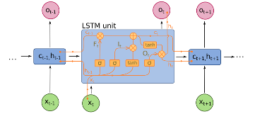

# Statistical streamflow modelling {#sm}

*Author: Lennart Marx*

*Supervisor: Henri Funk*

1000-3000 Words 10-15 pages

## Introduction

-   Importance of Streamflow modeling -hydro electricity... -classical models and problems
-   How much to focus on the provided paper?

## Data

### Preperation

The streamflow data is gathered from the bavarian hydrology authority (GKD). They provide freely accessible data on most water bodies in Bavaria.Focusing on rivers of medium size where the entire length is flowing inside of the area of the state of Bavaria, the river Regen located north/east of the city of Regensburg was chosen as a bases for this study.The GKD posesses 21 streamflow gauging stations located at the Regen or any of its tributary rivers. For the Regen river, data between 2014 and 2024 was available with daily measurements on the streamflows including the coordinates of the the gauging station. This study focused on the 15207507 Marienthal gauging station that was located closest to the final outflow towards the Danube river (IMAGE LOCATION of Measuring Station).

Utilizing the HydroRIVERS dataset, which contains the shapes of rivers all over the world, it was possible the acquire the shape of the Regen along with its geolocation (IMAGE).

A catchment also known as a drainage basin or watershed, is an area of land where all precipitation collects and drains off into a common outlet, such as a river, bay, or other body of water. The boundaries of a catchment are defined by the highest points of land around the drainage area, often referred to as the drainage divide. These catchment areas will later be used to determine the variables for precipitation that are used to forecast the streamflows of the river. Taking advantage of the HydroBASINS dataset, that contains the shapes of basins all over the world in different resolutions. With the software QGIS a Geoinformation System (GIS) all basins were chosen that completely contain the river Regen Shape, which led to the 19 defined chatchments that can be seen in fig bla (IMAGE).

The ERA5 reanalysis Dataset published by the copernicus project, contains a plethora of meteorological Data in the form of rasterized Data. Each data cell contains information of when it occured,where it occured in the form of longitude and latitude coordinates as well as the information on a meteorological variables. As suggested in (PAPER SOURCE), for this study the variables 2 meter temperature and total precipitation were selected in the area of the Regen and for the past 10 years.

### Preprocessing

The measuring station 15207507 contained 1 missing value which was imputed by linear interpolation. As suggested in (PAPER Source) non centered moving average smoothing with a window size of 3 was applied to the streamflow data (IMAGE). 

To combine the rasterized meteorological data from ERA5 with the streamflows of the Regen, it is necessary to only take precipitation into account that occurs within the defined catchments. To achieve this, a weighted average is calculated, where the weights are determined by the area size of the intersection between the raster cell of the meteorological data and the catchment. 

## Models

### LSTM

The Long Short-Term Memory (LSTM) cell is a type of recurrent neural network (RNN) architecture designed to model temporal sequences and their long-range dependencies more accurately than traditional RNNs. LSTMs were introduced by Sepp Hochreiter and Jürgen Schmidhuber in 1997 ( Citation missing) to address the issue of vanishing and exploding gradients encountered in traditional RNNs, which struggle to maintain context over long sequences.

placeholder {width="606"}

1.  **Cell State (**$C_t$): The internal memory of the cell, which can carry information across many time steps.
2.  **Hidden State (**$h_t$): The output of the LSTM cell at a given time step, also serving as the input to the next cell.
3.  **Input Gate (**$i_t$): Controls how much of the new information from the current input is used to update the cell state.
4.  **Forget Gate (**$f_t$): Decides how much of the past cell state should be forgotten.
5.  **Output Gate (**$o_t$): Determines the output of the LSTM cell based on the cell state.

LSTMs are particularly well-suited for tasks that involve sequential data and temporal dependencies, such as:

1.  **Natural Language Processing (NLP)**:
    -   Language modeling
    -   Machine translation
    -   Speech recognition
2.  **Time Series Forecasting**:
    -   Stock price prediction
    -   Weather forecasting
    -   Anomaly detection

Streamflow forecasting involves predicting the flow of water in rivers and streams over time, which is inherently a time-series problem with temporal dependencies influenced by various factors such as rainfall, snowmelt, and upstream water management. When used in an encoder decoder architecture LSTM-cells can also incorporate Future known covariates such as weather forecasts. These specifications make LSTM-based architectures beneficial for modeling and forecasting streamflow data.

### Temporal Fusion Transformer

The Temporal Fusion Transformer (TFT) is a neural network architecture specifically designed for multi-horizon time series forecasting. It combines the strengths of both recurrent and attention-based models, offering an advanced approach to handling complex time series data. The TFT was introduced by Bryan Lim et al. in 2019, aiming to provide interpretability and accuracy for forecasting tasks (IMAGE).

A TFT consists of several key components:

1.  **Temporal Processing**:
    -   **Local Processing with LSTMs**: LSTMs are used to process local temporal dependencies within the time series.
    -   **Multi-Head Attention**: An attention mechanism to capture long-range dependencies across different time steps.
2.  **Variable Selection**:
    -   **Static Covariate Encoders**: Handle static features that do not change over time (e.g., location-specific data).
    -   **Temporal Covariate Encoders**: Manage time-varying features (e.g., weather data, past values of the time series).
3.  **Gating Mechanisms**:
    -   **Gated Residual Network (GRN)**: Ensures that only relevant information is passed through layers, improving the network's efficiency and interpretability.
    -   **Variable Selection Networks**: Dynamically select relevant variables at each time step to enhance model performance and interpretability.
4.  **Multi-Horizon Forecasting**:
    -   **Sequence-to-Sequence Framework**: Allows the TFT to generate forecasts for multiple future time steps simultaneously.
5.  **Interpretable Outputs**:
    -   **Attention Weights**: Provide insights into which time steps and variables the model is focusing on, aiding interpretability.

The Temporal Fusion Transformer represents an advancement in time series forecasting, offering both high accuracy and interpretability. Its ability to capture complex dependencies, dynamically select relevant features, and provide insights into the decision-making process makes it a useful tool for streamflow forecasting.

###Metrics

Kling Gupta Efficiency

Mean Absolute Error

## Results

### Results from Paper

### Result LSTM

### Results TFT

## Conclusion

-talk about how the usage of mooving average smoothing is not advised

## Outlook

Firstly, implementing a robust hyperparameter tuning routine is essential to optimize model performance. This process will require additional computational resources due to the complexity and extensive search space. Given the high dependency of hyperparameters on lag, it is crucial to carefully adjust them to capture the temporal dynamics accurately.

Improving data preprocessing is another critical aspect. This includes downscaling meteorological variables to ensure the input data aligns better with the spatial and temporal resolution required for accurate streamflow predictions. Performance optimization techniques will also be explored to streamline the computational efficiency of the models.

To make the models more sensitive to extreme events such as floods, specialized training techniques and loss functions will be employed. Experimentation with different model architectures could offer insights into more effective structures for capturing the complex patterns in river streamflow data.

The models need to generalize across different rivers, which involves accounting for diverse hydrological and geographical characteristics. Including static variables such as river basin properties and land use information will help in creating a more comprehensive model that can adapt to various river systems.

@sabzipour
