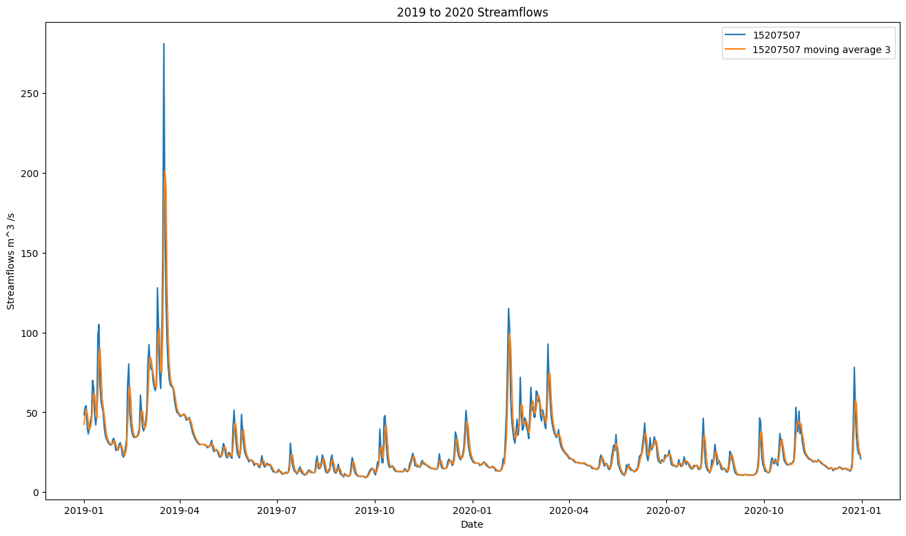
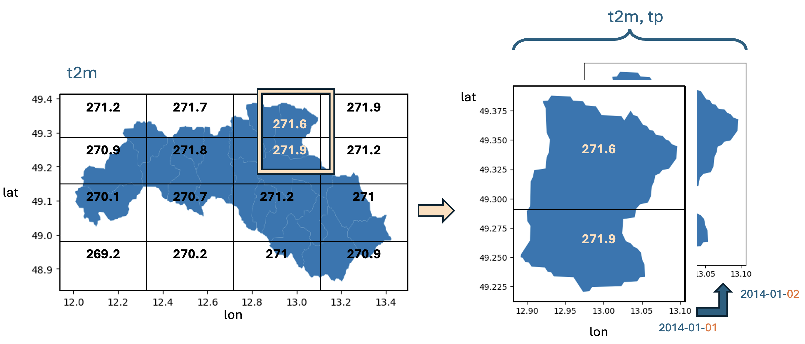
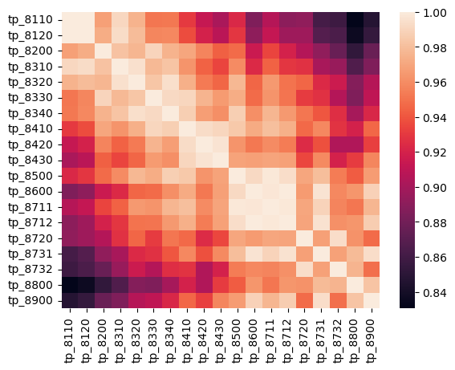
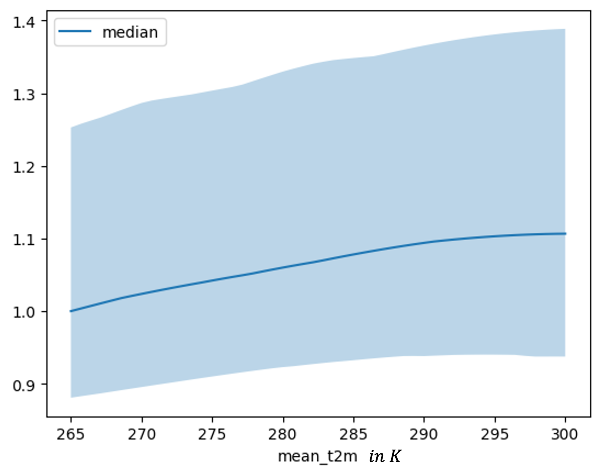

---
output:
  latex_engine: pdflatex
  keep_tex: true
  pdf_document: default
  word_document: default
  html_document: default
---

```{r message=FALSE, warning=FALSE, include=FALSE}
library(bookdown)
library(svglite)
```

# Statistical streamflow modelling {#sm}

*Author: Lennart Marx*

*Supervisor: Henri Funk*

*Degree: Master*

## Abstract

This study evaluates and compares the performance of Long Short-Term Memory (LSTM) networks and Temporal Fusion Transformers (TFT) in forecasting streamflows for up to seven day ahead forecasts, using historical streamflow data alongside precipitation and temperature as covariates. Freely available data published by the bavarian hydrological authority from the Regen river in Bavaria, Germany, was used in conjunction with meteorological data from the ERA5 reanalysis dataset. River basins are defined via the HydroRIVERS and HydroBASINS dataset to obtain the area over which precipitation is aggregated. Results indicate that while both models face challenges in predicting extreme values, TFT maintains more consistent accuracy over longer forecast horizons while pure LSTM model's predictions decline sharply in performance with increasing lead times.

## Introduction

Streamflow forecasting plays a crucial role in water resource management, particularly in flood prediction. As climate change intensifies extreme weather events and alters precipitation patterns, accurate streamflow forecasts have become increasingly important for mitigating flood risks by providing information about the timing and magnitude of potential flood events.This knowledge enables authorities to implement timely flood control measures, operate reservoirs effectively, and issue early warnings to vulnerable communities. As flooding remains one of the most common and destructive natural disasters, especially in developing countries, improved forecasting capabilities can significantly reduce the human and economic toll of these events. (@nearing2024)

Hydropower is the dominant source of renewable energy, accounting for 16% of the world's electricity output and 62% of renewable electricity generation (@lee2022). Precise streamflow predictions can be beneficial in optimizing reservoir operations. @lee2022 show that this is the case for 94% of all analyzed dams dependent on forecasting ability and reservoir characteristics.

A streamflow refers to the flow of water in rivers, streams or other water bodies, originating from precipitation, melting snow, and groundwater discharge. It is typically measured in cubic meters per second (m³/s).

In recent years, machine learning techniques have emerged as powerful tools for forecasting in various domains, including hydrology. Traditional hydrological models often rely on extensive datasets and intricate physical parameters, which can be challenging to obtain and process. In contrast, machine learning models such as Long Short-Term Memory (LSTM) networks offer an alternative approach by learning patterns directly from historical data.

This study aims to evaluate and compare the performance of LSTM and TFT models in forecasting streamflows up to seven days ahead. By incorporating precipitation and temperature as future known covariates alongside historical streamflow data, this work seeks to determine the effectiveness of these models in predicting streamflows.

## Data

### Preperation

The streamflow data is gathered from the bavarian hydrology authority (GKD). They provide freely accessible data on most water bodies in Bavaria @gkd2024. Focusing on rivers of medium size where the entire length of the river is located inside of the state of Bavaria, the river Regen positioned north/east of the city of Regensburg was chosen as a bases for this study. The GKD has data on 21 streamflow gauging stations located at the Regen or any of its tributary rivers. For the Regen river, data between 2014 and 2024 is available with daily measurements on the streamflows including the coordinates of the the gauging station. This study focused on the 15207507 Marienthal gauging station that was located closest to the final outflow towards the Danube river within the city of Regensburg. Utilizing the HydroRIVERS dataset, which contains the shapes of rivers all over the world, it was possible the acquire the shape of the Regen along with its geolocation as shown in figure \@ref(fig:regen-shape) @lehner2008.

```{r regen-shape,fig.cap = 'Streamflow gauging stations that provide there measurements at the GKD along the Regen river (adapted from @OpenStreetMap2017)', cache=FALSE, out.width="70%", fig.align="center", echo=FALSE, eval = TRUE}
knitr::include_graphics('work/07-hydroLSTM/images/regen_stations.png')
```

A catchment also known as a drainage basin or watershed, is an area of land where all precipitation collects and drains off into a common outlet, such as a river, bay, or other body of water. The boundaries of a catchment are defined by the highest points of land around the drainage area, often referred to as the drainage divide. These catchment areas will later be used to determine the variables for precipitation that are used to forecast the streamflows of the river. Taking advantage of the HydroBASINS dataset, that contains the shapes of basins all over the world in different resolutions @lehner2008. With the software QGIS a geoinformation system (GIS) all basins were chosen that completely contain the river Regen shape, which led to the 19 defined catchments that can be seen figure \@ref(fig:regen-catch).

```{r regen-catch, cache=FALSE, fig.cap = 'Catchments defined for the Regen river based on the HydroBASINS shapefile dataset (adapted from @OpenStreetMap2017)',out.width="70%", fig.align="center", echo=FALSE, eval = TRUE}
knitr::include_graphics('work/07-hydroLSTM/images/river_catch.png')
```

The ERA5 reanalysis dataset, contains a plethora of meteorological data in a rasterized form. Each data cell contains information of when it occured, where it occured in the form of longitude and latitude coordinates as well as the information on a meteorological variables @hersbach2023. As proposed in @sabzipour2023, for this study the variables 2 meter temperature and total precipitation were selected around the area of the Regen and for the past 10 years.

### Preprocessing

The measuring station 15207507 contained 1 missing value which was imputed by linear interpolation. As suggested in @sabzipour2023 non centered moving average smoothing with a window size of 3 was applied to the streamflow data as can be seen in figure \@ref(fig:marien-stream).

```{r marien-stream, cache=FALSE, out.width="80%",fig.cap = 'streamflows of the 15207507 Marienthal gauging stations before (blue) and after (orange) applying moving average smoothing', fig.align="center", echo=FALSE, eval = TRUE}

```

To combine the rasterized meteorological data from ERA5 with the streamflows of the Regen, it is necessary to only take precipitation into account that occurs within the defined catchments. To achieve this, a weighted average is calculated, where the weights are determined by the area size of the intersection between the raster cell of the meteorological data and the catchment. This can be seen in a schematic visualization in figure \@ref(fig:spatial-avg).

```{r spatial-avg, cache=FALSE, out.width="80%",fig.cap = 'schematic visualization of the spatial averaging performed for temperature and total precipitation during data preprocessing', fig.align="center", echo=FALSE, eval = TRUE}

```

$$ tp(\text{catch}_i) = \frac{1}{A(\text{catch}_i)} \sum_{cell_j \in \text{ERA5 raster}} \left( tp(\text{cell}_j) \cdot A(\text{catch}_i \cap \text{cell}_j) \right) \tag{1} $$
<div style="text-align: center;">
A : area  
catch : catchment  
cell : one cell in the raster data set of ERA5  
tp : total precipitation
</div>


Since the catchments are geospatially very close to each other, the different catchments are highly correlated to each other and therefore provide little variance (see Figure \@ref(fig:tp-corr)). To reduce the feature space for both variables temperature and precipitation, the mean is taken over all catchments. Finally to reduce the noise in the features a moving average of window size 3 was applied.

```{r tp-corr, cache=FALSE, out.width="70%", fig.cap = 'correlation table for total precipitation over all catchments',fig.align="center", echo=FALSE, eval = TRUE}

```

## Models

### LSTM

The Long Short-Term Memory (LSTM) cell (figure \@ref(fig:lstm)) is a type of recurrent neural network (RNN) architecture designed to model temporal sequences and their long-range dependencies more accurately than traditional RNNs. LSTMs were introduced by Sepp Hochreiter and Jürgen Schmidhuber in 1997 to address the issue of vanishing and exploding gradients encountered in traditional RNNs @hochreiter1997.

```{r lstm, cache=FALSE, out.width="70%", fig.cap = 'visualization of a LSTM cell at time step t (image adapted from @chevalier2023)',fig.align="center", echo=FALSE, eval = TRUE}
knitr::include_graphics('work/07-hydroLSTM/images/LSTM.png')
```

1.  **Cell State (**$C_t$): The internal memory of the cell, which can carry information across many time steps.
2.  **Hidden State (**$h_t$): The output of the LSTM cell at a given time step, also serving as the input to the next cell.
3.  **Input Gate (**$i_t$): Controls how much of the new information from the current input is used to update the cell state.
4.  **Forget Gate (**$f_t$): Decides how much of the past cell state should be forgotten.
5.  **Output Gate (**$o_t$): Determines the output of the LSTM cell based on the cell state.

LSTMs are particularly well-suited for tasks that involve sequential data and temporal dependencies, such as:

1.  **Natural Language Processing (NLP)**:
    -   Language modeling
    -   Machine translation
    -   Speech recognition
2.  **Time Series Forecasting**:
    -   Stock price prediction
    -   Weather forecasting
    -   Anomaly detection

Streamflow forecasting involves predicting the flow of water in rivers and streams over time, which is inherently a time-series problem with temporal dependencies influenced by various factors such as rainfall, snowmelt, and upstream water management. When used in an encoder decoder architecture LSTM-cells can also incorporate future known covariates such as weather forecasts. These specifications make LSTM-based architectures beneficial for modeling and forecasting streamflow data.

### Temporal Fusion Transformer

The Temporal Fusion Transformer (TFT) (figure \@ref(fig:tft)) is a neural network architecture specifically designed for multi-horizon time series forecasting. It combines the strengths of both recurrent and attention-based models, offering an advanced approach to handling complex time series data. The TFT was introduced by Bryan Lim et al. in 2019, aiming to provide interpretability and accuracy for forecasting tasks @lim2021.

```{r tft, cache=FALSE, out.width="80%", fig.cap = 'model architecture for the Temporal Fusion Transformer (image from @lim2021', fig.align="center", echo=FALSE, eval = TRUE}
knitr::include_graphics('work/07-hydroLSTM/images/TFT.png')
```

A TFT consists of several key components:

1.  **Temporal Processing**:
    -   **Local Processing with LSTMs**: LSTMs are used to process local temporal dependencies within the time series.
    -   **Multi-Head Attention**: An attention mechanism to capture long-range dependencies across different time steps.
2.  **Variable Selection**:
    -   **Static Covariate Encoders**: Handle static features that do not change over time (e.g., location-specific data).
    -   **Temporal Covariate Encoders**: Manage time-varying features (e.g., weather data, past values of the time series).
3.  **Gating Mechanisms**:
    -   **Gated Residual Network (GRN)**: Ensures that only relevant information is passed through layers, improving the network's efficiency and interpretability.
    -   **Variable Selection Networks**: Dynamically select relevant variables at each time step to enhance model performance and interpretability.
4.  **Multi-Horizon Forecasting**:
    -   **Sequence-to-Sequence Framework**: Allows the TFT to generate forecasts for multiple future time steps simultaneously.
5.  **Interpretable Outputs**:
    -   **Attention Weights**: Provide insights into which time steps and variables the model is focusing on, aiding interpretability.

The Temporal Fusion Transformer represents an advancement in time series forecasting, offering both high accuracy and interpretability. Its ability to capture complex dependencies, dynamically select relevant features, and provide insights into the decision-making process makes it a useful tool for streamflow forecasting.

### Kling Gupta Efficiency

The Kling-Gupta Efficiency (KGE) is a statistical metric used to evaluate the performance of hydrological models by comparing simulated data to observed data. Developed by Gupta et al. in 2009, the KGE addresses limitations found in traditional metrics such as the Nash-Sutcliffe Efficiency (NSE). The KGE decomposes the evaluation of model performance into three distinct components, providing a more comprehensive assessment. These components are correlation, bias, and variability, which help in understanding different aspects of the model's accuracy.

The KGE is calculated using the following formula:

$$ \text{KGE} = 1 - \sqrt{(r - 1)^2 + (\alpha - 1)^2 + (\beta - 1)^2} \tag{2} $$

-   $r$ is the Pearson correlation coefficient between the simulated and observed values.

-   $\alpha$ is the bias ratio, defined as the ratio of the mean of the simulated values to the mean of the observed values.

-   $\beta$ is the standard deviation ratio, defined as the ratio of the standard deviation of the simulated values to the standard deviation of the observed values.

## Results

### Training Setup

The 2 different model architectures were trained using the historical streamflows as well as temperature and precipitation as covariates. Using an input sequence length of 364 days and an output lead time of up to 7 days. Temperature and precipitation can be used as future known values when considering weather forecasts. For example when trying to predict one step ahead forecast for the streamflow in addition to the past 364 days of precipitation values one can consider the precipitation forecast for the next day to get the best predictions possible.

The LSTM Model is run in an encoder decoder architecture, were the past 364 days are the input for an LSTM cell which returns a hidden state and an output as the encoder step. During the decoder step, the encoder hidden state is fed into the decoder LSTM together with the future known inputs. The model predicts incrementally in the sense that for example to predict a 3 step ahead forecast it firsts predicts 1 and 2 step forecast and uses both forecasts to then predict the 3 step prediction. Both model architectures were used from the pytorch-forecasting library. The models were retrained for the different lead times. The used hyperparameters for both models are shown in Table \@ref(tab:tab-hyperparams).

The dataset is split into 70% train set, 15% validation set and 15% test set respectivell.

```{r tab-hyperparams, echo=FALSE}
hyperparameter_data <- data.frame(
  Hyperparameter = c("Batch Size", "Epochs", "Hidden Size", "Attention Head Size", "Learning Rate",
                     "Dropout", "Weight Decay", "Gradient Clipping", "Loss Function", "Optimizer",
                     "Reduce on Plateau Patience", "Time Varying Known Features", "Time Varying Unknown Features"),
  LSTM = c(128, 100, 128, "-", 0.001, 0.2, 0.001, 0.1, "Mean Absolute Error", "Adam", 7, "t2m, tp", "streamflow 15207507"),
  TFT = c(128, 80, 128, 2, 0.003, 0.1, 0.0001, 0.1, "Mean Absolute Error", "Adam", 7, "t2m, tp", "streamflow 15207507")
)
knitr::kable(hyperparameter_data, caption = "Hyperparameter comparison between LSTM and TFT.")
```


### Results

The models evaluated on the holdout test set show good performance for lead times of 1 and 2 days especially considering since the training and validation loss that is used is the MAE and not the KGE. The performance declines sharply for the LSTM model across the lead times while the decline for the TFT is more gradual as can be seen in Table \@ref(tab:tab-results).

```{r tab-results, echo=FALSE}
library(knitr)
performance_data <- data.frame(
  `Lead Time` = 1:7,
  `TFT KGE` = c('0.8352', '0.7103', '0.6410', '**0.6096**', '**0.5901**', '**0.5778**', '**0.5717**'),
  `LSTM KGE` = c('**0.9696**', '**0.8821**', '**0.6716**', '0.4943', '0.4302', '0.3312', '0.3185')
)
knitr::kable(performance_data, caption = "Performance comparison between TFT and LSTM models across different lead times on a holdout test set. Better performing model for each lead time in bold", format = "markdown")
```

Forecasting the peaks of the streamflows is challenging and neither model performs particularly well on this task. Especially when considering that the peaks were already drastically reduced due to the moving average smoothing of the target variable. The model routinely undershoots the observed true streamflows here shown for a lead time of 5 days for the LSTM Model and the TFT Model in figure \@ref(fig:lstm-pred) and in figure \@ref(fig:tft-pred) respectively. This behavior can be observed for all lead times except 1 and 2 days where the performance is reasonable even in the peaks.

```{r lstm-pred, cache=FALSE, out.width="80%", fig.cap = 'LSTM predicted streamflows for a lead time of 5 days (orange) compared to the observed streamflows (blue)', fig.align="center", echo=FALSE, eval = TRUE}
knitr::include_graphics('work/07-hydroLSTM/images/lag5_lstm.png')
```

```{r tft-pred, cache=FALSE, out.width="80%", fig.cap = 'TFT predicted streamflows for a lead time of 5 days (orange) compared to the observed streamflows (blue)', fig.align="center", echo=FALSE, eval = TRUE}
knitr::include_graphics('work/07-hydroLSTM/images/lag5_tft.png')
```

### Feature Importance

For an inspection of feature dependence it is possible to make use of the inbuilt function that the pytorch-forecasting library provides. The models show very similar behavior for both used covariates. As can be seen in \@ref(fig:tp-tft-imp) the TFT model observes a slightly stronger relationship between high total precipitation and large streamflows, but the plot for for both models has the expected shape, that high precipitation leads to high streamflows and vice versa.

In analyzing the relationship between t2m and streamflow, both graphs demonstrate a positive relationship. Specifically, the TFT dependence plot in Figure \@ref(fig:t2m-tft-imp) shows an increase up to approximately 280 K, beyond which the effect plateaus. Similarly, the LSTM model depicted in Figure \@ref(fig:t2m-lstm-imp) shows a more gradual increase, with the effect leveling off at higher mean temperatures of around 295 K.

```{r tp-lstm-imp, cache=FALSE, out.width="70%", fig.cap = 'Feature dependence plot for mean total precipitation for a lead time 5 trained LSTM', fig.align="center", echo=FALSE, eval = TRUE}
knitr::include_graphics('work/07-hydroLSTM/images/mean_tp_feature_importance_lstm.png')
```

```{r tp-tft-imp, cache=FALSE, out.width="70%", fig.cap = 'Feature dependence plot for mean total precipitation for a lead time 5 trained TFT', fig.align="center", echo=FALSE, eval = TRUE}
knitr::include_graphics('work/07-hydroLSTM/images/mean_tp_feature_importance_tft.png')
```

```{r t2m-lstm-imp, cache=FALSE, out.width="70%", fig.cap = 'Feature dependence plot for mean two meter temperature for a lead time 5 trained LSTM', fig.align="center", echo=FALSE, eval = TRUE}

```

```{r t2m-tft-imp, cache=FALSE, out.width="70%", fig.cap = 'Feature dependence plot for mean two meter temperature for a lead time 5 trained TFT', fig.align="center", echo=FALSE, eval = TRUE}
knitr::include_graphics('work/07-hydroLSTM/images/mean_t2m_feature_importance_tft.png')
```

## Conclusion

This study compares the performance of LSTM (Long Short-Term Memory) and Temporal Fusion Transformer (TFT) models in forecasting streamflows of the bavarian Regen river for up to seven days ahead, using precipitation and temperature as future known covariates alongside historical streamflow data. The data used was obtained from freely available data provided by the Bavarian hydrology authority and Copernicus Climate Project.

The findings indicate that both models exhibit limitations in predicting extreme values such as floods, with KGE (Kling-Gupta Efficiency) scores significantly lower than those reported in similar studies like @sabzipour2023, likely due to limited data amounts and the challenges inherent in modeling a river system instead of a reservoir. The results also demonstrate a clear difference in performance trends between the two models across different lead times.

Although the KGE was not used as the loss function in training the models. The LSTM's observed KGE scores are high starting at 0.9696 for a one-day lead time, before dropping sharply to 0.3185 for a seven-day lead time. Conversely, the TFT model shows a more gradual decline, from 0.8352 at one day to 0.5717 at seven days, suggesting it maintains more consistent accuracy over longer forecast horizons.

Despite the sharper decline in performance for longer lead times, the LSTM model is notably less resource-dependent, making it a viable option for scenarios where computational resources are limited. However, attempts to forecast streamflows without future known meteorological variables were unsuccessful, underscoring the importance of these covariates in achieving accurate predictions.

While the moving average was applied here, it is not advised to use this tool for streamflow forecasting. By reducing the peaks in the target variable it artificially boosts the predictive abitlity of the model and forces the model to miss the peaks by an even larger margin. In a flood scenario even with a high KGE, the model would miss the exact streamflow value as it was trained on lower peaks and would underestimate the posed danger in the situation.

## Outlook

Implementing a robust hyper-parameter tuning routine is essential to optimize model performance. This process will require additional computational resources due to the complexity and extensive search space. Given the high dependency of hyper-parameters on lag, it might be necessary to tune hyper-parameters for each lead time separately.

To make the models more sensitive to extreme events such as floods, specialized loss functions could be employed or training a consecutive model that that specifically forecasts the peaks taking the first models predictions as inputs.

The ERA5 dataset used for obtaining meterological data in this study only provides a very coarse representation of the underlying variables. The use of down scaling techniques to obtain a finer grid than the one used in this study might be able to boost the accuracy of the model.

Another next step could be to test the models ability to generalize by training on multiple datasets from different rivers. Including static variables such as river basin properties and land use information can help in creating a more comprehensive model that can adapt to various river systems.
