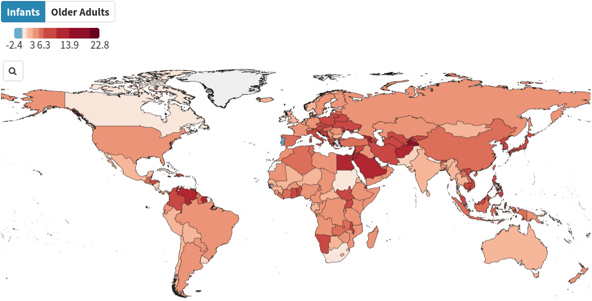
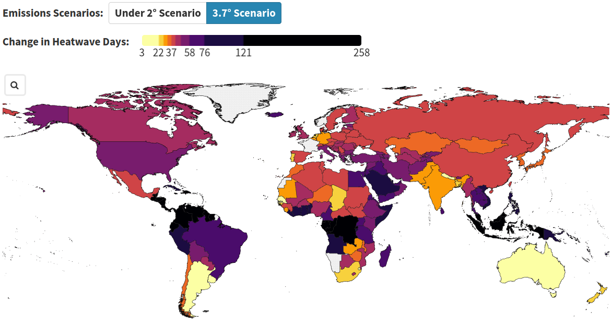
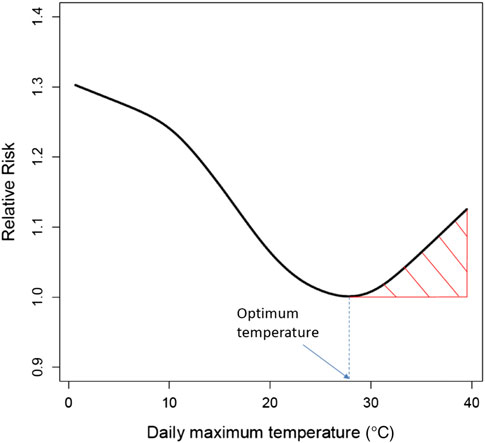
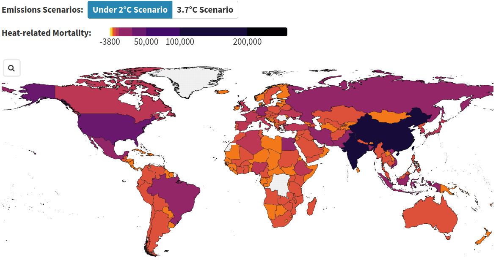

---
output:
  pdf_document: default
  word_document: default
  html_document: default
---

# The Lancet Report 2023    {#he1}

*Author: Michael Strobl*

*Supervisor: Prof. Dr. Helmut Küchenhoff*

*Suggested degree: Bachelor*

## Introduction

The 2023 report of the Lancet Countdown on health and climate change (@romanello20232023) aims to monitor the evolving impact of climate change on health and the emerging health opportunities of climate action. It is in its eighth iteration and was created by 114 scientists and health practitioners from 52 research institutions and UN agencies from all continents (but Antarctica). While this chapter is based on the 2023 report, there are also regional reports available, such as the 2024 report for Europe (@Van_Daalen2024-ut).

The current report focuses on 47 indicators, tracking changes based on observed data as well as projections, in the following fields:

#. Health hazards, exposures, and impacts
#. Adaptation, planning, and resilience for health
#. Mitigation actions and health co-benefits
#. Economics and fincance
#. Public and political engagement with health and climate change

The remainder of this chapter provides some background information on climate models, detailed information on three indicators, and a discussion.

## Background

Shared Socioeconomic pathways (SSPs) (@RIAHI2017153) were established by the climate research community in order to make the analysis of future climate impacts, vulnerabilities, adaptation, and mitigation possible. They describe alternative socioeconomic developments regarding their energy, land use, and emissions implications, e.g. more or less renewable energy vs. fossil fuels. The following SSPs are of interest for the rest of this chapter:

#. SSP1: Sustainability (low challenges to mitigation and adaption), corresponding to a 2°C emission scenario
#. SSP3: Regional Rivalry (high challenges to mitigation and adaptation), corresponding to a 3.7°C emission scenario

These pathways are considered by climate models, e.g. CMIP6 (@gmd-9-1937-2016), in order to describe multiple scenarios for climate projections. Figure \@ref(fig:cmip6strobl) shows CMIP6 simulations for multiple models and all SSPs. In this chapter, we consider SSP1, representing a sustainable path, and SSP3, representing a non-sustainable path, which humanity is following right now.

```{r cmip6strobl, cache=FALSE, out.width="100%", eval=TRUE, echo=FALSE, fig.cap="CMIP6 climate simulations for SSPs with projections until 2100 (https://www.dkrz.de/en/communication/climate-simulations/cmip6-en/cmip6-acivities-at-dkrz-overview?set_language=en; accessed on July 10, 2024)"}
knitr::include_graphics("work/08-lancet/figures/cmip6.jpg")
```

## Selected Indicators

We selected three indicators from the first field (Health hazards, exposures, and impacts) with detailed descriptions and outcomes. 

### Indicator 1.1.2: Exposure of vulnerable populations to heatwaves

Heatwaves have a severe or even life-threatening impact on human health, e.g. high temperatures can cause heat stroke, heat exhaustion, heat syncope, and heat cramps (see, for example, @doi:10.1161/CIRCULATIONAHA.122.061832 or @chambers2020). The following variables (among others) can influence mortality: increased risk for older adults (>65 years of age), low-income countries due to a reduced number of health workers, or pre-existing cardiovascular and chronic respiratory conditions.

This indicator tracks the number of heatwave days and the exposure of vulnerable populations (older adults and infants <1 years of age) to heatwaves. A heatwave day is a period of 2 or more days where both the minimum and maximum temperatures are above the 95th percentile of temperatures in 1986-2005.

The following datasets were used for this indicator:

* ERA5 monthly averaged data on single levels (@hersbach2020era5): World-wide weather data on a lat-lon grid of 0.25 degrees from 1940 onwards.
* ISIMP3b Bias Adjustment dataset (@lange2021isimip3b): A bias adjusted and downscaled version of the output of CMIP6 climate models with projections up to the year 2100.
* Hybrid gridded demographic data for the world (@Chambers_2020): Demographics data from 1950-2020 with 5-year population bands and a 0.5 degree grid.
* 2020 Revision of World Population Prospects (https://population.un.org/wpp/): This dataset contains population estimates as well as projections for 237 countries or areas between 1950 and 2100.
* A global downscaled age structure dataset for assessing human impacts of climate change (@briggsdaviddownscaled): This dataset contains historic population estimates starting in 1970 and projections considering SSP1 and SSP3 in a 0.5 degree grid.

Headline Finding:

"In 2013-2022, infants and people over 65 experienced, on average, 108% more days of heatwave per year than in 1986-2005."

Figures \@ref(fig:heatwaves1infantsstrobl) and \@ref(fig:heatwaves1adultsstrobl) show the increase in the number of heatwave days, comparing the time periods 1986-2005 and 2013-2022, for infants and older adults, respectively. This increase (or decrease for Portugal) per country can be calculated, for example, through ERA5 monthly averaged weather data and the hybrid gridded demographics dataset.

```{r heatwaves1infantsstrobl, cache=FALSE, out.width="100%", eval=TRUE, echo=FALSE, fig.cap="Change in number of heatwave days per country for infants, comparing the time periods 1986-2005 and 2013-2022."}

```
```{r heatwaves1adultsstrobl, cache=FALSE, out.width="100%", eval=TRUE, echo=FALSE, fig.cap="Change in number of heatwave days per country for older adults, comparing the time periods 1986-2005 and 2013-2022."}
knitr::include_graphics("work/08-lancet/figures/indicator_1_2.png")
```

The change in the number of heatwave days ranges from approximately -1 in Portugal to 16 in Tajikistan, with only minimal differences between infants and older adults.

Similarly, the ISIMP3b Bias Adjustment dataset combined with the global downscaled age structure dataset can be used to project the change in heatwave days up until the year 2100. Figures \@ref(fig:heatwaves2ssp1strobl) and \@ref(fig:heatwaves2ssp3strobl) show the projected change in heatwave days for older adults at mid-century (2041-2060) with baseline period 1995-2014. For example, the increase for Venezuela ranges from approximately 88 (SSP1) to 153 (SSP3) heatwave days per year.

```{r heatwaves2ssp1strobl, cache=FALSE, out.width="100%", eval=TRUE, echo=FALSE, fig.cap="Projections of the change in number of heatwave days for older adults per country for SSP1 (under 2 degree scenario) for mid-century (2041-2060) with baseline period 1995-2014."}
knitr::include_graphics("work/08-lancet/figures/indicator_1_3.png")
```
```{r heatwaves2ssp3strobl, cache=FALSE, out.width="100%", eval=TRUE, echo=FALSE, fig.cap="Projections of the change in number of heatwave days for older adults per country for SSP3 (3.7 degree scenario) for mid-century (2041-2060) with baseline period 1995-2014."}

```

### Indicator 1.1.5: Heat-related mortality

This indicator is tracking days with temperatures exceeding safe levels for humans and heat-related mortality. Only older adults are considered.

Similar datasets are used here as for the previous indicator. However, the difficulty arises due to the fact that safe temperatures may vary across regions (see @Honda2014). 

Headline Finding:

"In 2018-2022, people experienced on average 86 days of health-threatening high temperatures annually. 60% of such temperatures were made more than twice as likely to occur by human-caused climate change."

Therefore, @Honda2014 created the notion of an Optimum Temperature (OT), at which the mortality is the lowest. Figure \@ref(fig:mortalityhondastrobl) shows an example for the Tokyo Prefecture and the period 1972-2008. A smoothing spline with six degrees of freedom was used to model the Relative Risk (RR) for mortality and observed daily maximum temperature data. OT represents the daily maximum temperature where RR is the lowest. RR was used here in order to account for different populations of regions and an RR=1.0 is the reference mortality at around OT, i.e. the average number of deaths observed when the daily maximum temperature was within the range of the 75th to the 85th percentile for each year.

```{r mortalityhondastrobl, cache=FALSE, out.width="100%", eval=TRUE, echo=FALSE, fig.cap="A smoothing spline with six degrees of freedom was used for temperature data from the Tokyo Prefecture and the period 1972-2008, showing the daily maximum temperatures and the Relative Risk (RR) for mortality."}

```

The shaded area to the right of OT represents temperatures with increased mortality, i.e. daily maximum temperatures above OT are considered as risky for older adults. The average OT percentile of 47 Japanese prefectures was 83.6, which was used to decide which daily maximum temperatures exceeded safe levels for this indicator. In addition, a distributed lag nonlinear model (@Armstrong2006-mv) was used to model the increase in mortality (represented by RR) depending on temperature. This model is considered as a response function, which can be used to calculate the RR and therefore the absolute increase of mortality depending on the observed or projected temperatures.

Figure \@ref(fig:mortality1strobl) shows the increase in the number of days with unsafe temperatures (daily maximum temperatures exceeding OT). This includes the increasing number of days that were made at least twice as likely due to human induced climate change (it is not described how the red line was created).

```{r mortality1strobl, cache=FALSE, out.width="100%", eval=TRUE, echo=FALSE, fig.cap="Average number of days with unsafe temperatures for older adults from 1997 to 2022, including days that are twice as likely due to climate change."}
knitr::include_graphics("work/08-lancet/figures/indicator_2_1.png")
```

In addition, Figures \@ref(fig:mortality2ssp1strobl) and \@ref(fig:mortality2ssp3strobl) show the absolute projected increase in heat-related mortality per country for older adults at mid-century (2041-2060) compared to 1995-2014 as baseline, for SSP1 and SSP3, respectively. In both cases there is an increase, although it seems that the two scenarios, SSP1 and SSP3, have been flipped accidentially. In addition, only the absolute increase is shown, i.e. it is obvious that highly populated countries, such as India and China, have a very high increase compared to smaller countries. 

```{r mortality2ssp1strobl, cache=FALSE, out.width="100%", eval=TRUE, echo=FALSE, fig.cap="Projections of the absolute change in heat-related mortality for older adults per country for SSP1 (under 2 degree scenario) for mid-century (2041-2060) with baseline period 1995-2014."}

```
```{r mortality2ssp3strobl, cache=FALSE, out.width="100%", eval=TRUE, echo=FALSE, fig.cap="Projections of the absolute change in heat-related mortality for older adults per country for SSP3 (3.7 degree scenario) for mid-century (2041-2060) with baseline period 1995-2014."}
knitr::include_graphics("work/08-lancet/figures/indicator_2_5.png")
```

The response function is kept constant for these projections, i.e. adaptation is ignored for this indicator. Also, absolute numbers of mortality are used here, i.e. it was not distinguished between heat-related deaths and other causes.

### Indicator 1.4: Food insecurity and undernutrition

In 2022, 725 million people faced hunger and in 2021, 3.1 billion people were unable to afford a healthy diet (@noauthor_2023-jt). For example, climate change is undermining crop yields, affecting labour capacity, and threatening food security of marine resources.

In addition to the previously mentioned datasets, specifically ERA5 and ISIMP3b, data from the Food and Agriculture Organization Food Insecurity Experience Scale (FIES) (@CAFIERO2018146) was used. This dataset contains survey data from 153 countries and territories during the years 2014, 2015, and 2016. Among others, people were asked for whether they experienced moderate or severe food insecurity within the past 12 months. This was matched with weather data in these peoples specific regions in order to find out whether they experienced heatwaves (as previously defined) or drought months (12-monthly SPEI; only during the growth season of specific crops). In order to make predictions for all other years, including the future, a time-varying panel regression model was used (without further detail). The goal was to predict the percentage of people reporting food insecurity based on heatwaves and drought months experienced within a specific year.

Headline Finding:

"The higher frequency of heatwave days and drought months in 2021 compared to 1981–2010, is associated with 127 million more people experiencing moderate or severe food insecurity."

Figure \@ref(fig:food1strobl) shows world-wide predictions of the change in percentage points (using the previously mentioned model) for heatwaves and drought months for the period 2014-2021. As temperatures, number of heatwave days as well as number of drought months increase, more people are expected to experience severe or moderate food insecurity.

```{r food1strobl, cache=FALSE, out.width="100%", eval=TRUE, echo=FALSE, fig.cap="Impact of extreme weather (heatwaves and droughts) on food insecurity from 2014-2021, based on survey data."}
knitr::include_graphics("work/08-lancet/figures/indicator_3_1.png")
```

Figures \@ref(fig:food2ssp1strobl) and \@ref(fig:food2ssp3strobl) show projections (SSP1 and SSP3, respectively) for the percentage point changes for both kinds of extreme weather combined for mid-century (2014-2060), compared to the baseline 1995-2014. For example for Somalia, this change ranges from 4.02 (SSP1) to 10.32 (SSP3).

```{r food2ssp1strobl, cache=FALSE, out.width="100%", eval=TRUE, echo=FALSE, fig.cap="Projections of the impact of extreme weather on food inscurity per country for SSP1 (under 2 degree scenario) for mid-century (2041-2060) with baseline period 1995-2014."}
knitr::include_graphics("work/08-lancet/figures/indicator_3_2.png")
```
```{r food2ssp3strobl, cache=FALSE, out.width="100%", eval=TRUE, echo=FALSE, fig.cap="Projections of the impact of extreme weather on food inscurity per country for SSP3 (3.7 degree scenario) for mid-century (2041-2060) with baseline period 1995-2014."}
knitr::include_graphics("work/08-lancet/figures/indicator_3_3.png")
```

It is unclear why for many countries there is missing data.

## Discussion

The 2023 report of the Lancet Countdown on health and climate change provides a comprehensive overview of the current state of the impact of climate change on health and opportunities of climate action. 47 indicators are used to keep track of where humanity is at right now.

We provided detailed descriptions of three main indicators and the modelling techniques used, if mentioned. However, there are a few issues discovered:

* These modelling techniques are typically not described in much detail. Sometimes, as in the case for @Honda2014, some more information is provided in cited articles, but still on a relatively high level.
* The baselines for comparisons or projections vary. It is not clear, nor described, why different baselines are used. For projections, it is obvious that the baseline for CMIP6 projections (1995-2014) was used, without information on why not the one that was previously used for the indicator at hand.
* In general, the main findings are reported, without going much into detail on how the authors came up with these. In some cases, e.g. indicator 1.1.5, cited articles provide more information, but in other cases, e.g. indicator 1.4, it seems to be mainly the authors own work, without providing details. 


