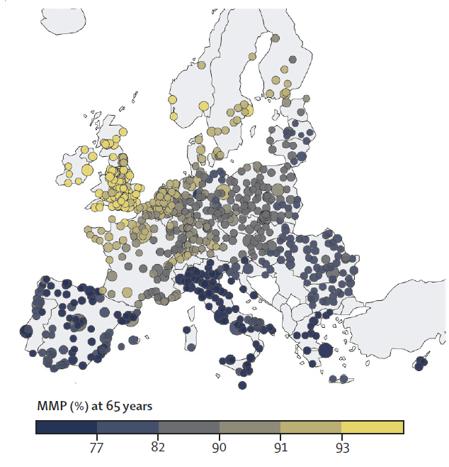
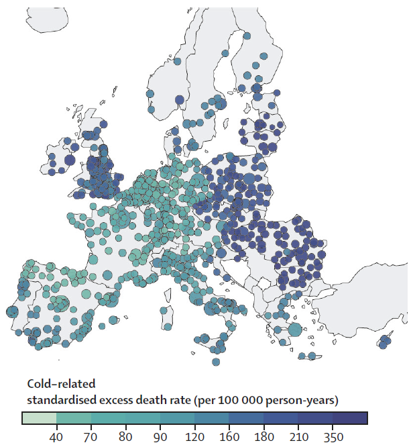
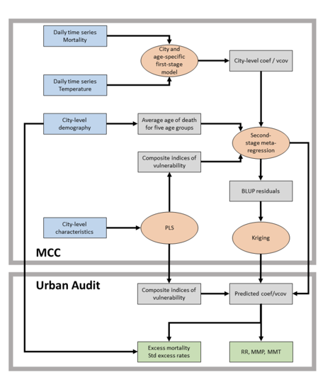

# Introduction

This presentation covers epidemiologic studies on the effects of heat on health. The aim is to discuss the excess mortality attributed to heat and cold based on recent studies by Masselot et al. (2023) [@masselot2023] and the joint effects of air pollution and heat on mortality as examined by Stafoggia et al. (2023) [@stafoggia2023].

## Excess Mortality Attributed to Heat and Cold

### Background for Study

Masselot et al. (2023) conducted a comprehensive study on the mortality impacts of non-optimal ambient temperatures. Both heat and cold are established risk factors, and the study aims to provide a robust assessment of these impacts. Previous research has predominantly focused on country-specific data or omitted significant factors.

### Added Value

This study offers several key advancements:

First, it has unprecedented city coverage, examining 854 urban areas across Europe. This extensive coverage offers a more comprehensive assessment compared to prior studies that focused on specific countries or regions. Furthermore, the study balances its focus on both heat and cold impacts, providing a complete picture of temperature-related health risks. It explicitly models age-specific risks and provides age-standardized mortality rates, which allow for fair comparisons across different locations with varying demographic compositions. This is particularly important as it highlights the heightened vulnerability of the elderly population.

Compared to Zhao et al. (2021), Masselot et al. (2023) focuses on a more detailed regional scope by examining 854 cities in Europe, while Zhao's study covered 750 locations globally. Both studies cover the same period from 2000 to 2019, allowing for direct comparison. Masselot's study utilizes higher resolution ERA5-Land reanalysis data, which may provide a more accurate exposure assessment, especially for smaller cities. Additionally, the inclusion of age-specific mortality data in Masselot's study allows for a more nuanced analysis of age-related vulnerability to temperature extremes. Here is a table summarizing the key differences between the two studies:

| Feature                       | Zhao et al. (2021)            | Masselot et al. (2023)               | Added Benefit of Masselot et al. (2023)                       |
|-------------------------------|-------------------------------|--------------------------------------|---------------------------------------------------------------|
| **Geographical Scope**        | Global (750 locations in 43 countries) | Europe (854 cities in 30 countries)   | More detailed focus on a specific region.                      |
| **Temporal Scope**            | 2000-2019                     | 2000-2019                            | Allows direct comparison of results.                           |
| **Exposure Data**             | Gridded temperature data (0.5° x 0.5°) | ERA5-Land reanalysis data (9 km resolution) | Higher resolution data provides more accurate exposure assessment. |
| **Outcome Data**              | Daily all-cause or non-external mortality counts | Daily all-cause or non-accidental mortality counts, with age-specific data for a subset of cities | Inclusion of age-specific mortality data allows for nuanced analysis. |
| **Modeling Framework**        | Three-stage: time-series regression, meta-regression, prediction | Three-stage: quasi-Poisson regression with DLNM, meta-regression with PLS, kriging interpolation | Incorporation of PLS for dimensionality reduction and kriging for spatial interpolation. |
| **Vulnerability Assessment**  | Limited to 5 meta-predictors | Includes 22 city-specific characteristics | Comprehensive assessment of vulnerability factors. |
| **Age-Specific Analysis**     | Not explicitly mentioned      | Provides age-specific relative risks and age-standardized mortality rates | More targeted understanding of vulnerable age groups.         |

### Limitations

The study also has limitations. The extrapolation of exposure-response functions (ERFs) across European cities may introduce bias, especially in less-covered areas like Eastern Europe. Additionally, reliable ERFs could not be estimated for people younger than 20 years due to low death counts, limiting the analysis for younger populations.

### Findings

The study by Masselot et al. (2023) provides a detailed analysis of the impact of non-optimal temperatures on mortality across Europe. The study found an annual excess of 203,620 deaths due to cold and 20,173 deaths due to heat. Age-standardized excess death rates were calculated at 129 per 100,000 person-years for cold and 13 per 100,000 person-years for heat.

#### Regional Variations

The results indicated significant variations across different regions of Europe. The highest mortality effects were observed in eastern European cities, where the infrastructure and healthcare systems might be less equipped to handle extreme temperatures compared to their western counterparts.

 

#### Age-Related Vulnerability

The study highlighted that vulnerability increases with age, particularly for individuals aged 85 and above. The pooled overall cumulative exposure-response relationship was predicted at several ages: 20-44 years, 45-64 years, 65-74 years, 75-84 years, and 85+ years. This data provides crucial insights into how different age groups respond to temperature extremes.

  

Several key terms are defined in the study to better understand the results:

- **Exposure-Response Function (ERF):** This describes the relationship between exposure levels (temperature) and mortality risk.
- **Minimum Mortality Temperature (MMT):** The specific temperature at which mortality risk is lowest.
- **Minimum Mortality Percentile (MMP):** The temperature range where the population is generally healthiest.
- **Relative Risk (RR):** The ratio of mortality risk at a specific temperature compared to the MMT.

The study also analyzed the relative risks for cold and heat in capital cities across five age groups. The findings showed that excess mortality is generally lower in Western Europe compared to Northern and Southern Europe.

#### Geographical Gradient

One notable finding is the north-south gradient in the Minimum Mortality Percentile (MMP) and Minimum Mortality Temperature (MMT). As temperatures get hotter, the MMP decreases and the MMT increases, indicating that populations in hotter climates have adapted to higher temperatures as their baseline for optimal health.

|  |  |
|:--------------------------------------------:|:--------------------------------------------:|
| Minimum Mortality Temperature Across Europe      | Minimum Mortality Percentile Across Europe  |

 
The study's maps illustrate these gradients and the spatial distribution of temperature-related mortality risks. For example, cold-related mortality shows higher excess death rates in Eastern Europe, while heat-related mortality is more prominent in Southern Europe.

|  |  |
|:--------------------------------------------:|:--------------------------------------------:|
| Cold-Related Standardized Excess Death Rate      | Heat-Related Standardized Excess Death Rate  

These visualizations provide a comprehensive overview of the temperature-mortality relationship across Europe, highlighting regions and populations that are most vulnerable to extreme temperatures.

### Conclusion

The detailed findings from this study underscore the importance of tailored public health strategies that consider regional and age-specific vulnerabilities. By understanding the nuanced impacts of heat and cold across different European cities and demographic groups, policymakers can better prepare for and mitigate the adverse health effects of extreme temperatures.

### Data and Framework

The study utilized data from 854 urban audit cities from Eurostat and 232 cities from the Multicountry Multi-city (MCC) Collaborative Research Network. City-specific meta-predictors included total population, proportion of population above 65 years, population density, GDP per capita, and environmental factors like PM2.5 concentration and annual temperature range.

Dimensionality reduction is achieved using PLS regression to create composite indices of vulnerability. This method helps in capturing geographical variability in risks while avoiding overfitting. PLS regression is used for dimensionality reduction and predictive modeling, particularly useful when dealing with a large number of highly correlated predictors. The Akaike Information Criterion (AIC) helps select the optimal number of PLS components by balancing goodness of fit with model complexity.

### Modelling Framework

The modelling framework includes several stages:
1. **City-Specific Risk Estimation:** Using a quasi-Poisson regression model with a distributed lag non-linear model (DLNM).
2. **Meta-Regression and Spatial Interpolation:** Pooling city-specific estimates into a multivariate multilevel meta-regression model.
3. **Prediction and Impact Assessment:** Predicting ERFs for all 854 cities and estimating excess deaths.

Here is a Flowchart of the Modelling Framework:

### Partial Least Squares (PLS) Regression

Partial Least Squares (PLS) regression is a statistical method used for dimensionality reduction and predictive modeling. It is particularly useful when dealing with a large number of highly correlated predictors. The goal of PLS is to find the fundamental relations between two matrices (predictors and responses) by projecting the predictors to a new space.

In the context of epidemiologic studies on the heat effects, PLS regression helps in creating composite indices of vulnerability from city-specific characteristics. This method captures geographical variability in risks while avoiding overfitting.

#### PLS Algorithm

The PLS algorithm iteratively constructs new predictor variables (latent variables) that are linear combinations of the original predictor variables. These new variables are uncorrelated and explain the maximum possible variance in the response variables.

The steps involved in PLS are as follows:

1. **Standardize the predictors and responses**:
   \[
   \mathbf{X} = \frac{\mathbf{X} - \mathbf{\bar{X}}}{\mathbf{S_X}}
   \]
   \[
   \mathbf{Y} = \frac{\mathbf{Y} - \mathbf{\bar{Y}}}{\mathbf{S_Y}}
   \]

2. **Calculate the covariance matrix**:
   \[
   \mathbf{C} = \mathbf{X}^T \mathbf{Y}
   \]

3. **Extract the first latent variable**:
   \[
   \mathbf{w}_1 = \arg \max \left( \mathbf{w}^T \mathbf{C} \mathbf{w} \right)
   \]
   Subject to \(\|\mathbf{w}\| = 1\).

4. **Compute the scores for the first latent variable**:
   \[
   \mathbf{t}_1 = \mathbf{X} \mathbf{w}_1
   \]
   \[
   \mathbf{u}_1 = \mathbf{Y} \mathbf{q}_1
   \]
   Where \(\mathbf{q}_1 = \mathbf{C} \mathbf{w}_1\).

5. **Deflate the matrices**:
   \[
   \mathbf{X}_1 = \mathbf{X} - \mathbf{t}_1 \mathbf{p}_1^T
   \]
   \[
   \mathbf{Y}_1 = \mathbf{Y} - \mathbf{t}_1 \mathbf{c}_1^T
   \]
   Where \(\mathbf{p}_1 = \mathbf{X}^T \mathbf{t}_1 / (\mathbf{t}_1^T \mathbf{t}_1)\) and \(\mathbf{c}_1 = \mathbf{Y}^T \mathbf{t}_1 / (\mathbf{t}_1^T \mathbf{t}_1)\).

6. **Repeat steps 2-5** for the remaining components.

#### Geometric View

Geometrically, PLS regression can be viewed as projecting the original predictor space \(\mathbf{X}\) into a lower-dimensional latent space while maximizing the covariance between the predictors and the responses \(\mathbf{Y}\).

The projections are chosen to ensure that each successive pair of latent variables captures the maximum possible covariance between \(\mathbf{X}\) and \(\mathbf{Y}\).

### Akaike Information Criterion (AIC) and Model Selection

AIC is used to select the optimal number of PLS components. It balances the goodness of fit with the complexity of the model. Lower AIC values indicate a better model fit, accounting for the number of parameters used.

The formula for AIC is:
\[
\text{AIC} = 2k - 2\ln(\hat{L})
\]
where \(k\) is the number of parameters in the model and \(\hat{L}\) is the maximized value of the likelihood function for the estimated model.

The plot below shows the AIC values for different numbers of PLS components. The optimal number of components is indicated by the lowest AIC value, which in this case is four components. This balance ensures that the model is neither overfitted nor underfitted, providing a parsimonious and explanatory model for predicting temperature-related mortality risks.

 \footnote{Source: Excess mortality attributed to heat and cold}

### Application in the Study

In the epidemiologic study on the heat effects, PLS regression was performed by reducing the dimensionality of city-specific characteristics into a few uncorrelated components. These components were then used in the meta-regression model to predict temperature-related mortality risks across different cities and age groups.

The PLS regression allowed the study to incorporate a large number of variables, such as demographic and environmental factors, without overfitting the model. This approach provided a robust framework for assessing the vulnerability of different urban areas to heat and cold effects.

By selecting the optimal number of components through AIC, the study ensured that the models were both parsimonious and explanatory, leading to reliable predictions of excess mortality due to temperature extremes.

### Application in the Study

In the epidemiologic study on the heat effects, PLS regression was performed by reducing the dimensionality of city-specific characteristics into a few uncorrelated components. These components were then used in the meta-regression model to predict temperature-related mortality risks across different cities and age groups.

The PLS regression allowed the study to incorporate a large number of variables, such as demographic and environmental factors, without overfitting the model. This approach provided a robust framework for assessing the vulnerability of different urban areas to heat and cold effects.

By selecting the optimal number of components through AIC, the study ensured that the models were both parsimonious and explanatory, leading to reliable predictions of excess mortality due to temperature extremes.

### Model

The model used to estimate the main effect of air temperature on mortality employs a quasi-Poisson regression framework. This framework is suitable for count data, such as daily death counts, and can handle overdispersion commonly observed in such data.

#### Quasi-Poisson Regression Model

The primary model is formulated as follows:
\[ \text{log}(\mu_i) = \alpha + \sum_{j=1}^{p} \beta_j x_{ij} + \gamma z_i \]
where:
- \(\mu_i\) is the expected daily death count for day \(i\),
- \(\alpha\) is the intercept,
- \(x_{ij}\) represents the predictor variables (e.g., temperature, humidity, etc.) for day \(i\) and predictor \(j\),
- \(\beta_j\) are the regression coefficients for the predictor variables,
- \(z_i\) includes other confounders such as air pollution levels, day of the week, and long-term trends,
- \(\gamma\) represents the coefficients for the confounders.

The quasi-Poisson model is an extension of the Poisson model, which allows for overdispersion by adding a dispersion parameter \(\theta\):
\[ \text{Var}(Y_i) = \theta \mu_i \]

### Assessing Overdispersion

In epidemiological studies involving count data, such as daily mortality counts, it is essential to assess for overdispersion. Overdispersion occurs when the observed variance in the count data is greater than what is expected under a standard Poisson model. This can lead to underestimated standard errors and consequently overconfident statistical inferences.

#### Overdispersion in Poisson Models

The Poisson regression model assumes that the mean and variance of the count data are equal (\(\mu = \sigma^2\)). However, in real-world data, this assumption often does not hold, especially in the presence of unobserved heterogeneity or clustering effects.

To assess for overdispersion, we can use the following diagnostic measures:

1. **Dispersion Parameter (\(\theta\))**:
   The dispersion parameter is defined as the ratio of the Pearson chi-square statistic to the degrees of freedom:
   \[
   \theta = \frac{\sum_{i=1}^{n} (y_i - \hat{\mu}_i)^2 / \hat{\mu}_i}{n - p}
   \]
   where \(y_i\) is the observed count, \(\hat{\mu}_i\) is the predicted count, \(n\) is the number of observations, and \(p\) is the number of parameters estimated in the model. A \(\theta\) value greater than 1 indicates overdispersion.

2. **Pearson Chi-Square Statistic**:
   The Pearson chi-square statistic is calculated as:
   \[
   X^2 = \sum_{i=1}^{n} \frac{(y_i - \hat{\mu}_i)^2}{\hat{\mu}_i}
   \]
   This statistic is compared against the chi-square distribution with \(n - p\) degrees of freedom. A significantly large value indicates overdispersion.

3. **Residual Deviance**:
   The residual deviance should be approximately equal to the degrees of freedom under the Poisson assumption. A much larger residual deviance suggests overdispersion:
   \[
   \text{Deviance} = 2 \sum_{i=1}^{n} \left[ y_i \log\left(\frac{y_i}{\hat{\mu}_i}\right) - (y_i - \hat{\mu}_i) \right]
   \]

#### Addressing Overdispersion

When overdispersion is detected, alternative modeling approaches should be considered to obtain valid statistical inferences:

1. **Quasi-Poisson Model**:
   The quasi-Poisson model adjusts for overdispersion by introducing a dispersion parameter:
   \[
   \text{Var}(Y_i) = \theta \mu_i
   \]
   This model provides robust standard errors that account for overdispersion.

2. **Negative Binomial Model**:
   The negative binomial model is another approach that introduces an additional parameter to model the overdispersion. The variance is modeled as:
   \[
   \text{Var}(Y_i) = \mu_i + \alpha \mu_i^2
   \]
   where \(\alpha\) is the overdispersion parameter. This model is particularly useful when the overdispersion increases with the mean.

3. **Generalized Estimating Equations (GEE)**:
   GEEs provide a flexible approach to handle correlated and overdispersed data by specifying a working correlation structure. They produce robust standard errors that are valid even if the specified correlation structure is incorrect.

#### Application in the Study

In the context of the study on the effects of temperature on mortality, assessing overdispersion is crucial for ensuring the validity of the model estimates. The quasi-Poisson regression model was chosen for this study due to its ability to handle overdispersed data effectively. The dispersion parameter was estimated, and diagnostic checks were performed to confirm the presence of overdispersion.

By using the quasi-Poisson model, the study obtained robust standard errors and more reliable estimates of the temperature-mortality relationship. This approach ensured that the findings were not biased by underestimated variability, leading to more accurate and confident public health recommendations.

#### Quasi-Poisson Regression Model

The Quasi-Poisson regression model adjusts for overdispersion in count data like mortality. The model is represented as:
\[ \text{log}(\mu_i) = \alpha + \sum_{j=1}^{p} \beta_j x_{ij} + \gamma z_i \]
where \(\mu_i\) is the expected daily death count, \(\alpha\) is the intercept, \(x_{ij}\) represents the predictor variables (e.g., temperature), \(\beta_j\) are the regression coefficients, and \(z_i\) includes other confounders like air pollution levels.

#### Distributed Lag Non-Linear Model (DLNM)

To capture the delayed and non-linear effects of temperature on mortality, a Distributed Lag Non-Linear Model (DLNM) is used. The DLNM incorporates the lagged effects of temperature, recognizing that exposure to extreme temperatures can affect mortality over several days. The model can be expressed as:
\[ \text{log}(\mu_i) = \alpha + f(\text{temperature}_{i-l}) + \sum_{k} \beta_k z_{ik} \]
where \(f(\text{temperature}_{i-l})\) represents a smooth function of temperature over lag \(l\) days, and the other terms are as previously defined.

The smooth function \(f\) is typically modeled using splines, allowing for flexible non-linear relationships:
\[ f(\text{temperature}_{i-l}) = \sum_{m=1}^{M} s_m(\text{temperature}_{i-l}) \]
where \(s_m\) are the spline basis functions and \(M\) is the number of basis functions.

#### Meta-Analysis

In the second stage, the results from individual city-specific models are pooled using a multilevel random-effects meta-analysis. This approach combines the estimates from different cities while accounting for between-city variability. The random-effects model is given by:
\[ \hat{\theta}_j = \theta + u_j + \epsilon_j \]
where:
- \(\hat{\theta}_j\) is the estimated effect size for city \(j\),
- \(\theta\) is the overall effect size,
- \(u_j\) is the random effect for city \(j\), assumed to follow a normal distribution with mean 0 and variance \(\tau^2\),
- \(\epsilon_j\) is the within-city error term.

The overall effect size \(\theta\) is estimated by weighting the city-specific estimates based on their variances:
\[ \hat{\theta} = \frac{\sum_{j=1}^{J} w_j \hat{\theta}_j}{\sum_{j=1}^{J} w_j} \]
where \(w_j = \frac{1}{\text{Var}(\hat{\theta}_j) + \tau^2}\) are the weights.

#### Incorporating Age-Specific Effects

The model also considers age-specific effects by stratifying the analysis by different age groups. Age-stratified models help in understanding the differential impact of temperature on various age cohorts. The age-specific model is given by:
\[ \text{log}(\mu_{i,a}) = \alpha_a + \sum_{j=1}^{p} \beta_{j,a} x_{ij} + \gamma_a z_i \]
where \(\mu_{i,a}\) is the expected daily death count for age group \(a\), and the other terms are as previously defined but specific to age group \(a\).

### Findings and Interpretation

The combination of quasi-Poisson regression, DLNM, and multilevel meta-analysis provides a robust framework for estimating the temperature-mortality relationship. The pooled estimates across cities indicate the overall effect of temperature on mortality while accounting for local variations and confounders.

The findings from the model underscore the significant impact of temperature extremes on mortality, with cold temperatures generally showing a larger effect than heat in many European cities. The results highlight the importance of considering both immediate and lagged effects of temperature, as well as the need for city-specific and age-specific analyses to inform targeted public health interventions.

By employing these advanced statistical techniques, the study provides comprehensive and nuanced insights into the public health implications of temperature variability and extreme weather events.

## Joint Effect of Heat and Air Pollution on Mortality

### Findings

The study by Stafoggia et al. (2023) examined the combined effects of high temperatures and air pollution on mortality. The analysis involved data from 620 cities in 36 countries, providing a comprehensive overview of the joint impact of these environmental stressors. The findings indicated that both high temperatures and air pollution independently increase mortality rates. However, their combined effect is significantly more pronounced. Specifically, a temperature increase from the 75th to the 99th percentile was associated with an 8.9% rise in mortality.

### Model

To estimate the joint effect of air temperature and air pollution on mortality, a two-stage modeling approach was employed.

#### First Stage: City-Specific Models

In the first stage, city-specific models were developed using a quasi-Poisson regression framework. The model is expressed as:

\[ \text{log}(\mu_{i}) = \alpha + \beta_1 \text{Temp}_{i} + \beta_2 \text{PM}_{i} + \beta_3 (\text{Temp}_{i} \times \text{PM}_{i}) + \sum_{j=1}^{p} \gamma_j z_{ij} \]

where:
- \(\mu_{i}\) is the expected daily death count for day \(i\),
- \(\alpha\) is the intercept,
- \(\text{Temp}_{i}\) represents the temperature on day \(i\),
- \(\text{PM}_{i}\) represents the air pollution level (e.g., PM2.5 concentration) on day \(i\),
- \(\text{Temp}_{i} \times \text{PM}_{i}\) is the interaction term between temperature and air pollution,
- \(\beta_1, \beta_2,\) and \(\beta_3\) are the coefficients for temperature, air pollution, and their interaction, respectively,
- \(z_{ij}\) represents other covariates (e.g., day of the week, long-term trends),
- \(\gamma_j\) are the coefficients for the covariates.

The interaction term (\(\beta_3\)) captures the joint effect of temperature and air pollution on mortality, indicating how the combined exposure amplifies the risk.

#### Distributed Lag Non-Linear Model (DLNM)

The DLNM was used to account for the delayed effects of temperature and air pollution. The model is formulated as:

\[ \text{log}(\mu_{i}) = \alpha + f(\text{Temp}_{i-l}, \text{PM}_{i-l}) + \sum_{k=1}^{p} \gamma_k z_{ik} \]

where:
- \(f(\text{Temp}_{i-l}, \text{PM}_{i-l})\) is a bivariate smooth function of temperature and air pollution over lag \(l\) days,
- \(z_{ik}\) are other covariates.

This model allows for flexible modeling of the non-linear and lagged relationships between temperature, air pollution, and mortality.

#### Second Stage: Meta-Analysis

In the second stage, the city-specific estimates were pooled using a multilevel random-effects meta-analysis. This approach combines the results from different cities, accounting for between-city heterogeneity.

The random-effects model is given by:

\[ \hat{\theta}_j = \theta + u_j + \epsilon_j \]

where:
- \(\hat{\theta}_j\) is the estimated effect size for city \(j\),
- \(\theta\) is the overall effect size,
- \(u_j\) is the random effect for city \(j\), assumed to follow a normal distribution with mean 0 and variance \(\tau^2\),
- \(\epsilon_j\) is the within-city error term.

The overall effect size \(\theta\) is estimated by weighting the city-specific estimates based on their variances:

\[ \hat{\theta} = \frac{\sum_{j=1}^{J} w_j \hat{\theta}_j}{\sum_{j=1}^{J} w_j} \]

where \(w_j = \frac{1}{\text{Var}(\hat{\theta}_j) + \tau^2}\) are the weights.

### Comparison of Findings: Masselot et al. (2023) vs. Stafoggia et al. (2023)

Both studies highlight the significant impact of temperature on mortality, but they approach the analysis from different angles and include different additional variables.

#### Masselot et al. (2023)

- **Focus**: Assessed the impact of non-optimal temperatures (both heat and cold) on mortality across Europe.
- **Model**: Used a quasi-Poisson regression with DLNM for temperature effects, and meta-regression for pooling city-specific estimates.
- **Key Findings**: Higher mortality rates associated with cold temperatures compared to heat. Significant regional variations with Eastern Europe showing higher vulnerability. Age-specific analysis revealed increased vulnerability in older age groups.
- **Data**: Included 854 cities across Europe.

#### Stafoggia et al. (2023)

- **Focus**: Examined the joint effect of high temperatures and air pollution on mortality.
- **Model**: Used a quasi-Poisson regression with an interaction term for temperature and air pollution, combined with DLNM for lagged effects. Pooled city-specific estimates using multilevel random-effects meta-analysis.
- **Key Findings**: Both high temperatures and air pollution independently increase mortality, but their combined effect is more pronounced. The interaction between temperature and air pollution significantly amplifies mortality risk.
- **Data**: Included 620 cities in 36 countries.

#### Comparison of Temperature Effects

- **Temperature Alone**:
  - Both studies confirm that temperature extremes (both high and low) significantly affect mortality rates.
  - Masselot et al. focused on a broad spectrum of temperature effects, including both heat and cold.
  - Stafoggia et al. specifically addressed the interaction between heat and air pollution.

- **Combined Effects**:
  - The interaction term in Stafoggia et al.'s model revealed a synergistic effect, where the combined exposure to heat and air pollution resulted in a higher mortality risk than the sum of their individual effects.
  - This aspect was not covered in Masselot et al.'s study, which did not include air pollution as a variable.

- **Methodological Differences**:
  - Masselot et al. used a wider range of temperatures and focused on a comprehensive assessment of cold and heat effects, including age-specific vulnerabilities.
  - Stafoggia et al. provided insights into the compounded effects of environmental stressors, emphasizing the need to consider multiple factors in public health policies.

### Conclusion

Both studies contribute valuable insights into the public health impacts of temperature extremes. Masselot et al. (2023) highlighted the broader spectrum of temperature effects across Europe, while Stafoggia et al. (2023) provided a nuanced understanding of the combined effects of heat and air pollution. Together, these studies underscore the importance of considering both direct and interactive effects of environmental stressors in epidemiological research and public health planning.
