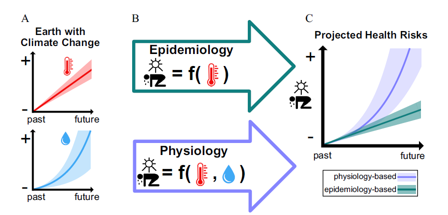
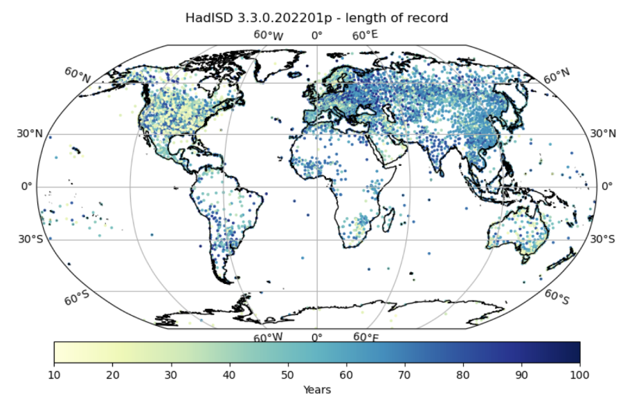

---
output:
  pdf_document: default
  word_document: default
  html_document: default
---
# Controversial issue : heat and humidity    {#he3}

*Author: Mona Niethammer*

*Supervisor: Helmut Kuechenhoff*

*Degree: Master*  

```{r message=FALSE, warning=FALSE, include=FALSE}
library(bookdown)
library(svglite)
```

## Abstract 

As climate change progresses, the incidence of heat-related deaths and other adverse health effects is increasing. Physiological research indicates that both heat and humidity significantly impact the body’s response to heat, influencing mortality and other health outcomes. However, numerous epidemiological studies have attempted to demonstrate this relationship, often finding minimal or no effect of humidity on adverse health outcomes. This discrepancy between physiological knowledge and epidemiological findings creates a controversial issue, which is further explored in this chapter.

## Introduction 

### Background 

Climate change is a broad and pressing topic as the number of heat-related deaths and the air-temperature break records. Extreme heat waves have become a consistent feature of summer seasons, leading to an increase in heat-related fatalities (@ebi). Climate change amplifies both heat and humidity, as rising greenhouse gas levels elevate their values. Physiological studies indicate that heat and humidity together contribute to human heat stress, adversely affecting the human body. (@baldwin) Heat stress occurs when environmental conditions overwhelm the body‘s cooling mechanism (@buzan). When the body cannot sufficiently lower its core temperature, health deteriorates, potentially leading to death. From a physiological perspective, the body’s cooling mechanisms are influenced by the surrounding heat and humidity. 

In contrast, a wide range of epidemiological studies have found either no or only a weak correlation between humidity and human heat stress or negative health outcomes. Those studies all infer that a rise in air-temperature (heat) is associated with negative health outcomes. These two contradictions lead to a controversial issue as physiologically it is known that there is an effect of humidity on health outcomes, whereas in epidemiological studies they did not find an effect of humidity on health outcomes. Figure 1 describes this contradiction between physiological knowledge and epidemiological studies.
Heat in this chapter is used as synonym for high ambient temperature. 

```{r controversial, cache=FALSE, out.width="500", fig.align="center", echo=FALSE, eval = TRUE}

```

**Figure 1:** <font size="2">Flowchart illustrating the controversial issue between epidemiological studies and physiological knowledge. \
*A: illustrates how heat and humidity changes with the climate change. B: illustrates that epidemiological studies only take heat as driver into account, the physiological view heat and humidity. C: shows the predictions from the epidemiological view and physiological view.* </font> 

### Epidemiological Studies 
Several epidemiological studies investigated the influence of humidity and heat on negative health outcomes such as death or cardiovascular diseases. Results of these studies are mixed regarding the association of humidity with negative health outcomes. For instance, a study conducted in New York found a positive correlation between high levels of relative humidity (RH) and cardio-respiratory hospitalizations. However, this study is one of the few that identified a link between humidity and negative health outcomes. 
Baldwin et al. reviewed numerous epidemiological studies, conducted further research, and concluded six key reasons why epidemiological studies found less or even no effect of humidity on health outcomes:

1) At high temperatures, humidity has minimal influence on health outcomes. \
2) Limited data sets may skew the study results. \
3) Analyses often focus on vulnerable populations, such as the elderly or individuals with impaired sweating and evaporative functions. \
4) Extremely high levels of heat and humidity, necessary for humidity to significantly impact heat strain, are rare. \
5) The relationship between heat and humidity is often not adequately considered, potentially leading to inappropriate model results. \
6) Sub-daily meteorological phenomena, such as rain, which occur during high heat and humidity, may bias studies based on daily data. \
(@baldwin)

### Physiological knowledge 
Physiological evidence indicates that heat and humidity increase health risks, leading to higher rates of morbidity, mortality, reduced physical work capacity, and other adverse health outcomes as the climate crisis worsens. (@buzan)

The human body has two primary cooling mechanism to control the body temperature. One mechanism involves redistributing blood flow to the skin (vasodilation),  allowing metabolically generated heat from inside the body to reach the skin’s surface and subsequently the environment. This process requires increased blood flow and elevates cardiac demand, potentially triggering cardiovascular events such as myocardial infarction in individuals with heart conditions.
The other mechanism involves secreting sweat onto the skin, which evaporates to the environment and heat from the body is removed. These cooling mechanisms are crucial for the human body to maintain the human core temperature. (@ebi)

However, the effectiveness of these mechanisms diminishes with increased heat and humidity. Higher ambient humidity reduces the proportion of sweat that evaporates from the skin, decreasing the effectiveness of sweating. Consequently, sweating does not lead to heat loss anymore, causing a continuous rise in body temperature. The human body responds to that by producing more sweat, which can lead to heat stroke, dehydration, or exceed the body's physical limits. (@baldwin) 

Certain populations are at higher risk due to less efficient cooling mechanisms. For instance, people over 65 have diminished sweating ability, and those with cardiovascular diseases cannot effectively increase blood flow to the skin. These factors, among others, exacerbate the difficulty in cooling the body. (@ebi) \
When the body can no longer cool itself, heat stress occurs. However, these physiological insights are not consistently reflected in epidemiological studies. Several methodological and physiological factors might explain this discrepancy.

First, heat-vulnerable individuals often have impaired sweating capacities, especially with aging. Thermoregulatory sweating can decrease by up to 25% in people over 60, making them less sensitive to high humidity. Since most studies include only individuals over 65, this might explain the lack of association between humidity and heat stress. Hence, older people may be less sensitive to high humidity. As in most studies individuals aged >65 years were included this may be one explanation for the non-association of humidity on heat stress.

Second, it is possible that the threshold at which differences in humidity impact the body’s regulatory mechanisms are rarely attained. This means, that only at a specific threshold of humidity the body’s cooling mechanisms have trouble and this threshold may be reached rarely in especially dry areas.

Third, heat-related outcomes may result from other causes unrelated to humidity. For example, cardiovascular diseases are a leading cause of death, and high temperatures can exacerbate these conditions independently of humidity.

Lastly, dehydration, a major cause of heat-related deaths, reduces the amount of sweat, thereby minimizing the impact of high humidity on evaporation and cooling. (@baldwin)

## Heat and Humidity in Studies 
### Humidity definitions 
Humidity has multiple definitions, making it crucial to select the appropriate measure for answering specific research questions. (@baldwin) categorize humidity variables into four groups: 

1. Simple relative variables including Relative Humidity (RH), Dew-point depression (DPD) and Saturation deficit. \
2. Mass-based variables including specific humidity, absolute humidity, dew point temperature, vapor pressure and mixing ratio. \
3. Composite indicators such as the Heat index, Humidex, Wet-bulb-temperature, UTCI and further more. \
4. Physiologic-based humidity indicators including maximum evaporation, required evaporation, total evaporation. \
Davis et al. reviewed the use of humidity variables in epidemiological studies, finding that 62% of studies used RH, while absolute humidity and specific humidity were used in only 5.3% and 1.5% of the studies, respectively. They discussed the appropriate use of different humidity variables, cautioning against the frequent use of RH due to its strong inverse correlation with temperature and its diurnal and seasonal variability. Instead, they recommend using mass-based variables like absolute or specific humidity, which provide a more accurate measure of exposure to humidity levels. \
The selection of humidity variables must be done carefully, as they can be highly correlated with other variables, particularly heat. Davis et al. concluded that using RH is often inappropriate and should be done with caution if necessary. (@davis)

The widespread use of RH in epidemiological studies is largely caused by the available data and the measurements which are done. Mostly, if humidity is measured, then RH is measured. Deriving mass water-vapor based variables such as absolute and specific humidity can introduce uncertainty and bias in estimates.  

### Composite Indicators 
As discussed in the section on humidity definitions, composite indicators are frequently used in studies. There are over 120 diagnostic heat stress metrics available and they are very useful in the design of heat warning systems (@buzan). Composite indicators consider heat, humidity, and additional variables simultaneously, making them practical for certain applications Using such composite indexes is highly practical, however comes at the cost of interpretability. Changes in the composite index can result from variations in heat, humidity, or other included variables, potentially leading to biased or misleading estimates. This may cause the effects of heat or humidity to be underestimated. Baldwin et al. recommend the use of alternative methods such as confounding or effect modification, to separately assess the effects of heat and humidity (@baldwin).  

### Confounder
A confounder is a variable that affects both the exposure of interest and the outcome. Figure 2 illustrates how humidity acts as a confounder in the relationship between heat and a health outcome. 

```{r confounder, cache=FALSE, out.width="500", fig.align="center", echo=FALSE, eval = TRUE}

```

**Figure 2:** Humidity as confounding effect.

In many epidemiological studies, humidity has been used as a confounder in analyzing the effect of heat on health outcomes. By adjusting for humidity, researchers aim to remove the confounding influence of humidity on the relationship between heat and health outcomes, effectively eliminating the indirect path from heat to the health outcome through humidity. This adjustment leads to a different interpretation of the estimates, as shown in the following linear model:

$$
Ε[Y│t,h]= β_0+ β_1*t+ β_2*h
$$

Here, Y represents the health outcome of interest, t is heat, and h humidity. In this model, $β_1$ represents the conditional total effect of heat on the health outcome, while $β_2$ represents the direct effect of humidity on the outcome. However, interpreting confounding estimates can be misleading. (@baldwin, @westreich) 

One significant drawback of adjusting for confounding is the potential for multicollinearity issues. 
If heat (the exposure of interest) and humidity (the confounder) are highly correlated, including both variables in a regression model can lead to multicollinearity. This situation results in estimates that capture similar information, making it difficult to interpret the individual effects of the variables. Additionally, the precision of the estimated coefficients may be reduced. Including calendar variables to adjust for long-term or seasonal trends can further exacerbate multicollinearity if the correlation between heat and humidity varies significantly over time. 

Baldwin et al. suggest using alternative approaches to significance testing that do not rely solely on p-values. Furthermore, it is crucial to carefully consider the relationship between heat and humidity and their individual effects on health outcomes to avoid misleading results. (@baldwin)

### Effect Modification and Interaction 
Including humidity as an effect modifier or interaction with heat is another method to test an effect of humidity in the framework of negative health outcomes and was used in some epidemiological studies (@baldwin). Unlike confounding, which distorts relationships and should be eliminated, effect modification and interaction are desirable biases. They provide valuable insights into how variables interact and influence outcomes, revealing inherent aspects of causal relationships that need clarification. 

Often, the two terms *Effect Modification* and *Interaction* are used interchangeably. However, from a causal view these two concepts differ in a counterfactual perspective and slightly differ in their definition. The counterfactual perspective involves hypothetical scenarios, asking “What if?” questions such as, “What if heat remained the same but humidity was lower? Would the health outcome change?”. (@bours) Counterfactual outcomes are typically written with a superscript such as $Y^t$ and answers the question: "What would the outcome Y be if the exposure was t?". Or as another example $Y^{th}$ answers the question: "What would the outcome Y be if both exposures t and h occurred together?". As in real-world data typically not all combinations of exposures are observed in each individual we talk here about hypothetical scenarios.  
Both concepts are scale dependent and their presence depends on the scale used. Here, we use the risk difference scale for formal definitions. 

**Interaction** refers to the combined causal effect of two exposures, such as heat and humidity. **Effect modification** pertains to how the causal effect of one exposure changes across different levels of a second exposure. For example, “How does the effect of heat change across different levels of humidity?”. Let T refer to heat, H to humidity and Y represent the outcome of interest such as heat-related death. $Y^t$ is the counterfactual outcome under exposure t and $Y^{th}$ is the counterfactual outcome under t and h.
Humidity (H) is an effect modifier on the risk difference scale for the effect of heat (T) on the outcome (Y) if H is not affected by T and there are two levels of T ($t_0$,$t_1$) and two levels of H ($h_0$,$h_1$), such that:

$$
Ε[Y^{t_1}│H=h_1] - E[Y^{t_0}│H=h_1] ≠ E[Y^{t_1}|H=h_0]- E[Y^{t_0}|H=h_0]
$$

Effect modification indicates that the effect of heat on the outcome differs across levels of humidity. Recognizing effect modification allows for public health interventions to better address how heat exposure interacts with humidity, enabling more targeted strategies to mitigate health risks associated with specific combinations of heat and humidity.

There is an interaction on the risk difference scale between T and H on Y if there are two levels of T ($t_0$,$t_1$) and two levels of H ($h_0$,$h_1$), such that:
$$
Ε[Y^{t_1, h_1}] - E[Y^{t_0, h_1}] ≠ E[Y^{t_1, h_0}]- E[Y^{t_0, h_0}]
$$

Interaction requires that the joint effect of heat and humidity is different from the sum of their individual effects. If interaction is present, studying each exposure separately may not fully capture the complexity of their joint influence on the outcome. (@vanderweele) 

According to Baldwin et al. analytical approaches to estimate interaction of effect modification are similar. They suggest that by including interaction terms or effect modifiers the main question of interest needs to be considered, also the scale of interest and the potential policy implications. (@baldwin)

Unfortunately, the interpretation of interaction terms and effect modifiers often leads to misinterpretation and often the scale (multiplicatively or additive) also is not considered correctly. Therefore, it is crucial to understand the concepts of interaction and effect modification and how to interpret them correctly. 

### Data Limitations 
The availability and quality of weather data vary significantly across different locations worldwide. Low-income countries, particularly in regions like Africa, often have limited access to weather data compared to high-income countries with greater resources for data collection. Figure 3 illustrates global sub-daily weather data from the HadISD collection, highlighting disparities in data coverage. Regions such as Africa, South America, and Australia have fewer measurements compared to Europe or the US. This lack of data, especially in areas prone to extreme heat events, results in gaps in our understanding and estimation of weather-related impacts on health outcomes. 

Tropical and subtropical climates, characterized by high levels of humidity and heat, are particularly affected by these data limitations. Missing data in these regions hinder our ability to comprehend the combined effects of heat and humidity on health outcomes. Epidemiological studies often overlook locations where humidity plays a significant role due to these data gaps. 

Another challenge is the temporal resolution of weather data. Many studies rely on daily mean measurements, which may overlook fluctuations in temperature and humidity throughout the day. Correlations between heat and humidity can vary depending on the time of day, potentially impacting the findings of epidemiological studies. 

Furthermore, the location of weather stations, typically situated outside urban areas and often at airports, may not accurately capture urban heat effects. Additionally, indoor and outdoor variations in heat and humidity are not accounted for, as most measurements are taken outdoors.

Another limitation is the common practice of measuring only relative humidity (RH), which may not provide the most accurate representation of humidity. Deriving measurements like specific or absolute humidity from RH introduces uncertainties.

In summary, the lack of comprehensive weather data can result in underestimating the impact of humidity on health outcomes. Researchers should consider these data limitations, especially when generalizing results to different countries and weather conditions. (@baldwin)

```{r HadISD, cache=FALSE, out.width="500", fig.align="center", echo=FALSE, eval = TRUE}

```

**Figure 3:** Station coverage and length of record in HadISD (@raymond)

## Examples 
Armstrong et al. conducted a study to assess the potential impact of humidity in addition to heat on daily mortality during summer months. They employed a time series regression model with a distributed lag nonlinear model (DNLM) for heat, utilizing data from 445 cities across 24 countries. Various models were fitted, including those incorporating different humidity terms or an interaction term between heat and humidity. Model comparison using the Akaike information criterion (AIC) revealed that the best fit was achieved when humidity was included as a linear term. Surprisingly, the results indicated that a 23% increase in relative humidity (99th percentile) was associated with a 1.1% decrease in mortality, a non-significant finding contrary to expectations. Sensitivity analyses involving specific humidity and dewpoint yielded similar results. Despite the consideration of humidity as a potential effect modifier, the model with this interaction term was not favored based on AIC criteria (@armstrong). 

However, Baldwin et al. caution against relying solely on AIC for determining whether an interaction term should be included in a model. Consequently, the influence of an interaction term on the results remains uncertain, raising questions about the appropriateness of its exclusion. The final model used by Armstrong et al. included relative humidity as a linear term, thereby treating humidity as a confounder. As highlighted earlier, utilizing humidity as a confounder can introduce several challenges. 

Armstrong et al. also acknowledge some limitations of their study, including data gaps from tropical and less developed countries, exclusive consideration of mortality as an endpoint, and the potential for missed associations between humidity and mortality under specific conditions (@armstrong).

In another epidemiological study, Schwartz et al. investigated the effect of heat and humidity on hospital admissions for heart disease and myocardial infarction among individuals over 64 years old in 12 US cities. They employed a Poisson model for each city, incorporating regression splines to control for season and barometric pressure, and adjusting for the day of the week. Despite their comprehensive approach, they found no evidence of an effect of humidity on hospital admissions. Possible explanations include bias introduced by the use of relative humidity and the consideration of humidity as a confounder, as discussed earlier. Additionally, focusing solely on older individuals, who are more vulnerable to heat and sweating impairments, may have biased the study's findings. (@schwartz)

In a separate review, Budd examined the history and limitations of the wet-bulb globe temperature (WBGT) index, widely used since its development for the United States Army and Marine Corps in 1950. The index incorporates air temperature, mean radiant temperature, absolute humidity, and air movement as basic elements of the thermal environment. Budd identifies several limitations of the index, including its underestimation of stress in environments with restricted evaporation, challenges in interpreting its results, and limitations in the accuracy of sweat measurement due to calibration methods and instrumentation. (@budd)

## Discussion 
The discrepancies observed in epidemiological studies regarding the impact of humidity on health outcomes may stem from various factors warranting consideration. Understanding how to appropriately incorporate humidity into study designs is paramount. As discussed earlier, humidity can serve as a confounder, effect modifier, as interaction with heat or component of a composite index, each with its own set of limitations. It is crucial to recognize the different measures of humidity available and prioritize the use of mass water-vapor based variables such as specific or absolute humidity.

Maintaining a clear research question or hypothesis is essential when evaluating the role of humidity in studies. Researchers should be mindful of these considerations to ensure the robustness and validity of their findings.

Efforts to improve data collection are imperative, particularly to include regions with tropical climates and low-income countries that are often underrepresented in studies. Furthermore, relying solely on vulnerable populations in studies may introduce bias, underscoring the importance of striving for a representative sample.

Humidity represents an intriguing factor that merits attention alongside heat in studies examining health outcomes. Proper planning and execution of studies investigating the effects of heat and humidity require a nuanced understanding of humidity, its appropriate incorporation into models, and awareness of potential limitations and errors.
