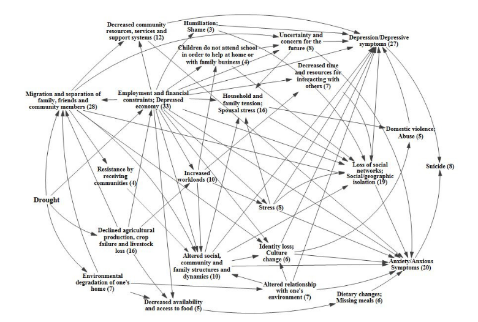
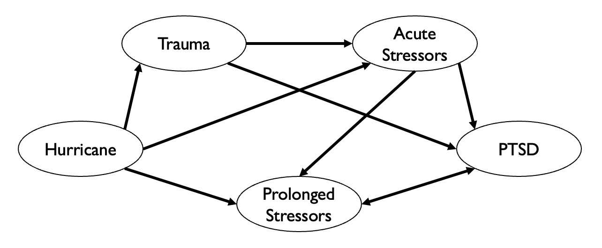

---
output:
  html_document: default
  pdf_document: default
---

# Climate Crisis and Mental Health    {#menh3}

*Author: Nina Straub*

*Supervisor: Helmut Küchenhoff*

*Degree: Master*  

```{r, include=FALSE}
knitr::opts_chunk$set(echo = FALSE)
library(bookdown)
```


## Introduction
It is widely recognized that climate change (CC) is impacting both economy and society. However, it is also increasingly acknowledged as critical factor influencing various aspects of human health. In 2009, the World Health Organisation (WHO) declared CC as one of the largest threads to human health of the twenty-first century and recognised the need for a research agenda to understand complex linkages between climate change and health [@worldhealthorganizationProtectingHealthClimate2009]. In following years, initiatives such as the Lancet Countdown, a global monitoring system designed to track research and support policy decisions on Health and CC, drew resources and attention to this pressing problem [@wattsLancetCountdownHealth2018]. Despite these efforts, some health conditions are still little researched and the impact of climate change on them is poorly understood. Among them are mental health (MH) and human well-being [@romanello2023ReportLancet2023a].
According to the OECD, 20-30% of the working population are affected by a MH condition. Mental disorders are the worldwide leading cause of years lived with disability [@whitefordGlobalBurdenDisease2013, @hewlette.MakingMentalHealth2014] and a considerable burden not only for individuals but also society and economy. In 2010, the direct and indirect costs were estimated to amount to 2493 billion US dollars worldwide [@hewlette.MakingMentalHealth2014] and the lost economic value amounts to 4-8% of GDP in different regions [@ariasQuantifyingGlobalBurden2022]. However, health care systems spend a disproportional amount on treatment. In England, MH conditions make out about 26% of the burden of disease, but only 13% of health expenditure are attributed to treatment [@hewlette.MakingMentalHealth2014]. Globally, 80% of people do not get sufficient treatment at all [@worldhealthorganizationComprehensiveMentalHealth2021].
Given the proportion of MH in global burden of disease, it seems surprising that little research has investigated how CC might affect MH. The aim of this chapter is to outline the challenges in researching the impact of CC on MH and to present research approaches on this topic. Emphasis will be placed on the methodological and statistical difficulties.

## Challenges of Quantifying Climate Change Impact on Mental Health
Important to notice is that CC does not directly impact MH, but rather the consequences of a changing climate, like the increase in magnitude, frequency and intensity of extreme climate events mediate the effect of CC on MH [@hayesClimateChangeMental2018]. The Intergovernmental Panel On Climate Change (IPCC) report identified multiple pathways how CC could impact MH. The direct pathway includes exposure to traumatic events such as floods, hurricanes or other severe weather-related events. The indirect pathway consists of the consequences of prolonged events such as drought or sea level rise that lead to displacement, food shortages or economic hardship. The last pathway, vicarious exposure or overarching/diffuse exposure refers to the long-term emotional distress caused by the awareness of the negative consequences of CC and the associated feelings of helplessness and despair [@intergovernmentalpanelonclimatechangeClimateChange20222023].
Although in the IPCC report most of the adverse effects of CC on MH are assessed with "very high confidence", no concrete projections are given as to how many additional people will suffer from mental disorders. This is peculiar because for other health effects that are assessed with very high confidence, figures for additionally affected individuals are given [@intergovernmentalpanelonclimatechangeClimateChange20222023].
The discrepancy between confidence and tangible figures is caused by multiple challenges of attributing CC to MH, which can be clustered in external and internal difficulties. The external difficulties of quantification mainly consist of the globally insufficient resources devoted to monitoring and treating MH. Although the Lancet Countdown emphasised the need to integrate MH in future CC health considerations, only five out of 16 countries included MH in their health adaption plans [@watts2018ReportLancet2018]. In the most recent Countdown report it was noted that the development of an indicator to cover the relations between CC and MH is still ongoing [@romanello2023ReportLancet2023a]. One major problems hereby is that current prevalence estimates for mental illnesses are unreliable, as mental illness is severely underdiagnosed, especially in third world countries [@worldhealthorganizationComprehensiveMentalHealth2021]. With the lack of a baseline, good projection estimates are difficult.
The internal difficulties of quantification evolve around the complex nature of MH itself. Hayes et al. (2018) identified four key aspects which complicate the estimation of CC impact: Firstly, the risk of pathologizing normal stress responses due to a changing climate while adverse mental health outcomes are underdiagnosed. Secondly, multiple causal pathways in which one CC correlate can influence different MH outcomes. Thirdly, effects of CC may only become apparent after a considerable time period, which complicates the investigation of causal effects. Lastly, existing complex interactions between MH and other social determinants of health, and their relationship with CC, is insufficiently understood.

```{r, label="impactDrought", out.width = "80%", fig.align = "center", fig.cap= "Causal process diagram of the impact of drought on the mental health outcomes depression, anxiety and suicide. Numbers in brackets are number of papers meeting the search criteria for each factor. Figure adapted from Vins et al. (2015)."}

# use 400px for pdf output
```

The four aspects can be illustrated by a causal process diagram, shown in Figure \@ref(fig:impactDrought), which depicts the multiple pathways by which droughts can influence MH outcomes [@vinsMentalHealthOutcomes2015]. Most apparent is the economic route: Droughts have a negative impact on crop yield, influencing employment and financial stability in the agricultural sector. Financial hardship has been shown to have a negative impact on MH, leading to depression and, in severe cases, even suicide [@carletonCropdamagingTemperaturesIncrease2017, @edwardsImpactDroughtMental2015]. Another causal route is the one concerned with the decreased availability of food, leading to dietary changes or famine. This can directly influence neurodevelopment of children or anxiety in adults, but also indirectly cause migration, which can lead to social isolation and loss of cultural identity, again having a negative impact on MH outcomes. To estimate the impact of droughts on MH e. g. via the migration route, it would require not only to estimate the increase and severity of droughts due to CC, but also how much migration this would cause and how many of the affected individuals would consequently develop a mental illness. This is a genuine challenge for accurate climate projections, as estimation of migration movements and the development of mental illness depend on many interrelated factors [@mazhinMigrationHealthCrisis2020]. Some individual linkages between events (e. g. the influence of economic hardship on MH) are well-researched. Future research needs to integrate these pathways and link them to different climate scenarios to better understand the overall causal processes and make accurate projections possible [@vinsMentalHealthOutcomes2015].

## Data Sources and Methods Used to Investigate Climate Change Impact
To enable evidence-based policies to protect health from climate change, the WHO has identified five research priorities: (i) Assessing risks with data-based studies and, in a second step, projections and modelling, (ii) identifying the most effective interventions, (iii) guiding health-promoting mitigation and adaption decisions in other sectors, (iv) improving decision-support and (v) estimating costs [@worldhealthorganizationProtectingHealthClimate2009].
While this research agenda has advanced in relation to some health outcomes, research on MH and CC is almost exclusively concerned with the first step of the first priority [@cianconiImpactClimateChange2020]. Methods used to describe future MH risks vary, but most quantitative studies can be grouped into a few broad categories relating to the data and measurement instruments, the study design and the statistical analysis applied [@charlsonClimateChangeMental2021]. The two main data sources are either official statistics or (representative) surveys. Official statistics such as mortality data or hospitalisation rates are low in cost for the researcher and have the advantage of being more objective than self-assessment questionnaires or interviews. But there are some considerable downsides. Some health outcomes, e. g. suicide rates, are often underreported, especially in countries where there is high stigmatisation. Furthermore, proxy variables sometimes have to replace variables of interest. For example, when examining the impact of drought on farmer suicide rates, occupation is not captured in the mortality statistics and one is limited to analysing rural males aged 30-60 years, assuming that they are working in agriculture [@carletonCropdamagingTemperaturesIncrease2017]. Surveys do not have this downside, as one can collect variables of interest and potential confounders directly, leading to more fine-grained information [@edwardsImpactDroughtMental2015]. However, survey data is more prone to self-selection bias and dropouts, particularly in longitudinal designs [@kesslerTrendsMentalIllness2008]. In addition, measuring instruments can have a low validity and data collection is costly in terms of both time and monetary resources. Which data source is chosen is largely dependent on the research question and study design.
The most common study designs are cross-sectional, followed by case-studies. Little studies attempt to model outcomes [@charlsonClimateChangeMental2021].
The specific statistical analysis depends on the data source and the study design. Classic linear regression (in case of a continuous outcome, e. g. general wellbeing) and logit models (in case of binary outcome, e. g. has a mental illness – does not have a mental illness) are most often used, but also more flexible models, allowing for non-linear effects of climatic covariates such as temperature or precipitation, are possible.
For a more detailed review on studies about environmental exposure and MH outcomes, see Charlson et al. (2021).
It can be summarized that research concerning the impact of CC on MH is less advanced than research on other health outcomes and mostly restricted to assessing risks. A methodological difficulty inherent to research questions regarding MH is firstly the measurement of MH outcomes, relying on psychometric instruments or diagnostic interviews, and secondly the large number of potential unmeasured confounders, especially when working with official statistics.
An important motivation for researching the interactions between CC and health is that, based on a good understanding of causality and reliable projections, evidence-based measures can contribute to the adaptation of health care systems and prevent the most adverse outcomes. However, in the most frequently used cross-sectional studies on CC and MH, causal interpretations must be carefully scrutinised, particularly when dealing with complex causal processes. Different designs such as longitudinal or interventional designs, a shift towards the other WHO research priorities ii)-v) and a greater focus on non-western regions and populations may contribute to a more reliable, causal understanding.

## The Impact of Hurricanes on Posttraumatic Stress Disorder (PTSD)
To illustrate how the above theoretical principals are operationalised in practice, an exemplary study and its results will be described in the following. The paper “Trends in Mental Illness and Suicidality after Hurricane Katrina” [@kesslerTrendsMentalIllness2008] is concerned with the impact of one of the most destructive natural catastrophes in the history of the United States [@graumannHurricaneKatrinaClimatological2006]. To investigate the effect on MH, 815 pre-hurricane residents of the most affected areas were interviewed 5-8 months after the event (baseline) and again one year later (follow-up). In these interviews, data on hurricane-related stressors, demographic variables (age, gender, ethnicity, household income, education, etc.) and different MH conditions (anxiety and mood disorders, PTSD, suicidality, severity of mental illness) were collected. As the first screening interview found that individuals with higher hurricane-related stress levels chose to not participate in the study, weights were applied to the baseline hurricane-related stress variable to account for this selection bias. Additionally, the authors differentiated between individuals from the New Orleans Metropolitan area (metro subsample) and individuals from other areas (non-metro subsample). Multiple logistic regression models of the form

\[
\pi_i = P(Y_i = \text{mental illness} \mid \eta_i) = h(\eta_i) = \frac{\exp(\eta_i)}{1 + \exp(\eta_i)}
\]
with linear predictors

\[
\eta_i = \beta_0 + \beta_1 x_{i1} + \beta_2 x_{i2} + \cdots + \beta_p x_{ip}
\]

were used to investigate the different outcomes of mental illnesses. In the following, only the results of the outcome of PTSD shall be outlined.
The overall prevalence of PTSD was high in both subsamples and on both measurement points (14.9% on baseline, 20.9% on follow-up for the total sample), compared to the US-wide prevalence of 6% [@goldsteinEpidemiologyDSM5Posttraumatic2016]. A two-tailed, within-responded paired t-test showed that prevalence increased significantly over time. Significance was driven by increase of prevalence in the non-metro subsample (11.8 vs 20.0%, *p* < 0.001), while the prevalence of the metro-subsample stagnated over time (25.9 vs 24.1%, *p* = 0.37). Recovery rate in the follow-up was low as 66.4% of baseline cases continued to have PTSD, 16.9% classified for another diagnosis and only 16.7% recovered. In the logistic regression model, only two of the demographic variables, participants age and family income, had a significant influence on PTSD outcome.
The authors hypothesised that the significant increase in prevalence might be explained by an increase in hurricane-related stress. However, this hypothesis was not confirmed by the data. Regarding hurricane-related stress as outcome variable, one can find that stress decreased significantly over time in the whole sample (91.7 vs 57.5%, *p* = 0.001), but in the follow-up, stress was significantly higher in the metro subsample than the non-metro subsample (78.3 vs 51.7%, *p* < 0.001). This contrasts with the increase of PTSD in the non-metro subsample. One can conclude that higher levels of residual hurricane-related stress cannot explain the increase of PTSD prevalence over time in the non-metro subsample. In turn, when taking hurricane-related stress of the follow-up into the model as a predictor variable, one can find that it is indeed significant for both subsamples. In this final model, stress exposure was a key predictor which explained substantial variation in PTSD. The results can be seen in Table \@ref(tab:tabResults). Remarkable are the odds-ratios of 20.3 for severe and 12.8 for serious stress compared to individuals with no hurricane-related stress, after controlling for socio-demographic variables and diagnosis of PTSD in the baseline interview. The authors argue that, if interpreted causally, the population-attributable risk proportion of PTSD due to hurricane-related stress is 31.9%, meaning that this proportion would be expected to remit if all hurricane-related stress would be resolved. Although the causality assumption may not be fulfilled, this statement is interesting as it could be a methodological approach to estimate additional PTSD diagnoses due to natural disasters.

```{r, label = tabResults, warning=FALSE, message=FALSE, tab.cap="Effects of hurricane-related stress on PTSD outcome as shown in Kessler et al. (2008)."}
library(knitr)
library(kableExtra)
# library(papaja)

# Data for the table
data <- data.frame(
  Severity = c("Severe", "Serious", "Moderate", "Mild", "None", "$\\chi^2$ ($p$-value)"),
  OR = c("20.3*", "12.8*", "4.4*", "3.5", "1.0", "21.0"),
  CI = c("(4.9–84.6)", "(3.0–53.7)", "(1.2–16.1)", "(1.0–12.6)", "", "(< .001)")
)
knitr::kable(data) # use when knitting to html

# use when knitting to pdf, delte tab.cap above and *Note* down below
# apa_table(data,
#          col.names = c("", "OR", "(95\\% CI)"),
#          escape = FALSE,
#          align = c("m{4cm}", "m{4cm}", "m{4cm}"), # use for pdf output
#          caption = "Effects of hurricane-related stress on PTSD outcome as shown in Kessler et al. (2008).",
#          note = "CI, confidence interval; OR, odds ratio; PTSD, posttraumatic stress disorder. Effects estimated with multiple logistic regression model controlling for sociodemographic variables, baseline value of PTSD and subsample. Reference category were participants with no hurricane-related stress. Significance level was 0.05.",
#          font_size = "small")


```

*Note.* <font size="2">CI, confidence interval; OR, odds ratio; PTSD, posttraumatic stress disorder. Effects estimated with multiple logistic regression model controlling for sociodemographic variables, baseline value of PTSD and subsample. Reference category were participants with no hurricane-related stress. Significance level was 0.05.</font>

The study has four mayor limitations: First, in addition to the mentioned selection bias after the first screening, the dropout rate between measurement points was 21.9%. Although a weight was used to account for the selection bias, it is possible that other, non-collected variables might influence participation or dropout. Second, only screening scales instead of diagnostic interviews were used for diagnosis. Hurricane-related stress was measured using self-assessment questionnaires, which is both subjective and retrospective and possibly biased by current emotional functioning. Third, although interpreted causally, hurricane-related stress and PTSD might be influenced by unmeasured common causes, influencing the observed association. Lastly, there is no true pre-hurricane baseline for the sample, and preexisting mental illness was not recorded in the survey.
The results of the presented study are partially contradicting similar studies which found a decline in PTSD over time [@chenIncidencePosttraumaticStress2015]. The authors hypothesise that the increase in prevalence in the non-metro subsample may be caused by greater media attention and resources being allocated to the New Orleans metropolitan region, leading to a sense of neglect and slower reconstruction of infrastructure in other areas. It is also remarked that other stressors only indirectly linked to the hurricane, such as economic stress or displacement, might influence MH outcomes. This is an interesting point of discussion, as it shows that the IPCC categorization of climate change exposures impacting MH is not as simple as outlined before. Events that fall into the category of direct exposure, such as hurricanes, might have prolonged effects on mental health outcomes, e. g. via economic hardship. This in turn makes it very difficult to attribute MH outcomes to specific CC events, as effects can be observed directly after the event, but can also have a prolonged onset. The potential causal pathways of short-term and long-term stressors on PTSD are depicted in Figure \@ref(fig:DAGHurricane).

```{r, label="DAGHurricane", out.width = "75%", fig.align = "center", fig.cap="Potential direct and indirect causal pathways through which hurricanes might influence the development of posttraumatic stress disorder (PTSD)."}

# use 375px for pdf output
```

To conclude, the study shows that disaster-related stress does play a significant role in PTSD outcome. Since adverse effects are only weakly related to socio-demographic variables, efforts for sufficient treatment must extend to the entire population. High residual hurricane-related stress after two years and its strong relation to PTSD emphasizes the need for evidence-based measures to address residual stress in multiple ways, ranging from rebuilding infrastructure to providing counselling and financial support.
Although the study itself does not link the results to CC, it would be possible to draw a connection between this single, natural disaster and future CC impact on MH. According to the IPCC (2023), hurricanes are projected to increase in frequency and severity. If, as claimed in the study, hurricane-related stress plays a causal role in the development of PTSD, this increase in hurricanes would have a considerable effect on the number of individuals suffering from PTSD and would need to be taken into account for future health care adaption plans.

## Adaption and Mitigation Strategies
Although the IPCC classifies the adverse impact of CC on MH to be of very high confidence, little attention has been directed to mitigation and adaption strategies for mental health and treatment systems [@charlsonClimateChangeMental2021]. In Berry et al. (2018), a possible approach to deal with the high complexity of the matter is outlined. They criticise that today’s policies and epidemiological research is focused mainly on individual outcomes, proximate causes and measurements on short timescales. To address the impact of CC on MH more holistically, they propose “systems thinking”, which they define as a set of skills used to examine interacting factors that produce outcomes, predict their behaviour and design interventions. More precisely, in research they demand a mixture of CC projections and experimental designs to understand causal influences. In policy, behaviour change should be accomplished through social policy and collective actions instead of aiming at individuals. In direct actions and interventions, they demand a shift from the single-hazard perspective of e. g. extreme weather events to a strategic long-term planning accounting for an increase in those extreme events [@berryCaseSystemsThinking2018].
An example for system thinking would be the protection of infrastructure to benefit MH. This sounds far-fetched, but considering that the cost of damage to critical infrastructure is estimated to increase tenfold [@forzieriEscalatingImpactsClimate2018], and that these costs divert resources from public health, put pressure on the functioning of society and take up individual resources – all factors that have a negative impact on MH – infrastructure protection could be a promotional strategy to protect MH from the impact of CC. The causal diagram of this process is depicted in Figure \@ref(fig:DAGInfra).

```{r, label="DAGInfra", out.width = "75%", fig.align = "center", fig.cap= "Top-level process diagramm depicting linkages between climate change, infratructure and mental health, as shown in Berry et al. (2018)."}
knitr::include_graphics("work/12-mentalhealth/figures/DAG_infra_2.png")
# use 375px for pdf output
```

The proposal by Berry et al. (2018) is a broad framework that may be useful to approach most of the problems discussed in this chapter. However, the individual components are yet to be tested in future research and policy designs.
On the more practical side, Hayes et al. (2018) and Newnham et al. (2020) proposed several practical measures that could protect MH from direct and indirect CC impact. For acute response to disaster, first-aid responders and nurses need to be trained in basic psychological first aid. It has also proven beneficial for subsequent MH outcomes to prepare people living in vulnerable areas (e.g. near rivers that will flood more frequently in the future) for the possibility that the event might occur [@munroEffectEvacuationDisplacement2017]. Intermediate adaption could include capacity building for therapy and counselling, education and programmes to reduce stigma as well as community-building and preparation training for extreme weather-related events [@newnhamPreparingMentalHealth2020]. Long-term prevention and mitigation require governments to include MH in their strategic health planning and the development of tools to predict risks, costs and needed resources. Ultimately, a swift transition towards a carbon-neutral economy would be the most cost-effective and efficient way of protecting MH from the impacts of CC.

## Conclusion
Climate change will have considerable effects on public health, including MH and wellbeing. As the latter has received little attention in research and politics, scientifically sound methods to quantify the impact of CC on MH are still being developed and research has yet not advanced from assessing the risks to estimating the costs or designing adaption strategies. Considering the importance of MH and wellbeing for individual life as well as society and economic production, more research and policy action is needed to understand this complex topic and prevent or at least attenuate the adverse impact of a changing climate on mental health.

\newpage

# References
